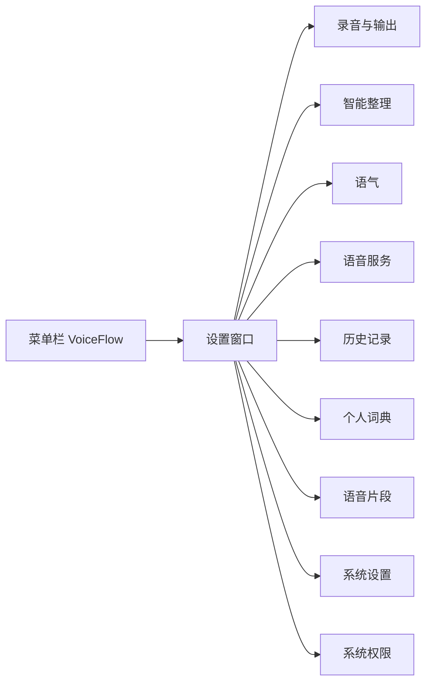
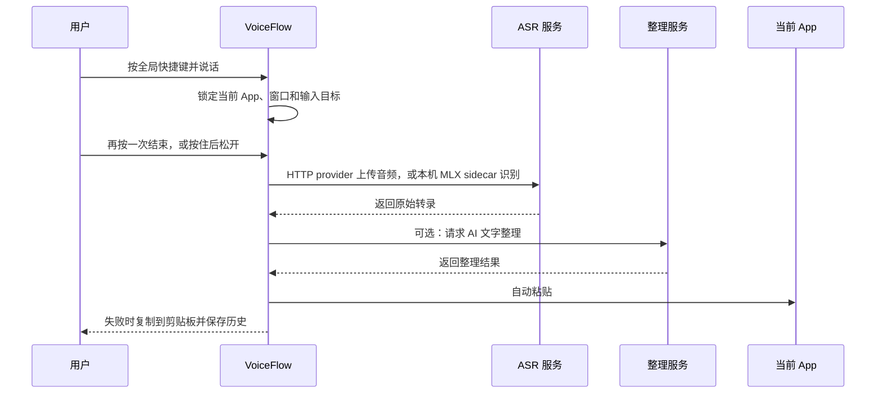

# VoiceFlow

VoiceFlow 是一个 macOS-first 的系统级语音输入工具。默认「点按切换」：按一次快捷键开始，再按一次结束；也可选择「按住说话」：按下录音，松开结束。支持 Fn / 🌐 单键和可注册的组合快捷键，默认 ⌘⌥Space。语音转换为文字后，经过可选的 AI 整理，再安全地插入当前获得焦点的 App。Esc 取消当前录音或处理。

它适合 Cursor、VS Code、浏览器、邮件、聊天、文档和终端等场景，重点解决三个问题：输入速度、技术词准确性，以及文本交付过程中的可恢复性。

> 当前版本是 macOS 优先的个人项目，最低支持 macOS 13。默认 ASR 是 Groq 批量上传，不是逐字流式字幕。On Device 使用 Swift / MLX sidecar 支持 Apple Silicon、macOS 14 或更新版本；SenseVoice Small 仅保留旧文件，不提供 MLX 推理。用户可显式下载固定 revision 的 Qwen3-ASR 0.6B、1.7B 或 Cohere Transcribe 2B 模型；Cohere 要求固定选择中文或 English。录音期间会在后台预取完整分块，但当前不会把预取文字显示到 HUD。

## 界面与交互

VoiceFlow 的设置窗口采用紧凑的双栏布局：左侧负责导航，右侧负责当前设置。设置页使用白灰或黑灰背景、连续设置行与细分隔线，支持浅色、深色和跟随系统。浅色主按钮为深灰，深色主按钮为浅灰；成功、警告和错误保留独立语义色。录音 HUD 保留独立的深灰风格。



### 设置窗口

- 设置窗口默认内容尺寸为 1035×750，不允许拖拽缩放、最大化或原生全屏；小屏按当前显示器的可用区域缩小，计算包含原生窗口边框、Dock 和屏幕缩放比例。移动到另一块屏幕或重新打开设置时会重新适配。
- macOS 设置页延伸到窗口顶部，不显示独立标题栏、「VoiceFlow 设置」文字或标题栏分隔线。原生窗口按钮融入侧栏顶部，顶部留白可拖动；侧栏品牌和导航避开按钮。加载、错误及首次引导页面共用同一拖动区域；其他平台保留原生标题栏。
- 左侧导航按「核心设置」「数据」「系统」分组，固定在窗口左侧；小屏适配和放大文字时可独立滚动。内容从侧栏旁统一留白，阅读区域最大宽度为 768px。
- 设置组件对齐用户提供的 Codex 参考：分组只有一层浅描边面板，内部用连续行和细分隔线；嵌套分组保持平坦。配置、预览和编辑器保留独立表面；小屏的长输入和选择器放在标签下方，开关保持行内。下拉框、输入框、普通按钮和开关使用填充表面；键盘聚焦和验证状态共用单层轮廓，不叠加边框与阴影焦点环。29 处选择器使用共享浮层菜单，选中项填充并显示勾选，支持方向键、键盘搜索、Esc、焦点返回及长列表滚动。网站域名与模型名的 3 处建议输入框使用同一菜单样式，并保留自由输入与原有校验。鼠标操作不为菜单选中项额外画焦点框。未选择 Fn 时不渲染空说明行，避免额外分隔线。录音方式用填充色和勾选标记表示选择，不叠加外框与内描边；快捷键只用一层填充表面，键盘聚焦和录制时才强调轮廓。
- 「录音与输出」按日常听写、录音反馈、本地保留、更多快捷键、高级录音设置排列；日常听写集中快捷键、录音方式、识别语言和输出方式。录音方式使用紧凑分段选择，所选模式及当前快捷键的具体说明紧邻显示；选中文本、翻译、看屏幕和跳过整理收在「更多快捷键」，增益和长录音分段收在「高级录音设置」。本地保留策略保持可见。
- 「智能整理」优先显示常用整理、输出选项与窗口 OCR 授权；临时覆盖、精确转写和视觉模型放在「高级整理设置」。App / 网站规则与各来源的逐 App 授权在「语气」中设置。
- 「语气」管理写作模式，以及按 App / 网站的映射（含该 App 是否整理、是否学习词条）。「编辑哪种语气」只选择编辑对象，不切换当前听写；样例试跑标明使用当前草稿或已保存配置，保持单个实例并在 Prompt 折叠区之外，Prompt 编辑器下方提供就近的「保存语气」操作；有未保存修改时，对比同一段文字在已保存语气和草稿下的结果，区分模型、本地处理、服务回退和保护规则回退。
- 「语音服务」分别选择转写和润色服务商。默认 Groq；也可以用 OpenAI `gpt-transcribe`、Deepgram、SiliconFlow、Fireworks、Mistral、Soniox、AssemblyAI、DashScope、DeepSeek、Anthropic、Ollama、本机 Whisper HTTP，或自定义 OpenAI 兼容端点（设置里有阿里云百炼 Qwen3-ASR、本机 FunASR、本机 mlx-qwen3-asr、本机 Whisper.cpp 预设）。AssemblyAI 对符合条件的短录音使用带整理候选的 Dictation；AI Off、本地-only 和长录音使用 raw Sync。若短 Dictation 候选失败，只有配置了共同整理凭据才会再请求该服务，否则保留原稿并使用本地回退。长录音合并 raw Sync 全稿后最多请求一次共同整理。保存 AssemblyAI 设置时只探测 raw Sync ASR，不验证可选的共同 cleanup；保存 Soniox 凭据只标记为已配置，听写或明确的 provider 测试才会连接。设置或凭据已保存不等于识别质量已验证。本机 Whisper 不下载 Handy 那种 ggml。On Device 可选择 Qwen3-ASR 0.6B / 1.7B 或 Cohere Transcribe 2B；模型由用户主动下载并按固定 revision 和文件 SHA-256 校验。需要 Apple Silicon 与 macOS 14+；旧 SenseVoice Small 仅保留文件，没有 MLX 推理，模型文件就绪也不能通过本机推理探测。界面分别显示文件、运行时握手、当前模型加载中和 loaded 状态。取消加载会停止本次加载并保留已保存选择与下载文件；握手不代表实际转写成功。启动时不会下载。Ollama cleanup 可显式选择本机 `qwen3.5:4b`；VoiceFlow 不安装 Ollama 或拉取该模型。清空本地 history 不会删除已下载的模型。
- 「语音服务」显示当前生效路线。修改服务、模型、区域、AI 整理开关或本机预设只改变草稿，点击「测试并应用」后生效，也可「放弃更改」。Soniox 使用「保存并应用」，不假称连接已测试；严格离线开关仍立即执行保护策略。服务行的测试只验证并保存该服务凭据，不切换路线。当前配置、服务密钥和应用操作集中呈现；所选服务的密钥直接显示，其他服务从「管理其他服务」展开；切换与折叠保留各服务唯一编辑器及密钥草稿，本机性能诊断默认收起。
- 折叠分组保留输入草稿和原有失焦提交，错误自动展开并在对应操作旁显示；快捷键录制从准备到恢复完成期间不能收起，准备期间离开页面也会恢复热键。后台词典学习等设置更新保留未保存语气草稿；展开或收起 Prompt 不会重建试跑或自动发起请求。
- App 映射默认突出 App 与语气，其余条件在「高级映射选项」中；收起不会清除设置，独立来源和风格示例授权始终可见。
- 「历史记录」按相邻记录的本地日期分组，保持查询顺序和分页；复制、编辑与可用重试直接可见，原文、版本、重新整理与删除在「更多操作」中。复制成功原位提示两秒；支持「导出记录」JSON、「导出音频」、删除单条记录和清空本地数据。编辑可取消或按 Esc 放弃；保存前不允许复制、重新整理或删除旧版本。交付未确认与已复制分别标记。
- 「个人词典」将添加和词条列表放在前面，统计收在「学习统计」中；支持手动词条和 CSV / TXT / TSV 导入，以及改正学习（待确认的纠正、已生效替换、口癖草稿、置顶词）；加载或操作失败会保留已有内容并提供重试。
- 「语音片段」用于保存和管理可快速展开的常用片段。
- 「系统设置」管理主题、界面语言、麦克风输入设备和菜单栏图标。设备选择旁完整显示当前或选定的麦克风名称。
- 「系统权限」集中显示麦克风、自动粘贴所需的辅助功能权限，以及屏幕相关操作所需的屏幕录制权限，并提供对应设置入口。

### 菜单栏 HUD

录音时 VoiceFlow 使用一个常驻但不抢焦点的透明浮动 HUD，通过动态球体、状态文字和灰阶动态边框提示当前状态。球体与状态文字作为一个整体居中；仅显示文字时不保留空的球体位置，引导预览与实际 HUD 共用 132×40 尺寸和对齐样式：

- 空闲：保持安静，不遮挡当前 App。
- 录音中：显示呼吸球体与 Listening… 状态，短暂显示当前 App / 语气，以及实际送入已配置 provider 的上下文来源（AX、设备端 OCR、云端视觉或无）；不会显示上下文文字。批量预取在后台运行，当前不显示预取文字。
- 处理中：显示塑形球体、Thinking… 状态与底部进度光线，提示语音识别或文字整理正在进行。
- 完成：短暂显示交付结果。
- 词典学习提示：可撤销学习规则。HUD 没有交付文本撤销按钮。
- 失败或降级：保留文本并提示复制到剪贴板。

### 首次启动引导

首次使用的主流程为：欢迎 → 权限 → 连接服务 → 听写试用 → 完成。选中文本改写在完成页按需试用，不再占用必经步骤；未试用时保留已有文字操作开关和快捷键。

- **推荐云端路线**：Groq 默认模型，填写或复用 Keychain 中的密钥，手动验证后进入听写试用。
- **本机路线**：Apple Silicon / macOS 14+，用户主动下载模型，通过文件与运行时能力检查后试用。首次引导保存为只转写（关闭 AI 整理），之后可在「语音服务」配置整理。模型下载需要网络，不自动开始；握手不等于真实转写已成功。Cohere 要求固定识别语言。
- **高级配置**：展开选择其他服务商、模型和区域；保留已选配置。非默认服务商会自动展开。AssemblyAI 检查 raw Sync ASR，不检查可选的共同 cleanup；Soniox 只确认本地凭据，真实连接在听写或明确的 provider 测试中发生。检查通过不代表识别质量已验证。

权限页在麦克风获准后提供可选本机自检。自动粘贴所需辅助功能权限仍可稍后设置。

### 麦克风自检与学习反馈

「系统 → 音频输入」和引导权限页可主动开始最多 30 秒的麦克风自检。显示实际打开的设备（含合盖选择）、输入增益、实时音量与无输入 / 轻声 / 峰值过高提示。只测量音量，不保存音频、不启动 ASR / AI、不写 History；正式听写、设备设置变化、离开页面或测试到期时退出。开启常开麦克风时，结束自检后恢复原本的空闲输入流。

「个人词典」显示待确认、生效替换、最近更新的纠正，以及实际用于本机替换的词条和处理次数。每段处理按词条计一次（包括历史重新整理），从新增记录开始累计，不回填旧数据。它不表示识别准确率或成功插入次数。未发生实际替换的提示词命中不算收益；词条已没有生效规则时，不再显示该词的收益记录。关闭学习只停止新纠正的自动观察，已生效替换继续可用；「清空全部数据」删除本机反馈记录。

### 录音样本评测

`npm run eval:audio -- --help` 提供显式 WAV 样本评测入口。默认只校验，不联网；`--init` 创建需填写和审核的模板，`--run` 才将选定样本发给明确选择的 ASR / 整理模型。它将实际 ASR 输出接入整理评测，分别报告原始转录、模型候选、最终文字 / 回退与阶段耗时。样本、人工参考稿和报告均放在仓库之外，不会自动读取麦克风或 History。使用方式见 [评测协议](docs/cleanup-evaluation.md#reviewed-audio-pipeline-entry-point)。该入口本身不是识别准确率或 macOS 自动粘贴验收结果。

## 核心工作流



### 语音输入

- 默认「点按切换」：按一次开始，再按一次结束；按住不会重复触发。
- 「按住说话」：按下开始，松开快捷键中的任意一个键结束；短按也会结束，不锁定持续录音。
- Fn / 🌐 点按只在独立按下并松开后切换；Fn 组合操作不触发点按，按住录音中形成 Fn 组合则取消本次录音。
- 快捷键显示为紧凑按键标签，点击后就地录入，保留当前绑定说明与 Fn / 取消操作；主听写可恢复默认 ⌘⌥Space，可选快捷键另有清除。只在录入框捕获组合键，原生确认所有物理键松开后保存；Tab / Shift+Tab 正常导航，捕获期间的 Esc、点击外部、焦点离开或切换 App 取消。按物理键识别，Option 产生的字符和 Shift 标点不会改变绑定。保存和取消等待原生完成，跨页面的迟到恢复按顺序执行，不干扰下一次录制；失败在原位说明原因并可重试。
- 快捷键录制只保存绑定，不改变录音方式。新绑定要求 ⌘ / ⌥ / ⌃ 与其他键组合，或使用功能键；单键录音可显式选择 Fn。普通字母、空格、Tab、Enter 和 Shift 字母不接受新绑定，已有合法配置保留。旧单独 ⌘ / ⌥ / ⌃ / ⇧ 绑定保留显示并暂停注册，需改为 Fn 或组合键。
- Fn 的系统输入法、表情、听写动作由用户在 macOS 键盘设置中调整，VoiceFlow 不自动修改系统设置。
- schema 25 将旧 `double_tap`、`hybrid` 和历史 `hold` 统一迁为 `tap`；新的纯按住值为 `hold_to_talk`。更新说明提示一次。
- 录音或处理时暂时禁止修改绑定与方式。绑定和模式保存校验配置合法性，不要求未更改的语音密钥；服务修改、完成引导和开始录音仍检查就绪状态。注册或写入失败恢复原绑定与页面值，取消录制等待按键松开后恢复监听。
- 全局快捷键可在不同 App 中使用。
- 「录音与输出 → 本次翻译」可配置独立快捷键（Fn 或组合键）和目标语言，空着表示关闭。只切换它启动的那次录音，与全局快捷键使用同一按法；不会更改全局输出模式。录音中 HUD 显示目标语言。当前场景须允许 AI 整理并配置整理服务；严格离线时只允许本机 Ollama 路线。服务失败仍走现有回退与交付提示，不宣称翻译成功。
- 支持自动检测中文、英文和中英混合语音，也可以手动指定语言。
- 长录音会自动分段，避免单次请求过大。
- 如果目标 App、窗口或焦点输入框在处理期间发生变化，VoiceFlow 会停止自动注入，改为剪贴板交付。
- ASR 或粘贴失败时不会丢失结果。History 会分开保存本地处理后的识别草稿、provider 原始文字（`asr_text`），以及实际产出文本的 ASR provider/model（`engine`）；旧记录没有原始字段或 provider provenance 时保持为空。

### AI 文字整理

AI 整理默认使用 Groq 上的 `openai/gpt-oss-20b`。这是为了避免将于 2026-08-16 对免费 / Developer 账户停用的 `llama-3.1-8b-instant` 和 `llama-3.3-70b-versatile` 作为新设置默认；已保存的 Llama 模型 ID 会保留，企业账户仍可使用。这个默认调整只处理服务可用性，不代表质量提升。也可以选 Groq 上的 `openai/gpt-oss-120b`，或使用 OpenAI、SiliconFlow、DeepSeek、Anthropic、Ollama 和兼容服务。终端和表单默认只做本地规则，不请求整理服务。[Groq 模型停用说明](https://console.groq.com/docs/deprecations)

整理逻辑会尽量：

- 移除口头禅、重复和明显的语音识别噪声。
- 处理自我纠正，例如「周四，不对，周五」。
- 修正标点、大小写、空格和段落。
- 保留 URL、邮箱、路径、命令、参数、版本号、错误信息和专业术语。
- 保留原始语言和中英文混合表达，不擅自翻译、总结或扩写。
- 在模型请求失败、输出为空或未明确成功结束（含截断、过滤与工具响应）时，回退到完整准备稿或本地规则整理。

关闭 AI 整理后不会请求文字整理服务；此前已启用的口述标点、明确自我修正、场景允许的词典替换和语音片段仍按各自设置处理。清理阶段本身会保留传入文本，History 的 `asr_text` 仍单独保留 provider 原文。

### 选中文本操作

通过独立快捷键启动后，VoiceFlow 需要辅助功能权限，并会读取当前选区；没有选区时，也可读取受支持的可编辑字段全文或空回复框。语音只接受六类明确操作：改写、精简、翻译、结构整理、起草回复，以及按指令修改一个值或术语。超过 16 KiB 的来源会被拒绝。若辅助功能只能读到选中文字、无法确认原字段或精确选区，文字仍可用于生成预览，但结果只能复制；不会用当前剪贴板内容代替来源。

生成结果先经过有限的事实保留检查，再显示为可编辑预览。检查用于拦截可识别的名称、数值、路径、版本和否定变化，并不证明语义正确。你手动编辑的预览是自己的文字，不会被标记为模型检查通过。确认时，VoiceFlow 会再次核对目标和来源；若在交付前发现选区或目标变化、或无法验证，只复制结果。若已经尝试写入但系统无法确认结果，会报告未验证，不会盲目重试。完整字段只通过验证过的辅助功能字段替换，不会在未知光标位置追加。动作不会按 Enter 发送内容，也不会执行命令或跨 App 操作。

每次预览由一次性事务 ID 和递增序号关联；重复确认无效，取消或更新动作会清除预览并阻止迟到结果复活。来源、语音指令和结果仅用于这次操作，不写入普通 History、纠错学习或导出。起草回复只在空回复框中进行，并且只有当前 App 规则明确允许读取及发送有界辅助功能文字时才会使用附近页面文字。

选中文本和看屏幕操作使用与普通听写相同的录音、ASR 和完整覆盖分段路径。若语音识别失败，完整录音按恢复策略保留在 History，之后可显式重试；长音频会分段完整识别。History 重试只复制结果，不恢复原目标或预览来源。操作成功时的来源、指令和预览仍只存在于本次事务。

### 看屏幕

独立于听写和选中文本操作的可选热键。用户设置快捷键并配置视觉模型后，才会截取当前窗口一张内存图，连同语音指令发给该模型，并显示同一套一次性事务预览（替换 / 只复制 / 取消）。确认前会重新核对目标；不能验证时只复制。默认听写不截屏；自动视觉上下文另由每条具体 App 规则的云端视觉权限控制。取消会丢掉图片；History 不保存截图。需要屏幕录制权限。会议录音、Spark 和生图仍不提供。

## Context-aware 输出

VoiceFlow 可以根据当前 App、窗口、焦点控件、经过授权的浏览器 host / 页面路径选择写作策略。规则中填写的 App、可执行文件、host、路径前缀和焦点字段必须全部匹配；更具体的网站 / 路径 / 字段规则优先于通用 App 规则，完整并列时按规则 ID 决定。缺少某个已指定的信号时不会匹配。写作场景元数据与读取文字是分开的权限。场景还会参考正向识别的字段类型：IDE 的通用编辑字段保持未知，只有明确的 chat/composer/prompt 字段按 coding prompt 处理；GitHub issue / pull request 只有在对应页面且字段标签足够明确时才区分标题、正文和评论；Slack / WeChat 搜索框按 Search 处理。原始字段标签仅用于本机短暂分类，不进 provider prompt 或 History。

自动读取文字默认关闭。逐 App 规则可分别允许有界 AX 选中 / 邻近文字、本机 OCR、云端视觉，以及将有界 AX/OCR/视觉识别文字送到用户配置的 ASR 或 cleanup provider。OCR 即使在本机识别，文字获准加入 provider 请求后也可能离开这台 Mac。自动云端视觉要求具体 App / 可执行文件规则、云端视觉和文字使用权限；host-only 浏览器规则不能开启截图。若获准的 AX 内容已足够，或 OCR 内容已足够，就不会请求云端视觉；OCR 和云端回退共用录音中至多一张当前窗口图。需要屏幕录制权限。普通听写不会截取整屏，也不会默认读取或上传窗口文字 / 图片。

VoiceFlow 可以按以下场景选择写作策略：

- Code
- Search
- Email
- Team collaboration
- Chat
- Document
- Terminal
- Calendar / task
- Form
- Notes
- Social
- General

Context 只作为文字整理的软提示，用户实际说出的内容优先。未知 App 会使用更保守的 General 策略。

raw URL、查询 / 片段、窗口标题、PID 和目标身份只用于本地规则与安全检查，不会发送给 LLM 或写入 History / 导出。AX、OCR、视觉文字和保留的风格样例也只有在对应 App 权限明确开启后才会进入 provider 请求。手动选中文本快捷键只授权这次选中的文字，不会附带无关的邻近文字；手动看屏幕仍是独立热键。

## 隐私与安全

- 新建或替换的服务商 API Key 只写入 macOS Keychain，并在读回验证成功后才保存设置；写入失败会报错，不会退回明文 sidecar。旧版 `settings.json` / `secrets/` 中的明文值会保留到安全迁移验证成功，且 API Key 不返回给前端。
- 默认按需打开麦克风；可选常开麦克风会持续打开输入设备，但空闲样本直接丢弃、不保存、不发送。会话样本只在用户触发录音后进入处理。若麦克风权限尚未决定，首次触发听写会由 macOS 显示授权提示；未允许时不会开始采集，可从「系统权限」页重新打开设置。
- HTTP ASR 会把音频发到用户配置的转写服务；On Device 音频发送给本机 Swift / MLX sidecar，模型由用户显式下载并留在本机。文件校验、能力握手或模型加载状态都不代表实际转写成功。严格离线模式只允许 On Device ASR；所有 HTTP ASR 路由都被阻止，包括配置为 loopback 的 LocalWhisper / 自定义 endpoint，以及对应引擎探测。它也会取消进行中的云端 cleanup 与视觉请求，并阻止新的云请求、重试、cascade / prefetch 和云端文字操作，同时保留已保存的 provider 选择。cleanup 仍可单独使用经验证的 loopback Ollama。显式模型下载仍需要网络。文字只上传到用户配置的整理服务；转写和润色可以不是同一家。
- 当前版本不收集 telemetry。
- 录音目标在开始时锁定；目标改变会触发 fail-closed，结果改走剪贴板。
- history retry 始终是 clipboard-only，不会把旧记录注入到当前可能不同的 App。
- 支持配置恢复音频和历史文字的保留时间，也支持导出、删除和清空。清空 history 不会删除 `app_data_dir/models/` 里的本机模型。
- 正常退出会取消活动处理并关闭 On Device sidecar，清理其私有临时音频；模型文件、provider 选择、History 与恢复 spool 按各自的保留策略保留。
- 默认 history SQLite 和恢复音频依赖 macOS 文件权限；可选的 recovery spool 应用层加密不会默认开启。

完整数据流和删除说明见 [`docs/privacy.md`](docs/privacy.md)。

## 技术栈

- **Frontend**：React 19、TypeScript、Vite、Tailwind CSS、Lucide React
- **Desktop runtime**：Tauri 2
- **Backend**：Rust、Tokio、Reqwest、SQLite（rusqlite）
- **Audio**：CPAL、Hound、Rubato
- **ASR**：默认 Groq `whisper-large-v3-turbo`；也可选 OpenAI `gpt-transcribe`、Deepgram、SiliconFlow SenseVoice、Fireworks、Mistral、Soniox、AssemblyAI、DashScope、本机 Whisper HTTP / MLX，或自定义 OpenAI 兼容端点
- **LLM cleanup**：默认 Groq `openai/gpt-oss-20b`；也可选 Groq 其他模型，以及 OpenAI、SiliconFlow、DeepSeek、Anthropic、Ollama 或自定义端点
- **macOS integration**：Keychain、Accessibility、microphone、menu bar、transparent floating panel

前端通过 Tauri commands 与 Rust 后端通信；音频采集、权限检查、上下文快照、Keychain、网络请求、历史记录和文本交付都由后端负责。

## 本地开发

### 官网首页

`website/` 是独立的 React / TypeScript / Vite 官网，提供中英文切换和聊天、邮件、开发提示词三种本地演示。演示进入视野后自动循环播放口述、整理与逐步成文，支持暂停、继续和重播；离开视野或切到后台时暂停，减少动态效果时默认显示静态结果。网页 HUD 直接复用桌面产品的球体组件、动画配置与样式，保持 132×40 尺寸、Listening… / Thinking… 状态和完成淡出。网页演示使用预设文本，不采集麦克风或调用转写服务。官网与桌面应用分别安装依赖、启动和构建；官网构建只需安装 `website/` 依赖，复用的纯 UI 源码不调用 Tauri。

在仓库根目录运行（需要 Node.js 20.19+ 或 22.12+）：

```bash
npm ci --prefix website
npm run dev --prefix website      # http://127.0.0.1:5173
npm run lint --prefix website     # 官网 TypeScript 检查
npm run build --prefix website    # 静态产物：website/dist/
npm run preview --prefix website  # http://127.0.0.1:4173
```

部署时将 `website/dist/` 作为静态站点发布。字体、Logo 和演示素材随站点托管；官网界面图标使用 [Hugeicons](https://hugeicons.com/) 的免费 Stroke Rounded 系列，统一 1.5 线宽。字体、图标与动画库许可见 `website/public/licenses/`。下载入口指向 GitHub 最新发行版的 `VoiceFlow.dmg`，下载版本的功能以对应发行说明为准。网页仅在浏览器本地记住语言选择。

### 桌面应用

环境要求：

- macOS 13+
- Node.js
- Rust toolchain
- Xcode Command Line Tools

安装依赖并启动开发模式：

```bash
npm ci
npm run tauri dev
```

常用命令：

```bash
npm run dev          # 只启动 Vite 前端
npm run build        # TypeScript 检查并构建前端
npm run lint         # TypeScript 类型检查
npm test             # 运行前端测试

cd src-tauri
cargo fmt --check
cargo test
cargo clippy --all-targets --all-features -- -D warnings
```

构建 macOS 安装包：

```bash
make dmg
```

产物写到 `.build/release/VoiceFlow.dmg`（不用仓库根目录的 `dist/`，那是 Vite 前端输出）。把 `VoiceFlow.app` 拖进 `/Applications`。

签名、第一次打开被拦截、以及为什么以前每次更新都要在系统设置里移出再添加权限，见下面的 [签名与权限](#签名与权限)。

## 签名与权限

macOS 的 TCC（辅助功能等）绑的是**代码签名身份**，不是 bundle id，也不是「看起来还叫 VoiceFlow」。未签名或 ad-hoc（`codesign -s -`）的包按**这一份二进制的哈希**识别。一重新编译或换包，哈希就变了。系统设置里旧条目可能还是开着的，但已经对不上新 copy，只能移出再添加。

这就是以前每次 update 都要重新授权的原因。

### 这个仓库怎么做

默认走**稳定自签证书**（不是 Apple Developer Program，也不是公证）。

| 做法 | 结果 |
|---|---|
| 未签名 / ad-hoc | 绕过 Gatekeeper 后能跑。每次更新权限都会丢。 |
| **稳定自签（本仓库默认）** | 每次 `make dmg`、以及导入同一张 `.p12` 的 GitHub Release，都是同一个身份。权限能保住。第一次打开仍要自己放行。 |
| Apple Development | Xcode 免费证。只在**你这台 Mac**上稳。不能公证。除非导出去，否则不能当 GitHub Release 的身份。 |
| Developer ID + 公证（`make notarize`） | 别人双击就能开，权限也能保住。需要每年 $99 的 Developer Program。 |

不把 ad-hoc 当默认。它最多把「已损坏」变成「无法验证开发者」，**保不住** TCC。

证书名称是 `VoiceFlow`，Team ID 是 `VOICEFLOW1`。designated requirement 变成这张叶子证书，之后用同一张证签的包会继承授权。

**这不是公证。** 别人第一次打开仍会被 Gatekeeper 拦。自签解决不了双击即用。

不要和别的 app 共用这张证。Mac Clippy 用的是另一套身份（`Mac Clippy` / `MCLIPPY001`）。

### 生成一次证书

```bash
make signing-cert
```

macOS 可能会要登录钥匙串密码，以便信任这张证。私钥写在 gitignore 里：

```text
.build/signing/VoiceFlow.p12
.build/signing/VoiceFlow.p12.base64
.build/signing/password.txt
```

不要把这些文件提交进仓库。如果钥匙串里已经有 `VoiceFlow`，脚本会直接退出，不会再做一张新的。

`make dmg` 发现没有这张身份时也会走同一条创建路径，所以第一次打 DMG 也可以顺便建证。

### 构建并安装签过名的 DMG

```bash
make dmg
```

未设置 `APPLE_SIGNING_IDENTITY` 时的选择顺序：

1. `VoiceFlow` 自签（保证本地包和 GitHub Release 是同一个身份）
2. Developer ID Application
3. Apple Development

可用 `APPLE_SIGNING_IDENTITY` / `APPLE_TEAM_ID` 覆盖。`make release` 默认打 `app,dmg`；`make dmg` 只打 DMG。

只保留一份：把权限授给 `/Applications/VoiceFlow.app`。`npm run tauri dev` 仍是未签名。日常用 dev 覆盖运行，权限还是会丢。

### 第一次打开（Gatekeeper）

浏览器或 GitHub 下来的包会带 `com.apple.quarantine`。没有公证时，系统可能说无法验证开发者；若完全未签名，还可能说「已损坏」。

1. 系统设置 → 隐私与安全性 → 仍要打开
2. 或只清这一个 app 的隔离属性：

```bash
xattr -dr com.apple.quarantine /Applications/VoiceFlow.app
```

不要关全机 Gatekeeper。

### 从旧的未签名 copy 迁过来

如果辅助功能开关是开的，但签过名的新包仍说没权限，那是旧的哈希条目还在。清一次再授：

```bash
tccutil reset Accessibility com.voiceflow.desktop
```

用 `VoiceFlow` 这张证签出来的 DMG 覆盖 `/Applications/VoiceFlow.app`，打开后再授权。之后同一张证的更新应能保住。

### GitHub Release

`.github/workflows/release.yml` 会打 `VoiceFlow.dmg`，并用 `softprops/action-gh-release` 挂到 **GitHub Release** 上（不是 Vite 的 `dist/`）。两种触发方式：

1. **Actions → Release → Run workflow** — 用 `package.json` 的版本当 tag（现在是 `v0.1.0`）。
2. **推送匹配的 tag**：`git tag v0.1.0 && git push origin v0.1.0`。

要让别人更新时权限还在，Actions 必须用**同一张**证：

```bash
make signing-cert
gh secret set MACOS_CERT_P12 < .build/signing/VoiceFlow.p12.base64
gh secret set MACOS_CERT_PASSWORD --body "$(cat .build/signing/password.txt)"
```

```bash
git tag v0.1.0
git push origin v0.1.0
```

没有这两个 secrets 时，workflow 仍会发 DMG，但是未签名，每次下载更新都可能要重加辅助功能。

CI **不会**在 runner 上现做一张新证。每次新证都会让所有人的 TCC 悄悄失效。

### 可选：Developer ID + 公证

别人双击、无警告，仍然需要付费账号：

```bash
APPLE_SIGNING_IDENTITY="Developer ID Application: Your Name" \
APPLE_TEAM_ID="TEAM_ID" \
make notarize
```

这会走 `scripts/release-macos.sh`（可再加 `VOICEFLOW_NOTARIZE=1` 以及 `APPLE_ID` / `APPLE_PASSWORD`）。和默认的自签 `make dmg` 是两条路。完整勾选见 [`docs/release-checklist.md`](docs/release-checklist.md)。

### 相关脚本

| 脚本 | 作用 |
|---|---|
| `scripts/make-signing-cert.sh` | 生成一次 `VoiceFlow` 身份并导出 `.p12` |
| `scripts/select-codesign-identity.sh` | 优先自签，然后 Developer ID，然后 Apple Development |
| `scripts/resolve-dmg-signing.sh` | 本地缺证就创建；打印 `APPLE_SIGNING_IDENTITY` 和 `APPLE_TEAM_ID` |
| `scripts/import-signing-cert.sh` | Release runner 导入 `MACOS_CERT_P12` |
| `scripts/stage-dmg.sh` | 把 Tauri 打出来的 DMG 拷到 `.build/release/VoiceFlow.dmg` |
| `scripts/select-codesign-identity-test.sh` | 身份优先级的 fixture 测试 |
| `scripts/release-macos.sh` | 可选的 Developer ID / 公证 |

CI 的 macOS job 会跑身份选择测试。

## 项目结构

```text
.
├── AGENTS.md            # Agent 约定：命令、文档分层、保守清理
├── src/                 # React 设置界面、HUD 和前端测试
├── src-tauri/src/       # 音频、ASR、LLM、权限、Keychain、历史记录
├── src-tauri/icons/     # 应用和菜单栏图标
├── public/              # 前端静态资源
├── scripts/             # 自签、DMG 发布、可选公证
├── docs/                # 活文档与研究对照；见 docs/README.md
├── package.json         # 前端脚本和依赖
└── src-tauri/Cargo.toml # Rust 依赖和 Tauri 配置
```

## 当前限制

- 目前以 macOS 为主要目标平台，Windows/Linux 尚未作为完整产品体验验证。
- 默认 ASR 仍是批量上传，不是真流式 ASR；完成的预取结果仅在录音结束后用于最终组装，且只有样本区间、音频内容和请求设置都一致时才复用，其余缺口会重新转写。
- 中文听写可以在设置里改用 SiliconFlow SenseVoice，或自定义 Qwen3-ASR / 本机 FunASR / 本机 mlx-qwen3-asr 端点；产品默认仍是 Groq Whisper。本机英文 Whisper 可走 whisper.cpp，模型名可用 Handy 同款 ggml 文件名。
- 自动粘贴依赖 macOS Accessibility 权限；没有权限时仍可复制到剪贴板。
- 看屏幕依赖屏幕录制权限和用户配置的视觉模型；没配模型时拒绝截屏。
- 浏览器上下文能力依赖用户明确授权。
- 本项目处于早期版本。默认 DMG 使用稳定自签；Developer ID 公证仍是可选的公开分发路径。

## License

License 尚未确定。项目依赖及其许可证说明见 [`THIRD_PARTY_NOTICES.md`](THIRD_PARTY_NOTICES.md)。

### 可选录音与系统控制

「录音与输出」可设置独立的「本次跳过 AI 整理」快捷键，默认为空。它只决定由该键成功启动的本次听写；用该键结束普通听写不会改变普通会话策略。仍有本地处理和词典替换，并使用所选 ASR 服务；AssemblyAI 使用 raw Sync，共同 AI 整理（含 Ollama）关闭。History 重试按当前设置运行。

录制可选快捷键时，Backspace / Delete 清空绑定，Esc 取消并保留原绑定；主听写快捷键不能清空。普通和跳过整理的按住状态分别绑定到各自热键，松开另一枚键不会结束当前按住的录音。主键注册失败后会尝试恢复原有辅助绑定。

提示音默认关闭，音量默认 0.6；开始音等待本次有效采样，结束音在采集停止后播放。「系统设置」提供合盖时的输入设备和登录后台启动（默认关闭）；后台启动不打开设置窗口。设备不可用仍明确报错。手动打开应用显示设置。

登录启动开关显示系统实际状态；显式切换会核对并纠正系统与保存值的差异，保存失败会回滚系统改动。修改其他设置不会覆盖在系统中单独调整的登录启动状态。

Cmd+Shift+D 在非编辑状态切换隐藏调试页，包含句尾缓冲（默认 250ms，0–2000ms）、可选 VAD、ASCII 模糊词典、常开麦克风和更新说明预览。VAD、模糊词典、常开麦克风默认关闭。缓冲可以取消，录音自动上限不延长。VAD 仅过滤可裁剪的最终 batch，实时流和完整音频恢复保留完整采样；实时／预取音频可能已在停止前发送。模糊词典只改同一行的普通 ASCII 词语，保留代码、URL、路径、数字与受保护内容，Code / Terminal / Form / Secure 输入不使用它。

CLI 可执行应用包中的 `Contents/MacOS/voiceflow`，参数为 `--toggle-transcription`、`--toggle-verbatim` 或 `--cancel`，优先级依次为 cancel、verbatim、transcription。动作启动和内部 `--background` 不显示设置窗口；第二实例把动作交给现有实例。

更新说明只从打包资源加载；首次安装不自动弹出，升级后按已读版本判断，预览不修改已读状态。读取失败不阻断设置页。安全输入阻止自动粘贴时，只有实际确认剪贴板写入才提示已复制；失败和输入状态不确定继续显示交付诊断。
