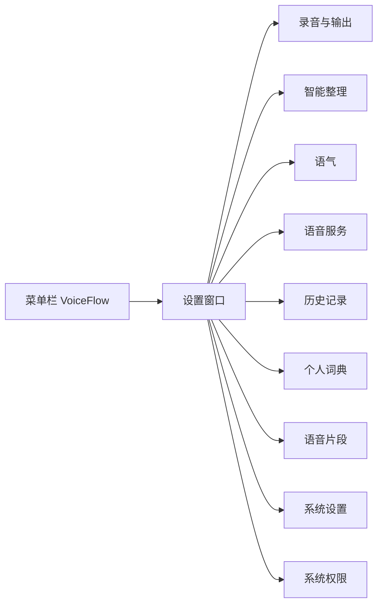
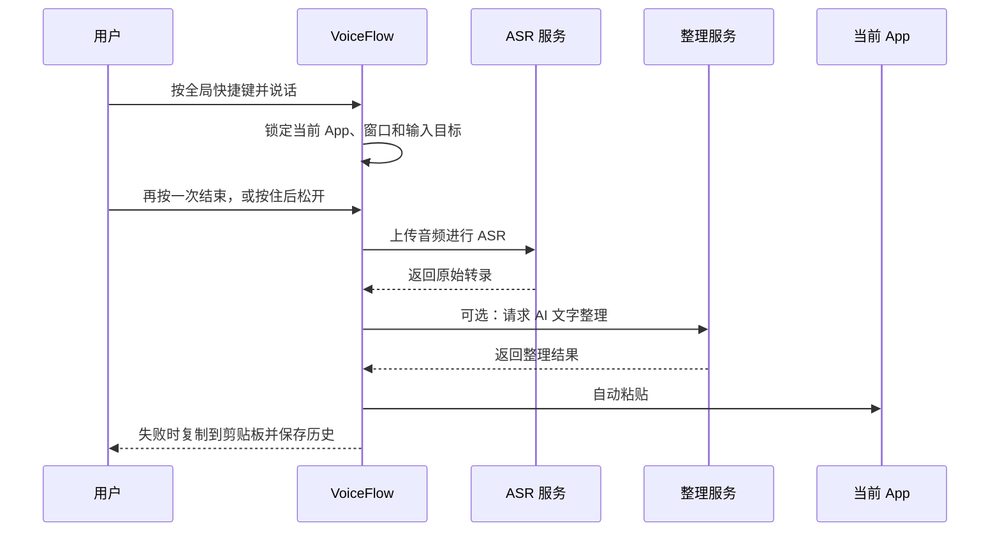

# VoiceFlow

VoiceFlow 是一个 macOS-first 的系统级语音输入工具。按一下全局快捷键开始说话，再按一次结束录音；VoiceFlow 将语音转换为文字，经过可选的 AI 整理，再安全地插入当前获得焦点的 App。功能键（⌘ ⌃ ⌥ ⇧ fn）使用双击开始和结束。按 Esc 可取消当前录音。

它适合 Cursor、VS Code、浏览器、邮件、聊天、文档和终端等场景，重点解决三个问题：输入速度、技术词准确性，以及文本交付过程中的可恢复性。

> 当前版本是 macOS 优先的个人项目，最低支持 macOS 13。默认 ASR 是 Groq 批量上传，不是逐字流式字幕；录音中 HUD 可以显示 prefetch 预览（最多约 280 字）。转写和整理可以换成其他服务商或本机 OpenAI 兼容端点。

## 界面与交互

VoiceFlow 的设置窗口采用紧凑的双栏布局：左侧负责导航，右侧负责当前设置。整体视觉是低干扰的深色 OLED 风格，也支持浅色模式和跟随系统。



### 设置窗口

- 左侧导航按「核心设置」「数据」「系统」分组。
- 「录音与输出」管理全局快捷键（按一下 / 双击 / 短按切换+按住说话）、选中文本热键、看屏幕热键、识别语言、长录音分段、输出方式和本地保留策略。
- 「智能整理」管理 App context、窗口文字识别、看屏幕用的视觉模型、输出模式和翻译目标语言。
- 「语气」管理写作模式，以及按 App / 网站的映射（含该 App 是否整理、是否学习词条）。
- 「语音服务」分别选择转写和润色服务商。默认 Groq；也可以用 OpenAI、Deepgram、SiliconFlow、DeepSeek、Anthropic、Ollama、本机 Whisper，或自定义 OpenAI 兼容端点（设置里有阿里云百炼 Qwen3-ASR、本机 FunASR 预设）。
- 「历史记录」支持查看、重试、导出 JSON、删除单条记录和清空本地数据。
- 「个人词典」支持手动词条和 CSV / TXT / TSV 导入，以及改正学习（待晋升、已生效替换、口癖草稿、置顶词）。
- 「语音片段」用于保存和管理可快速展开的常用片段。
- 「系统设置」管理主题、界面语言、麦克风输入设备和菜单栏图标。
- 「系统权限」集中显示麦克风、辅助功能和浏览器上下文所需权限。

### 菜单栏 HUD

录音时 VoiceFlow 使用一个常驻但不抢焦点的透明浮动 HUD，显示当前状态和语音波形：

- 空闲：保持安静，不遮挡当前 App。
- 录音中：显示实时波形、当前 App / 语气，以及 prefetch 完成块的预览字（不进剪贴板或 History）。
- 处理中：提示语音识别或文字整理正在进行。
- 完成：短暂显示交付结果。
- 失败或降级：保留文本并提示复制到剪贴板。

### 首次启动引导

首次使用会依次完成：

1. 欢迎。
2. 麦克风权限；辅助功能可选（没有时改为剪贴板交付）。
3. 默认 Groq API Key 验证。其他服务商在设置「语音服务」里配置。
4. 口述快捷键，并试用一次录音。
5. 选中文本操作快捷键。
6. 完成。

## 核心工作流



### 语音输入

- 默认是组合键按一下切换：第一次开始，第二次结束并转换成文字；按 Esc 取消。
- 也可以改成「短按切换，按住说话」：短按仍是开关，按住则松开后转写。
- 功能键（⌘ ⌃ ⌥ ⇧ fn）只能双击开始，再双击结束。
- 全局快捷键可在不同 App 中使用。
- 支持自动检测中文、英文和中英混合语音，也可以手动指定语言。
- 长录音会自动分段，避免单次请求过大。
- 如果目标 App、窗口或焦点输入框在处理期间发生变化，VoiceFlow 会停止自动注入，改为剪贴板交付。
- ASR 或粘贴失败时不会丢失结果，原始转录会保留在本地历史中。

### AI 文字整理

AI 整理默认使用 Groq 上的 `llama-3.1-8b-instant`。也可以改用 `llama-3.3-70b-versatile`、`openai/gpt-oss-20b` / `openai/gpt-oss-120b`，或其他服务商。`gpt-oss-120b` 更慢，不是质量升级。终端和表单默认只做本地规则，不请求整理服务。

整理逻辑会尽量：

- 移除口头禅、重复和明显的语音识别噪声。
- 处理自我纠正，例如「周四，不对，周五」。
- 修正标点、大小写、空格和段落。
- 保留 URL、邮箱、路径、命令、参数、版本号、错误信息和专业术语。
- 保留原始语言和中英文混合表达，不擅自翻译、总结或扩写。
- 在模型请求失败或输出为空时回退到原始转录或本地规则整理。

也可以关闭 AI 整理，此时只使用本地规则，不请求文字整理服务。

### 选中文本操作

选中文本后，可以通过独立快捷键说出操作指令，例如改写、缩短、翻译或总结。结果先进入可编辑预览，确认后才替换原文；如果选区或目标发生变化，则只复制结果，不直接替换文字。

### 看屏幕

独立于听写的可选热键。用户自己录了快捷键并配置视觉模型后，才会截取当前窗口一张内存图，连同语音指令发给该模型，并先弹出预览（替换 / 只复制 / 取消）。默认听写不截屏。取消会丢掉图片；History 不保存截图。需要屏幕录制权限。会议录音、Spark 和生图仍不提供。

## Context-aware 输出

VoiceFlow 可以根据当前 App、窗口、焦点控件和经过授权的浏览器 host 选择写作策略，例如：

- Code
- Search
- Email
- Team collaboration
- Chat
- Document
- Terminal
- Calendar / task
- Form
- Notes
- Social
- General

Context 只作为文字整理的软提示，用户实际说出的内容优先。未知 App 会使用更保守的 General 策略。

默认不会把 raw URL、窗口标题、PID 或文档内容发送给 LLM。浏览器上下文需要单独开启权限，并只保留本地 fingerprint 和 host 信息。

## 隐私与安全

- 各服务商 API Key 存储在 macOS Keychain，不写入 settings JSON，也不返回给前端。
- 语音只在用户主动触发录音后采集。
- 音频只上传到用户配置的 ASR 服务，文字只上传到用户配置的整理服务；转写和润色可以不是同一家。
- 当前版本不收集 telemetry。
- 录音目标在开始时锁定；目标改变会触发 fail-closed，结果改走剪贴板。
- history retry 始终是 clipboard-only，不会把旧记录注入到当前可能不同的 App。
- 支持配置恢复音频和历史文字的保留时间，也支持导出、删除和清空。
- 默认 history SQLite 和恢复音频依赖 macOS 文件权限；可选的 recovery spool 应用层加密不会默认开启。

完整数据流和删除说明见 [`docs/privacy.md`](docs/privacy.md)。

## 技术栈

- **Frontend**：React 19、TypeScript、Vite、Tailwind CSS、Lucide React
- **Desktop runtime**：Tauri 2
- **Backend**：Rust、Tokio、Reqwest、SQLite（rusqlite）
- **Audio**：CPAL、Hound、Rubato
- **ASR**：默认 Groq `whisper-large-v3-turbo`；也可选 OpenAI、Deepgram、SiliconFlow SenseVoice、本机 Whisper，或自定义 OpenAI 兼容端点
- **LLM cleanup**：默认 Groq `llama-3.1-8b-instant`；也可选 Groq 其他模型，以及 OpenAI、SiliconFlow、DeepSeek、Anthropic、Ollama 或自定义端点
- **macOS integration**：Keychain、Accessibility、microphone、menu bar、transparent floating panel

前端通过 Tauri commands 与 Rust 后端通信；音频采集、权限检查、上下文快照、Keychain、网络请求、历史记录和文本交付都由后端负责。

## 本地开发

环境要求：

- macOS 13+
- Node.js
- Rust toolchain
- Xcode Command Line Tools

安装依赖并启动开发模式：

```bash
npm ci
npm run tauri dev
```

常用命令：

```bash
npm run dev          # 只启动 Vite 前端
npm run build        # TypeScript 检查并构建前端
npm run lint         # TypeScript 类型检查
npm test             # 运行前端测试

cd src-tauri
cargo fmt --check
cargo test
cargo clippy --all-targets --all-features -- -D warnings
```

构建 macOS 安装包：

```bash
make dmg
```

产物写到 `.build/release/VoiceFlow.dmg`（不用仓库根目录的 `dist/`，那是 Vite 前端输出）。把 `VoiceFlow.app` 拖进 `/Applications`。

签名、第一次打开被拦截、以及为什么以前每次更新都要在系统设置里移出再添加权限，见下面的 [签名与权限](#签名与权限)。

## 签名与权限

macOS 的 TCC（辅助功能等）绑的是**代码签名身份**，不是 bundle id，也不是「看起来还叫 VoiceFlow」。未签名或 ad-hoc（`codesign -s -`）的包按**这一份二进制的哈希**识别。一重新编译或换包，哈希就变了。系统设置里旧条目可能还是开着的，但已经对不上新 copy，只能移出再添加。

这就是以前每次 update 都要重新授权的原因。

### 这个仓库怎么做

默认走**稳定自签证书**（不是 Apple Developer Program，也不是公证）。

| 做法 | 结果 |
|---|---|
| 未签名 / ad-hoc | 绕过 Gatekeeper 后能跑。每次更新权限都会丢。 |
| **稳定自签（本仓库默认）** | 每次 `make dmg`、以及导入同一张 `.p12` 的 GitHub Release，都是同一个身份。权限能保住。第一次打开仍要自己放行。 |
| Apple Development | Xcode 免费证。只在**你这台 Mac**上稳。不能公证。除非导出去，否则不能当 GitHub Release 的身份。 |
| Developer ID + 公证（`make notarize`） | 别人双击就能开，权限也能保住。需要每年 $99 的 Developer Program。 |

不把 ad-hoc 当默认。它最多把「已损坏」变成「无法验证开发者」，**保不住** TCC。

证书名称是 `VoiceFlow`，Team ID 是 `VOICEFLOW1`。designated requirement 变成这张叶子证书，之后用同一张证签的包会继承授权。

**这不是公证。** 别人第一次打开仍会被 Gatekeeper 拦。自签解决不了双击即用。

不要和别的 app 共用这张证。Mac Clippy 用的是另一套身份（`Mac Clippy` / `MCLIPPY001`）。

### 生成一次证书

```bash
make signing-cert
```

macOS 可能会要登录钥匙串密码，以便信任这张证。私钥写在 gitignore 里：

```text
.build/signing/VoiceFlow.p12
.build/signing/VoiceFlow.p12.base64
.build/signing/password.txt
```

不要把这些文件提交进仓库。如果钥匙串里已经有 `VoiceFlow`，脚本会直接退出，不会再做一张新的。

`make dmg` 发现没有这张身份时也会走同一条创建路径，所以第一次打 DMG 也可以顺便建证。

### 构建并安装签过名的 DMG

```bash
make dmg
```

未设置 `APPLE_SIGNING_IDENTITY` 时的选择顺序：

1. `VoiceFlow` 自签（保证本地包和 GitHub Release 是同一个身份）
2. Developer ID Application
3. Apple Development

可用 `APPLE_SIGNING_IDENTITY` / `APPLE_TEAM_ID` 覆盖。`make release` 默认打 `app,dmg`；`make dmg` 只打 DMG。

只保留一份：把权限授给 `/Applications/VoiceFlow.app`。`npm run tauri dev` 仍是未签名。日常用 dev 覆盖运行，权限还是会丢。

### 第一次打开（Gatekeeper）

浏览器或 GitHub 下来的包会带 `com.apple.quarantine`。没有公证时，系统可能说无法验证开发者；若完全未签名，还可能说「已损坏」。

1. 系统设置 → 隐私与安全性 → 仍要打开
2. 或只清这一个 app 的隔离属性：

```bash
xattr -dr com.apple.quarantine /Applications/VoiceFlow.app
```

不要关全机 Gatekeeper。

### 从旧的未签名 copy 迁过来

如果辅助功能开关是开的，但签过名的新包仍说没权限，那是旧的哈希条目还在。清一次再授：

```bash
tccutil reset Accessibility com.voiceflow.desktop
```

用 `VoiceFlow` 这张证签出来的 DMG 覆盖 `/Applications/VoiceFlow.app`，打开后再授权。之后同一张证的更新应能保住。

### GitHub Release

推送 `v*` tag（或在 **Actions → macOS Release** 手动跑）会构建并上传 `.build/release/VoiceFlow.dmg`。

要让别人更新时权限还在，Actions 必须用**同一张**证：

```bash
make signing-cert
gh secret set MACOS_CERT_P12 < .build/signing/VoiceFlow.p12.base64
gh secret set MACOS_CERT_PASSWORD --body "$(cat .build/signing/password.txt)"
```

```bash
git tag v0.1.0
git push origin v0.1.0
```

没有这两个 secrets 时，workflow 仍会发 DMG，但是未签名，每次下载更新都可能要重加辅助功能。

CI **不会**在 runner 上现做一张新证。每次新证都会让所有人的 TCC 悄悄失效。

### 可选：Developer ID + 公证

别人双击、无警告，仍然需要付费账号：

```bash
APPLE_SIGNING_IDENTITY="Developer ID Application: Your Name" \
APPLE_TEAM_ID="TEAM_ID" \
make notarize
```

这会走 `scripts/release-macos.sh`（可再加 `VOICEFLOW_NOTARIZE=1` 以及 `APPLE_ID` / `APPLE_PASSWORD`）。和默认的自签 `make dmg` 是两条路。完整勾选见 [`docs/release-checklist.md`](docs/release-checklist.md)。

### 相关脚本

| 脚本 | 作用 |
|---|---|
| `scripts/make-signing-cert.sh` | 生成一次 `VoiceFlow` 身份并导出 `.p12` |
| `scripts/select-codesign-identity.sh` | 优先自签，然后 Developer ID，然后 Apple Development |
| `scripts/resolve-dmg-signing.sh` | 本地缺证就创建；打印 `APPLE_SIGNING_IDENTITY` 和 `APPLE_TEAM_ID` |
| `scripts/import-signing-cert.sh` | Release runner 导入 `MACOS_CERT_P12` |
| `scripts/stage-dmg.sh` | 把 Tauri 打出来的 DMG 拷到 `.build/release/VoiceFlow.dmg` |
| `scripts/select-codesign-identity-test.sh` | 身份优先级的 fixture 测试 |
| `scripts/release-macos.sh` | 可选的 Developer ID / 公证 |

CI 的 macOS job 会跑身份选择测试。

## 项目结构

```text
.
├── AGENTS.md            # Agent 约定：命令、文档分层、保守清理
├── src/                 # React 设置界面、HUD 和前端测试
├── src-tauri/src/       # 音频、ASR、LLM、权限、Keychain、历史记录
├── src-tauri/icons/     # 应用和菜单栏图标
├── public/              # 前端静态资源
├── scripts/             # 自签、DMG 发布、可选公证
├── docs/                # 活文档、研究对照和历史计划；见 docs/README.md
├── package.json         # 前端脚本和依赖
└── src-tauri/Cargo.toml # Rust 依赖和 Tauri 配置
```

## 当前限制

- 目前以 macOS 为主要目标平台，Windows/Linux 尚未作为完整产品体验验证。
- 默认 ASR 仍是批量上传。HUD 预览来自 prefetch 完成块，不是真流式 ASR。
- 中文听写可以在设置里改用 SiliconFlow SenseVoice，或自定义 Qwen3-ASR / 本机 FunASR 端点；产品默认仍是 Groq Whisper。
- 自动粘贴依赖 macOS Accessibility 权限；没有权限时仍可复制到剪贴板。
- 看屏幕依赖屏幕录制权限和用户配置的视觉模型；没配模型时拒绝截屏。
- 浏览器上下文能力依赖用户明确授权。
- 本项目处于早期版本。默认 DMG 使用稳定自签；Developer ID 公证仍是可选的公开分发路径。

## License

License 尚未确定。项目依赖及其许可证说明见 [`THIRD_PARTY_NOTICES.md`](THIRD_PARTY_NOTICES.md)。
