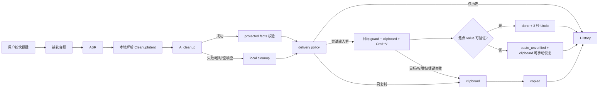
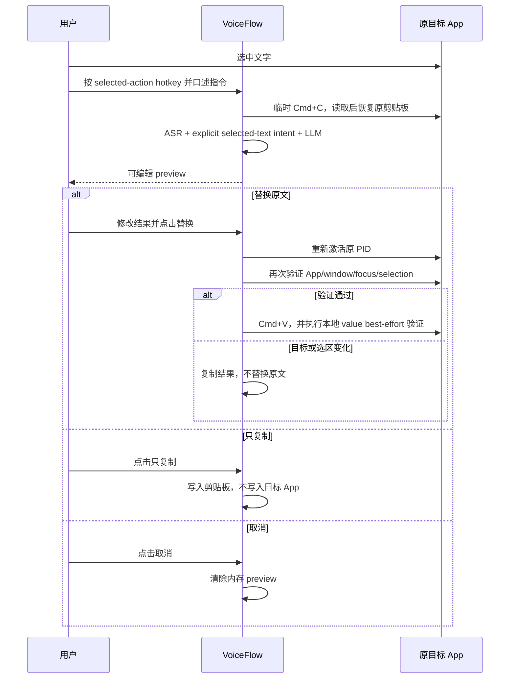

# VoiceFlow End-to-End Workflows

## 1. 普通口述：默认自动交付

关键语义：`Cmd+V` 发出成功不等于目标控件接收成功。macOS 能读取焦点 Accessibility value 且包含本次文本时才标记 `paste`；其余情况标记 `paste_unverified`，并保留剪贴板内容。

录音手势：默认组合键 tap 切换（再按一次结束，Esc 取消）；也可选 hybrid（短按切换、按住说话）；功能键只能双击。

## 2. 长录音

1. 超过分段阈值后，音频按 chunk 处理；HUD 在 caption chip 中显示 `正在识别 3/8` 这类进度，132×34 药丸仍保持紧凑。
2. 所有 chunk 完成后合并 transcript，再执行一次 cleanup 和 protected-fact 校验。
3. Settings 的“长录音输出”使用 `delivery_policy`：

   - 自动粘贴：优先写入输入框，失败后复制到剪贴板；
   - 写入当前输入框：同样使用 fail-closed target guard，无法安全写入时复制；
   - 复制到剪贴板：跳过键盘注入；
   - 仅保存到历史：不修改当前 App，也不覆盖剪贴板。

4. 任何部分 ASR、AI cleanup 或 delivery 降级都会保留 raw/final、原因和可恢复音频到 History。

当前 ASR 是 batch 上传，不是 WebSocket 流式。prefetch 会把已完成的非 warmup 分块预览写到 HUD（最多约 280 字），不进剪贴板、外部 App 或 History。最终仍走完整 ASR + cleanup 路径。

## 3. 选中文本助手：preview-first

选中文本、语音指令和生成结果默认只存在内存；只有用户主动编辑并保存到 History 时才进入持久化版本链。

## 4. Undo

Undo 只针对最近一次已完成的 paste transaction，生命周期 3 秒。点击后会再次比较 session generation、App/PID、window、browser target 和 focused input；任一目标变化就返回 `stale_target`，绝不发送盲目的 Cmd+Z。连续第二次插入会使前一次 transaction 失效。

## 5. Screen assistant 当前边界

Screen assistant 仍未接入生产流程。安全实现还需要：屏幕录制权限、ScreenCaptureKit 的纯内存 PNG 编码、图像尺寸/压缩上限、vision model 配置、截图脱敏策略和 preview-first 触发 UI。当前 LLM adapter 只接受文本，未满足这些前置条件前不采集或上传截图。
