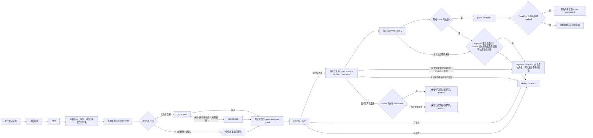
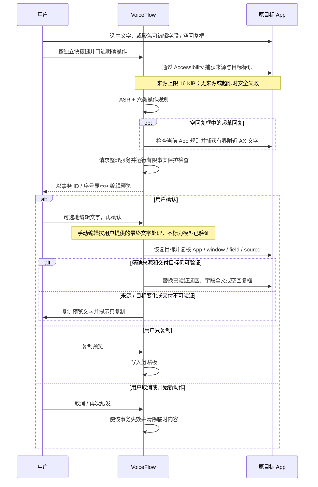

# VoiceFlow End-to-End Workflows

## 语气试跑与会话翻译

「编辑哪种语气」只选择编辑对象，不切换当前听写语气；试跑标明使用当前草稿或已保存配置。设置里的语气选择与单个手动试跑预览位于 Prompt 折叠区外；展开或收起 Prompt 不会重新挂载预览、触发试跑或取消正在进行的请求。普通折叠保留草稿及现有失焦提交，错误所在分组自动展开；快捷键录制所在分组从准备暂停热键到恢复完成期间不能收起。

后台设置快照按语气 id 和内容同步；相同内容不会重置编辑器。正在编辑的未保存 Prompt、名称和新建语气保留，其余语气接收更新；明确放弃草稿后使用最新已保存配置。错误在所属操作旁显示；试跑不可用时说明需要补全的字段，取消试跑后焦点返回试跑按钮。等待暂停热键期间离开页面，迟到的暂停完成会恢复全局热键，不进入录制或保存。

设置里的语气试跑是文字样例测试，不启动录音。请求携带当前语气草稿、用户输入文本和可选的已保存语气比较标记；样例最多 16 KiB，Prompt 最多 8000 字符。后端为该语气 family 构造场景，复用本机准备、整理路由、配置的 provider adapter、请求队列和最终保护检查。它清除测试快照里的片段和 App 映射，不获取真实窗口、上下文 grant 或风格示例；Prompt / Code 试跑使用 CodingPrompt，Terminal / Form / Search 使用对应字段类型。输出模式固定为自动整理以测语气，而 AI Off、强度和严格离线边界保留。试跑与听写共享服务限额，限流 / 重试事件独立，不改变录音 HUD。结果区分模型、本地-only、provider 回退和 guard 回退，包含试跑耗时；比较按已保存、草稿顺序进行，不将单次差异当作质量证据。它只返回内存结果，不进入交付、History 或学习。请求 ID 绑定取消；旧请求的取消 / 完成不能清除新试跑，取消早于请求启动时也不会重新发起。配置变更会废弃结果，90 秒到期终止试跑。

`translation_hotkey` 是可选独立录音快捷键（Fn 或组合键），旧配置和新安装默认空值。注册、按键录制、冲突校验与失败恢复都包括这条热键；使用全局 tap / hold_to_talk 录音方式，设置它不会修改全局按法。开始成功后，将 `translation_target_language` 固定在 DictationManager / StopClaim，分别应用到录音预取和停止处理的 settings 副本，只将本次 `output_mode` 覆盖为 translation。结束、取消、启动失败或下一次普通听写会清除临时值；按住模式只有同一来源、同一按压 ID、同一会话的 release 才能结束；其他热键和过期释放不会停止它。开始前检查实际场景的整理路由和凭据，不满足时不采集音频；未安装 / 不可用的 Ollama 仍通过现有本地回退处理。HUD 仅在活动录音 / 处理阶段显示翻译目标，完成或回退后使用现有交付状态，不把该标签当作翻译成功证据。正常听写的截图边界、目标复核和 History 恢复策略保持生效。

翻译输出模式将完整的本机准备稿声明为明确的 `Translate` intent，并携带固定目标语言；正文不必加「翻译成……」前缀，正文里提及其他语言也不会切换本次目标。轻量、标准和重度整理都传递该授权，provider 与最终保护检查使用同一操作。AssemblyAI 翻译听写走 raw Sync ASR，再通过共同整理服务翻译完整准备稿，不使用 fused Dictation 候选；需要可用的共同整理凭据。AI Off、保守场景和严格离线仍限制路由。History 重试使用当前处理设置，临时热键模式不写入 History。

## 首次使用、自检和学习反馈

主引导只有欢迎、权限、连接服务、听写试用、完成五步；完成页可主动进入选中文本试用。未进入可选试用时，结束引导不写入 `selected_actions_enabled` / `selected_action_hotkey`。连接服务默认显示 Groq 与 On Device 两条路线，服务商 / 模型 / 区域收在高级配置中；已有非默认服务商自动展开。On Device 在开始试用与最终保存时明确写入 `cleanup_enabled=false`，不把本机转写静默接到默认云端整理；运行时与 Cohere 语言检查仍是继续条件。

麦克风自检通过 `start_microphone_check` / `stop_microphone_check` 主动开启，要求已有麦克风权限和空闲操作状态；不发起隐式授权或服务请求。音频线程串行管理自检、录音和常开输入流。自检按保存的输入设备、合盖选择和增益打开实际 CPAL 输入，仅测量单声道音量、累计峰值与是否收到帧 / 信号，不缓存或编码样本。自检最多 30 秒，停止、离开设置、窗口隐藏或失去焦点、设备 / 增益改变或正式听写时关闭；正式录音优先，自检不能关闭新录音。结束后恢复原先获准的常开空闲流。自检事件独立于 HUD。会话 ID 过滤迟到结果和取消，取消先于启动也不会复活采集。开始命令五秒未返回时会发送取消。

词典反馈复用待确认与生效替换记录；实际收益由生产替换器记录它确实选择并应用的目标词，不把提示词命中或已正确拼写的文字算成替换。每个本机处理过程按目标词去重，存在 `learned_term_usage` 的次数 / 最近时间中；History 重新整理也可能计入。History schema v13 新建此表，不回填旧记录。统计发生在本机准备阶段，不能证明最终候选被接受、交付成功或识别质量提升。保守场景与无数据目录的语气试跑不写入记录。仅展示仍有生效学习规则的词条，忽略 / 忘记后隐藏；清空全部数据删除记录。读取失败保留已有数据并提供重试，不把未知统计冒充零。

完成页保存期间禁用可选试用入口，保存与读取设置都结束后才允许导航。词典页在听写完成后刷新学习反馈，覆盖粘贴确认、复制、仅历史、未确认和降级交付。

## 录音快捷键与设置事务

录音方式只有 `tap` 和 `hold_to_talk`，新安装默认 tap，默认绑定保持 `CmdOrControl+Alt+Space`。Fn/🌐 在点按模式下只在无其他按键的完整按下/松开后切换；组合快捷键在按下时切换，直到松开前忽略重复事件。按住模式在按下时开始，任一组成键松开即结束，短按同样结束。Fn 组合操作不会触发点按；纯按住期间加入其他键则取消该次会话。监听只检查必要的物理按键和修饰状态，不读取或保留输入文字。

原生输入通过 FIFO 队列先领取状态转换，再执行麦克风或转写工作。每次按压都有唯一标识；启动麦克风时收到松手或第二次点按会记住停止请求，启动完成后领取停止。空音频回到空闲，停止和处理期间忽略新录音手势；Esc、休眠和监听中断使用取消流程并清空按键状态，当前仍按下的键须先松开才能重新触发。翻译和跳过整理沿用同一录音方式，选中文本及看屏幕保持各自一次性流程。

schema 25 将旧 `double_tap`、`hybrid`、历史 `hold` 迁为 tap，保留合法绑定。旧单独 ⌘/⌥/⌃/⇧ 不被替换，保留显示并暂停注册，用户可改成 Fn 或组合键。捕获只提交绑定和目标，模式选择独立保存。录音或处理期间禁止修改。绑定事务先注册、再持久化、最后更新页面；失败恢复旧绑定，取消或完成捕获等待物理按键释放后恢复监听。仅绑定、模式或更新说明的修改使用结构校验，迁移也可在未读取到密钥时保存；服务修改、完成引导和开始录音仍要求相应就绪检查。

设置和引导共用就地快捷键编辑器：点击紧凑按键标签后，显示当前绑定、只读录入框、取消及适用的 Fn / 清除操作；主听写还可显式恢复默认 ⌘⌥Space。键盘捕获限于录入框，Tab / Shift+Tab 可导航；捕获期间的 Esc（含修饰键仍按下时）、点击外部、焦点离开该组、窗口失焦或隐藏均取消。WebKit 点击按钮时可能没有失焦目标，不能据此取消组内 Fn / 取消操作；外部点击与窗口失焦仍独立取消。物理键码避免 Option 字符与 Shift 标点变成另一枚键。新绑定要求 ⌘/⌥/⌃ 之一与其他键组合，或功能键；录音的 Fn 使用显式按钮，已有合法的普通单键 / Shift 绑定不被改写。重复事件忽略，WebView 在收到释放事件后将候选交给原生；WebKit 可能漏发普通键释放或保留旧修饰状态，因此原生等待所有物理按键释放后才注册、保存并恢复监听。准备、保存、取消各有进度；页面值只在原生确认后更新，错误在原位说明并可重试。全局捕获队列包含离开页面的未完成暂停或恢复，旧请求不能恢复下一次编辑的监听；尚未执行的暂停若已取消则跳过。明确取消可返回标签焦点，但外部操作后完成不会抢回焦点。

## 1. 普通口述：默认自动交付

普通听写在所有 App 都优先使用一次键盘粘贴；Accessibility 只用于确认目标与读回结果，不直接编辑字段。`Cmd+V` 发出不等于目标控件接收成功：只有焦点仍匹配且 Accessibility value 符合预期时才算确认。VoiceFlow 先保存 native pasteboard snapshot 和 ownership marker，确认粘贴后才会在 marker 仍由 VoiceFlow 持有时恢复旧剪贴板。只有键盘粘贴确定未发出且 marker 仍归 VoiceFlow 所有时，才会把听写文字留在剪贴板作为手动恢复路径；如果键盘可能已经发出，则先检查输入框，未看到文字时再从 History 复制，避免重复粘贴。若其他 App 已更新剪贴板或所有权无法确认，VoiceFlow 保留当前剪贴板并把文字放入 History。临时剪贴板写入后的取消会保留当前剪贴板、写入 History 并记录无转录文本的本机诊断；取消路径不会恢复旧 snapshot。尚未准备临时剪贴板时发生的失败，只会在原 snapshot 仍未变化时尝试安全复制回退。

粘贴失败或未确认时，History 会保存稳定错误码和不含听写文字的操作提示。详细本机诊断位于 `app_data_dir/diagnostics/paste-delivery.jsonl`，记录失败阶段、目标 App bundle ID、Accessibility / 焦点检查、clipboard snapshot 与 ownership、键盘尝试、读回验证和恢复结果；不记录 transcript、窗口标题、URL、PID 或密钥。启动和写入时会清理超过 30 天的记录，并从最旧记录开始裁剪到 10 MiB；“清空全部数据”也会删除该日志。

History-only、临时剪贴板所有权丢失 / 未知和 post-write cancellation 都以 History 作为恢复路径。若 SQLite 未能写入这些 History 结果，HUD 会报告保存失败；recovery spool 可用时，短录音保留带 manifest 的 WAV，长录音保留 recoverable session，下次启动将其重建为可重试的 History 音频。History 写入成功后，短录音仅为这次写入准备的临时 WAV 会删除；用户 opt-in 的成功音频与降级录音继续按各自保留策略处理。

交付警告使用 HUD 的紧凑两行提示，说明原因和下一步操作，并显示 6 秒后淡出。

录音手势：默认 tap 点按切换，再按一次结束；也可选 hold_to_talk 按住说话，松开完整快捷键的任一部分即结束，短按也会结束。Fn 单键和合法组合键都支持两种方式，Esc 取消。旧配置迁移规则见上方「录音方式与快捷键」；更换绑定不改变方式。

服务页把当前生效路线与待应用草稿分开。provider、模型、区域、AI 整理开关和本机预设修改后通过「测试并应用」生效；Soniox 明确「保存并应用」，保存不证明连接成功。严格离线开关立即执行保护策略。服务商行的探测只验证和保存自己的密钥，不切换当前路线。所选服务的密钥和应用操作位于同一配置表面，其余服务放在「管理其他服务」中，摘要显示已配置数量。每个服务只保留一个密钥编辑器，重排与折叠不清除草稿和错误；App 映射的高级条件可折叠，独立授权始终显示且保持原值。

ASR 默认保持 Groq `whisper-large-v3-turbo`；cleanup 默认保持 Groq `openai/gpt-oss-20b`。新增预设不覆盖已保存的 provider/model/custom endpoint。SiliconFlow 仍默认 `FunAudioLLM/SenseVoiceSmall`，另有可选 `Qwen/Qwen3-ASR-1.7B`。新 provider IDs 为 `fireworks`（`whisper-v3-turbo`，base host `https://audio-turbo.api.fireworks.ai`）、`mistral`（`voxtral-mini-2602`，base host `https://api.mistral.ai`）、`soniox`（实时流式专用 `stt-rt-v5`，WebSocket `wss://stt-rt.soniox.com/transcribe-websocket`）、`assemblyai`（Universal-3.5 Pro Dictation / raw Sync）和 `dashscope`（只接入 `qwen-audio-3.1-asr-flash-message`）。Fireworks 可用性尚未核实；Qwen 账户与地区可用性尚未核实；Soniox 的真实麦克风生命周期尚未验证；本阶段未验证 AssemblyAI / DashScope 帐号与服务可用性。Deepgram 预设不启用 `multi`，此处不声称它支持中文或中英混合。

On Device 是单独的本机 ASR provider。新选择默认为 `qwen3-asr-0.6b`，也可选 `qwen3-asr-1.7b` 或 `cohere-transcribe-2b`；MLX 运行要求 Apple Silicon 与 macOS 14 或更新版本。Cohere 要求将识别语言固定为中文或 English，自动语言模式不可用。SenseVoice Small 只作为旧设置和文件保留项，没有 MLX 推理支持；即使旧文件就绪也不能通过 MLX 推理探测。设置和引导页分别显示文件状态、sidecar 能力握手、当前模型 loading 和已 loaded 的具体模型；握手不等于已加载，也不等于实际转写成功。加载状态绑定模型 ID，用户可取消本次加载；取消会终止加载尝试，不更改保存的 provider / model 或删除下载文件。普通配置控件仍可在加载期间使用。

严格离线模式只允许 On Device ASR；它阻止所有其他 HTTP ASR 路由（包括配置为 loopback 的 LocalWhisper / 自定义 endpoint）及这些 HTTP 路线的 provider probe，但仍允许 On Device 本机设置探测。它也阻止 History 重试、cloud cleanup、cascade / prefetch 和视觉请求。开启时会取消进行中的云请求，不会自动更改用户保存的 provider 选择。cleanup 可显式配置为经验证的 loopback Ollama `qwen3.5:4b`；VoiceFlow 不安装 Ollama，也不下载 cleanup 模型。请求内容超过 4096 UTF-8 字节或本机 cleanup 不可用时会保留准备稿并使用本地规则或关闭 AI cleanup；完整本机 fallback 的结果不会记作模型整理成功。用户手动发起的 On Device ASR 文件下载需要网络连接，独立于严格离线下的听写请求。默认 Groq ASR / cleanup 选择以及用户已有 provider、model 和 key 不因新增选项而覆盖。

HTTP ASR 上传 16 kHz、单声道、16-bit PCM WAV。VoiceFlow 每个直接 ASR 请求最多发送 10 分钟；更长录音分段后完整覆盖，不截断尾部。单次录音本身最多 15 分钟。默认分段阈值为 25 秒（设置范围 5–3600 秒），目标段长默认 35 秒（范围 15–60 秒）；达到阈值或 10 分钟直接请求上限时会进入长录音分段路径。SiliconFlow 的 adapter 另限制单文件 50 MB、音频 1 小时；Mistral 文档上限为 3 小时；Fireworks 没有在当前接线中声明 provider 文件或时长上限，10 分钟是 app 的直接请求上限。

| Provider / preset | 请求与已知能力 |
|---|---|
| SiliconFlow SenseVoice / Qwen3-ASR | multipart 仅 `file`、`model`；只自动检测语言，不发送语言或术语字段，也不请求 `verbose_json`、时间戳或置信度。 |
| Fireworks `whisper-v3-turbo` | multipart `file`、`model`；只自动检测，不请求术语、时间戳或置信度；服务可用性尚未核实。 |
| Mistral `voxtral-mini-2602` | multipart `file`、`model`；省略 `language` 时自动检测，也可指定单一固定语言；最多 100 个术语通过 `context_bias` 发送；只在自动检测时请求片段时间戳，不发送 Whisper `prompt` 或置信度字段。 |
| Soniox `stt-rt-v5` | WebSocket 实时流；`auto` 发送 `zh`、`en` 候选提示，固定语言发送对应提示，均不限制识别；不发送自定义 context/terms。服务端 provisional token 与 final token 分开处理。 |
| AssemblyAI Universal-3.5 Pro | 选择固定的 Dictation 与 Sync endpoint；Dictation 最长 120 秒并返回独立 `text` 原稿与可选 `llm_response` 候选；AI Off、本地-only 或长录音走同一公司的 raw Sync。Dictation 和 Sync 的产品 `auto` 都显式发送 `language_codes: ["zh", "en"]`；固定中文 / English 分别发送 `language_codes: ["zh"]` / `language_codes: ["en"]`。Sync 的术语只用 `keyterms_prompt`，最多 100 项 / 8000 字符，避免通用 prompt 覆盖 `language_codes`。 |
| DashScope Qwen Audio 3.1 Message | 只接入 `qwen-audio-3.1-asr-flash-message` 完成音频 WebSocket 路径；原始识别关闭 disfluency removal，原生 polish 不启用。Beijing / Singapore 区域保存为相应 HTTPS origin 并解析到官方 `/api-ws/v1/inference` WSS endpoint；不使用 Workspace ID、不虚构语言提示字段。 |

ASR 不会因服务错误静默改用其他 provider。若用户另行配置了准确识别级联，满足该级联条件时才会额外请求其指定 provider。HTTP ASR 使用 30 秒请求超时；429 最多重试两次，网络错误和 5xx 最多重试三次，`Retry-After` 等待最多 60 秒。401/403 不重试；取消会停止排队、重试等待或正在进行的请求。HTTP ASR 不跟随重定向。History 中重试恢复音频时，超过直接请求上限的音频会拆分并完整识别，不丢弃片段。

### Soniox 实时流式

Soniox 是用户单独选择的 streaming-only ASR 路径；它不会调用 HTTP ASR，也不会对同一录音启动 batch chunk prefetch。录音开始时，VoiceFlow 先启动非阻塞、有界音频队列和后台 WebSocket 握手，麦克风采集不等待网络连接；握手期间的音频仍按样本顺序入队。队列满或覆盖校验失败会把流标为不完整，停止使用该流结果，并保留完整本机录音供恢复。每个录音会话只有一个 finalization 与交付所有者。保存 Soniox 凭据只写入 Keychain 并显示为已配置；保存本身不连接 provider。实际连接只在用户开始听写或明确执行 provider 测试时建立。

Soniox 的 provisional token 仅在当前会话内使用，不显示为已完成结果，也不启动 cleanup、写入目标 App、剪贴板、History 或学习。发送音频按实时节奏进行时，actor 仍通过同一 select 循环读取 WebSocket 消息，不在等待下一帧发送时阻塞接收。停止录音后，VoiceFlow 发送结束信号并等待 final transcript；只有最终转录进入已有本地准备、cleanup、保护检查与交付流程。历史记录保留 provider final 的 `asr_text`、本地准备后的 `raw_text` 与保护检查后的 `final_text`，不保存流式 provisional token。

若初次流的传输、音频覆盖或 finalization 失败，VoiceFlow 取消 / 拒绝该结果，用本机保留的完整裁剪前录音向同一 Soniox WebSocket 按近实时音频节奏重放一次；重放期间 HUD 显示“正在重新转写完整录音”。它不会把不确定的 partial 与重试结果拼接，也不会跨 provider 回退。两次尝试之间只允许这一次完整重放，不叠加 HTTP 队列重试；认证、请求格式或计费失败会作为可处理错误返回。此协议按实时节奏重放，耗时可能接近录音长度；可由取消终止，处理 watchdog 有界且最长 30 分钟。完整重放可能再处理并收费一次全录音；Soniox 按完整流时长计费，包括静音。实际价格依账户而异，参见 [Soniox 定价页](https://soniox.com/pricing) 和 [WebSocket API 说明](https://soniox.com/docs/api-reference/stt/websocket-api)。

### AssemblyAI 集成转写与原始 Sync

AssemblyAI 使用一把 Keychain key 和固定 endpoint，不是 OpenAI-compatible provider。保存 AssemblyAI 设置时的 ASR 探测使用 raw Sync 路径，并跳过可选的共同 cleanup 服务检查；探测结果不代表整理回退已经验证。对于总时长不超过 120 秒、且 CleanupIntent 允许 AI 整理的录音，VoiceFlow 发送 `POST https://dictation.assemblyai.com/v1/transcribe/live`。原始 `Authorization` header 携带 key；multipart 先发 `application/json` 配置，再发 `audio/wav` WAV 音频。此 endpoint 默认总会执行改写；省略或置空 `llm_instruction` 也会执行，接口没有 `cleanup=false`。

`text` 保留独立的 ASR 原稿，`llm_response` 只作为整理候选，`llm_error` 区分整理失败。候选通过与 Phase 2 一致的本机准备稿授权和最终保护检查后，才作为最终文字使用；接受候选会跳过第二次 LLM 请求。候选缺失、为空或 `llm_error` 时保留原稿；若共同整理凭据可用，对本地准备稿只发起一次共同 cleanup，否则使用本地规则回退。成功的短 Dictation 候选本身可提供整理，不要求共同整理凭据。候选被最终保护检查拒绝时保留受保护原稿 / 本地回退，不再发第二次模型请求。

当 cleanup 为 Off / local-only，或完整录音超过 120 秒时，单路改用 `POST https://sync.assemblyai.com/v1/transcribe` 获取原始 ASR；同一 key 以原始 `Authorization` header 发送，并带 `X-AAI-Model: universal-3-5-pro`。配置 part 放在 WAV 音频之前。每次请求最多 120 秒；更长音频由有界重叠 chunk 完整覆盖，并要求每块都成功后才合并原始全文并最多做一次共同 cleanup；任一块失败时跳过全稿 cleanup 和交付，把原始完整 WAV 存入失败 History 供显式全音频重试。该 all-or-nothing 规则只用于 AssemblyAI 长 Sync；其它 batch 路线保留现有部分结果复制与完整音频恢复策略。长录音的模型整理需要共同 cleanup 凭据；缺失或服务不可用时保留 raw / 本地准备稿并用本地规则回退。保存的 key 本身不是探测结果；设置保存时若 raw Sync 探测成功，也只说明该 ASR 请求可用，不验证共同 cleanup 服务或识别质量。Dictation 和 Sync 都明确发送 `language_codes`：产品 auto 映射 `['zh','en']`，固定中文与 English 分别映射 `['zh']` 与 `['en']`。这是预期语言列表；API 列出 32 种支持语言，但产品选择仍为 auto / zh / en。Sync 只通过 `keyterms_prompt` 发送最多 100 个、合计最多 8000 字符的相关术语；不附带会覆盖 `language_codes` 的通用 `prompt`。

### Qwen Audio 3.1 Message 原始转写

DashScope 设置显式保存 Beijing 或 Singapore：`https://dashscope.aliyuncs.com` 或 `https://dashscope-intl.aliyuncs.com`。这条路径在录音结束后上传已完成音频，不是 Soniox 式麦克风实时流。backend 将所选 HTTPS origin 转成对应官方 WSS host 加 `/api-ws/v1/inference`。连接使用 `Authorization: Bearer`，通过带 UUID 的 `run-task` / duplex 配置启动，等待 `task-started` 后才发完整音频；全部音频发完后发送 `finish-task`，仅在收到明确的 `task-finished` 时接受完成。模型固定为 `qwen-audio-3.1-asr-flash-message`，`disfluency_removal_enabled:false` 保留原始识别，interim results 不进入最终转录、cleanup 或 History。普通 HTTP `qwen-audio-3.1-asr-flash` 未接入此功能，也不标为可 raw-preserving。

Qwen Message 不提供已查证的固定语言提示字段，因此该路径使用多语言自动识别，不造出语言提示设置。只接收最终句子；服务若返回句子 / 词时间戳则按毫秒保留，heartbeat 不是转录，task-finished 的累计 usage 只记录一次。7168 输入 / 1024 输出 token 上限带来整段处理风险；VoiceFlow 对较长录音使用 15 秒目标、20 秒上限和 1.5 秒重叠的分段，并保留完整采集音频（包括安静片段）以保证覆盖。若任何块失败或达到输出预算上限，整段转写失败，不交付部分结果，完整 WAV 留在 History 供重试。此实现未验证实际账号权限、识别质量或延迟。严格离线会阻止这些云端路由、History retry、provider probe、预取和仍在进行的请求。

## 2. 长录音

1. 超过分段阈值后，音频按 chunk 处理；AssemblyAI 的每个 Sync 请求最多 120 秒，长录音与 DashScope 的保守 token 限额路径都必须由有界重叠 chunk 完整覆盖；HUD 在 caption chip 中显示 `正在识别 3/8` 这类进度，132×34 药丸仍保持紧凑。
2. 所有 chunk 完成后按来源音频的实际时间戳合并 transcript，再执行一次 cleanup 和最终 protected-span guard。AssemblyAI 不会逐 chunk 改写；它只合并 Sync 原稿后做一次全稿 cleanup。Qwen Message 也使用保守 token 分段并完整覆盖较长录音。只有双方词语及其可信时间都对齐到同一段真实重叠音频时才删除重复前缀；缺少可靠词时间或文本有多行布局时保留重复内容，避免把静音间隔前后两次相同口述删成一次。
3. Settings 的“长录音输出”使用 `delivery_policy`：

   - 自动粘贴：优先发送一次键盘粘贴；临时剪贴板准备前就失败时，仅当原剪贴板未变化才安全复制回退；
   - 写入当前输入框：同样使用 fail-closed target guard；键盘快捷键确定未发出且 VoiceFlow 仍拥有临时剪贴板时，保留听写文字供手动恢复；快捷键可能已发出时先检查输入框，只有确认文字缺失才从 History 复制；剪贴板所有权丢失或未知时保留当前内容并从 History 恢复；
   - 复制到剪贴板：跳过键盘注入；
   - 仅保存到历史：不修改当前 App，也不覆盖剪贴板。

4. 任何部分 ASR、AI cleanup 或 delivery 降级都会保留 raw/final、原因和可恢复音频到 History。

长录音 spool 为每个分块记录来源样本起点和样本数；恢复时按整数样本区间合并相同的重叠部分，并保留每个来源样本一次。来源区间有缺口、重叠样本内容冲突或新旧区间元数据混用时，恢复会安全失败。旧的非重叠 spool 仍按分块索引串接；旧 manifest 如果显示重叠、但没有精确样本区间，则不能精确重建，也会被拒绝。

Spool 保留期按 manifest 的 session 创建时间计算，不会因启动恢复写入或重建失败而延长；重建失败时，未到期的源分块会保留到原定到期时间。短录音为 History 写入失败准备的单 WAV session 也使用 manifest 和同一保留期限。创建时间缺失、无效或位于未来的 session 会保守清理。

HTTP providers 使用 batch ASR，且当前都报告 `streaming_partial_results=false`、`streaming_final_results=false`；只有 Soniox 报告 partial 与 final streaming capability。该 capability 描述协议接线，不代表真实录音行为或延迟收益已验证。Provider 时长与文件限制由 adapter 能力决定：SiliconFlow 报告 1 小时 / 50 MB，Mistral 报告 3 小时；未声明的 `max_audio_duration_secs=null` 不代表无限制。HTTP batch 路径下，VoiceFlow 的直接请求都不超过 10 分钟，录音不超过 15 分钟；超出直接请求上限的处理采用完整覆盖分段。batch prefetch 只服务这些 HTTP providers：它在录音期间于后台转写已完成的非 warmup 分块，但不向 HUD 显示预取文字，也不会写入剪贴板、外部 App 或 History。Soniox 真流式路径不再对相同音频启动 batch prefetch。HTTP 分块规划按固定校准样本和固定最大边界运行，不受音频设备 push 大小影响。对 HTTP provider，录音结束后只有最终分块与预取块的来源区间、精确样本内容、ASR 请求设置、录音 generation、配置 generation 和录音目标绑定都相同时才复用完整 transcript；缓存包含原始文字、分段、词时间、语言、置信度和 quota 元数据。取消、新录音或会影响当前处理的设置变化会丢弃迟到结果。若录音仍有效但交付目标改变，会保留可恢复的转写结果并通过现有剪贴板回退，不会向新目标注入；绑定到旧目标的上下文 / 视觉证据会丢弃。读取旧缓存 quota 不会覆盖较新的实时限流状态。静音裁剪、压缩或设置变化导致身份不一致时会重新转写，确保尾部和变化后的分块仍有识别覆盖。

录音预处理压缩长静音并裁掉数字静音，同时根据本次录音较安静的帧自适应判断语音边界；单凭固定音量门槛不会删除整段低音量语音。数字静音仍返回无语音。

普通与长录音先在本机按同一顺序执行语音标点 / 有界布局、用户词典与局部明确改口，再由本地解析 CleanupIntent。局部改口在整段来源上排除引号与 Markdown code literal 区域，包括跨句的修正标记和被替换实体。标点与每个布局阶段分别以该阶段完整输入定位引号 / code literal；只有解析器实际成功消费的精确语法范围可豁免自身 protected-span 匹配，每步检查通过后才进入下一步。payload 中的同词、部分重叠实体、引号 / code 内容和文件路径仍受保护；布局标签只移除空白和明确的命令分隔符，保留文件名等 payload 点号，code literal 内容不参与口述布局。Provider candidate 以准备后的文本为参照；最终验证不再对所有出现位置追加全局词典改写，并会拒绝丢失结构化行内容或改变代码缩进的候选。当整理关闭或场景被路由为本地处理时，不发起整理请求；provider 失败或验证拒绝时使用保守 fallback 并保留准备稿布局。`asr_text` 保留 provider 原始结果，便于区分原始识别与本地准备后的草稿。

共同云端整理只有协议明确成功终止时才产生候选：OpenAI-compatible 流式需要 `finish_reason: stop`，已收到 stop 后的正常 EOF 可接受；`[DONE]` 本身不能替代完成状态。Anthropic 需要 `end_turn` 或 `stop_sequence`，工具内容不作为整理结果。缺失完成状态、过滤、工具调用或 token 预算耗尽走完整准备稿的本地回退。共同 LLM 和视觉客户端与 ASR 一样不跟随 HTTP 重定向。

History 将 provider 返回的原始文字写入 nullable `asr_text`；如果 provider 在同一响应中明确给出独立整理候选，则另存为 nullable `provider_cleaned_candidate`。本地置信度过滤、口述修订和词典替换后的识别草稿在 `raw_text`，最终保护检查后的输出在 `final_text`，并记录实际产出识别草稿的 ASR provider/model。各字段保留各自来源，不会用本地或最终文字伪造 provider 候选。History 重新整理与音频重试会绑定启动时的处理配置代次；provider/model、AI Off 或严格离线等相关设置变化会取消旧操作，避免旧请求重试或写入剪贴板 / History 修订，也不会把取消当作本地回退。操作 lease 保持到该操作返回。旧记录迁移后 `asr_text`、候选和缺失的 provider provenance 保持为空；History 单独展示这些来源，JSON 导出会保留 nullable 字段。编辑状态支持取消与 Esc，保存前停用复制、重新整理及删除，避免操作旧版本；`unverified` 显示交付未确认，不能冒充已复制。词典加载独立保留各来源的最后成功数据，失败显示重试；学习撤销只在成功后关闭通知，旧操作迟到不关闭新通知。

普通听写的本机性能诊断只在当前进程保留最多 32 个 provider/model/path 分组和每阶段最近 128 个延迟样本。它分别汇总静默预识别、最终 ASR、整理、最终验证、粘贴提交、读回确认和停止到已确认插入，并区分已发送、已确认、未确认、复制、仅历史、预览、失败与取消。ASR 用量记录实际 HTTP 请求与失败数（包括队列重试）、提交 WAV 时长和可解码时长的请求数；流式路径另记录尝试 / 失败数、session 墙钟时长、发送音频秒数和重放音频秒数。墙钟时长与发送音频量是诊断指标，不等同于服务商报告用量或费用；Soniox 按实时流完整时长计费，包含静音。provider 返回的最多 8 种固定单位和数量保持独立，不换算为费用。只有键盘快捷键确定未发出且临时 marker 仍由 VoiceFlow 持有时，未确认结果才保留剪贴板供手动恢复；键盘可能已发出时先检查输入框，剪贴板所有权丢失或未知时从 History 恢复。停止到插入只统计读回确认成功的粘贴，AX 安全编辑会记入读回确认时间。诊断不包含文本、音频、上下文、图片、目标、URL、endpoint 或凭据；用户可在设置中读取并主动复制 JSON，不会自动上传。

## 3. 选中文本助手：preview-first

支持的操作是改写、精简、翻译、结构整理、起草回复和按指令修改一个值或术语；模糊指令或保护检查不支持的结果会安全失败，不创建预览。捕获不到 AXValue 或精确选区范围时，选中内容只能用于生成和复制。完整字段替换要求可验证的辅助功能字段值，不会写到不确定的插入光标。系统不从环境剪贴板读取来源，也不按 Enter 发送内容。

这些操作的语音指令经过共享录音 / ASR 路径；长音频仍完整覆盖分段。若 ASR 失败、需要重试，完整录音按恢复策略保存在 History；History 重试使用完整音频并且只复制结果，不恢复原来的目标字段。操作来源文字、指令和预览仍不写入普通 History。

每个动作有一次性事务 ID 和递增序号。后端只消费一次匹配预览；重复确认无第二次效果，取消后的迟到结果不会重建预览。用户确认前，选中文本、指令、页面文字和预览结果均为临时数据；操作本身不写入普通 History、纠错学习、HUD 或日志。确认时在修改前发现来源或目标变化会复制结果；如果已尝试写入但系统不能确认结果，则安全报告未验证，不盲目重试。事实保护是有限规则而非语义证明：例如否定标记按有限规则检查；翻译只识别受支持的日期 / 金额表示，其它无法验证的变化会失败。DraftReply 仅在空回复框和当前权限允许的有界附近文字下运行，不承诺开放式事实核查。

## 4. 后端交付撤销命令

当前 HUD 没有交付撤销按钮；保留的 `undo_last_delivery` Tauri 命令仅是后端能力，不是用户可点击的 3 秒入口。词典学习提示的「撤销」仍可用，撤销的是学习规则。

后端交付撤销只针对最近一次已确认的键盘 paste transaction，生命周期 3 秒。事务绑定交付完成后读回验证的实际字段与完整文字指纹，不使用录音启动时的字段代替。粘贴、读回和撤销由同一线程持有同一个原生 AX 字段 anchor；先返回交付结果，再最多保留 3 秒，不重新捕获焦点。anchor 不传入诊断或 History。调用命令后在该 worker 内复核 generation、App/PID、window、browser target、同字段身份、完整文字及期限；无法捕获或复核时不提供有效事务，目标变化返回 `stale_target`。同窗口另一个字段即使文字相同也不能通过同字段检查。连续第二次插入会使前一次 transaction 失效；线程随 ticket 释放或到期退出。

## 5. Screen assistant / 看屏幕

自动上下文是逐 App opt-in，与手动「看屏幕」热键分开：

1. `context_enabled` 打开后，场景与当前目标仍在本机分类；AppMapping 的 bundle / executable、网站 host / path、focused field 所有已填写条件必须同时匹配，缺少信号就不匹配。具体站点 / 路径 / 字段规则优先于通用浏览器规则，同等条件按 mapping ID 决胜。
2. 新旧 mapping 的 AX 文字、OCR、云端视觉和 `context_text_to_providers` 权限缺省关闭。只有匹配规则许可 `ax_text` 才读取有界 AX 文字；ASR / cleanup 只有在 `context_text_to_providers` 同时开启时才可收到有界 terms / 选中或邻近片段。获准的 OCR 派生文字也可能离开 Mac。
3. 如果 AX 内容不足，只有具体 App / executable 规则获准 `local_ocr`、全局窗口 OCR 打开且有屏幕录制权限时，才截当前窗口一张内存图供 OCR。若仍不足，且 `cloud_vision`、`context_text_to_providers` 和用户配置的 vision provider / model 都就绪，同一张图才会作为云端回退；不捕获整屏，不选择其他 provider。AX / OCR 足够时跳过云端。
4. 请求发出和结果返回时都会验证权限、录音 session、目标与页面 fingerprint。撤销权限 / 取消 / 目标或页面变化后丢弃证据或结果；图像不落盘、不进 History / 导出 / 日志。
5. HUD 只显示实际送入当前 provider 请求的来源（AX、设备端 OCR、云端视觉或无），不显示原始内容。raw URL、query、fragment、窗口标题、PID 和目标 identity 只用于本地路由与绑定。

手动「看屏幕」仍须用户自己录入 `screen_action_hotkey` 和配置视觉模型。触发后只截当前窗口一张内存 PNG（长边 ≤1280），连同语音指令发给用户配置的 vision provider，再弹出一次性事务预览（替换 / 只复制 / 取消）；确认会复核当前目标，目标变化或不能验证时只复制，取消会丢掉 PNG。屏幕结果沿用相同的确认 / 复制 / 取消事务命令，但不会被描述为经过选中文本操作的事实保护检查。手动动作不依赖自动上下文 grant，也不会启用后续自动截图。会议录音、Spark、生图仍然不做。

## 可选录音策略

成功领取会话启动时绑定跳过整理策略，StopClaim 携带它进入短／长录音处理；普通启动明确关闭，失败、取消和结束清理。JSON press / release / toggle 事件经类型解析，非法事件忽略。Idle release 不启动也不遗留策略；用辅助键停止普通会话不会重写它。

音频引擎使用同一个可复用输入流和会话回调槽。Idle 槽为空，样本直接丢弃；每次录音才创建本次 worker / spool / provider 通道。输入设备每次开始时按合盖状态重新解析。同设备且采样配置一致时复用；设备切换在安全边界重新打开，预热失败回退按需录音。

停止等待单调时钟 deadline，普通命令按顺序暂存，取消 token 独立于 recorder 锁；设备故障和自动上限优先终止等待。采集槽关闭后播放结束提示音，随后完成编码和有界可选上下文刷新。可选 VAD 使用自适应能量阈值及 onset / pre-roll / hangover，完整覆盖非整帧尾部。VAD 打开时取消最终预取复用，完整音频和 Soniox 流保持全稿。

精确词典后、共同准备稿中的可选 ASCII 模糊词典阈值为 0.18，只匹配同行普通词语；换行（含 Unicode 行／段落分隔符）、制表符、代码和受保护片段是边界。先用未套模糊替换、已应用获准口述修正的准备稿识别精确片段与明确文字操作，再仅对普通听写应用模糊词典。片段匹配和操作类型绑定到替换前的输入，模糊替换不能创建新的片段触发或文字操作。短录音、长录音和 History 重试共享该阶段，原始 asr_text 保持 provider 原稿，片段展开和明确文字操作不套用模糊替换。

历史列表只对相邻记录添加本地日期标题，不重新排序或改变查询和分页；加载更多后同日记录共用标题。复制、编辑与可用的重试保持直接可见，原文、版本、重新整理和删除由支持方向键、Escape 与焦点返回的「更多操作」菜单进入。进入编辑时输入框获焦；输入框、保存版本或取消按钮上的 Esc 均放弃编辑，保存或取消后焦点回到编辑入口。取消删除回到该行更多操作按钮。复制成功只在对应按钮显示两秒，失败保留实际错误，按钮宽度保持稳定。记录或音频导出期间，原按钮显示「导出中…」，暂时停用两个导出入口和清空操作；完成或失败后恢复，反馈紧邻页面标题与导出区。

文字操作预览先显示可编辑结果，来源、截图与指令默认折叠；展开共用正文滚动区。语音服务把输入中的密钥与已保存凭据分开，连接检查状态仅表示本次页面会话的检查结果；删除密钥失败在对应服务旁显示错误并保留输入草稿。严格离线模式会在当前生效摘要标出被阻止的路线。
