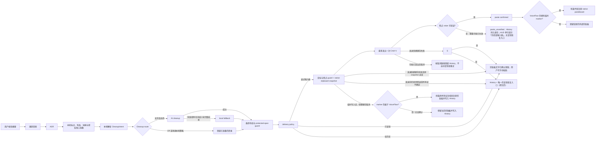
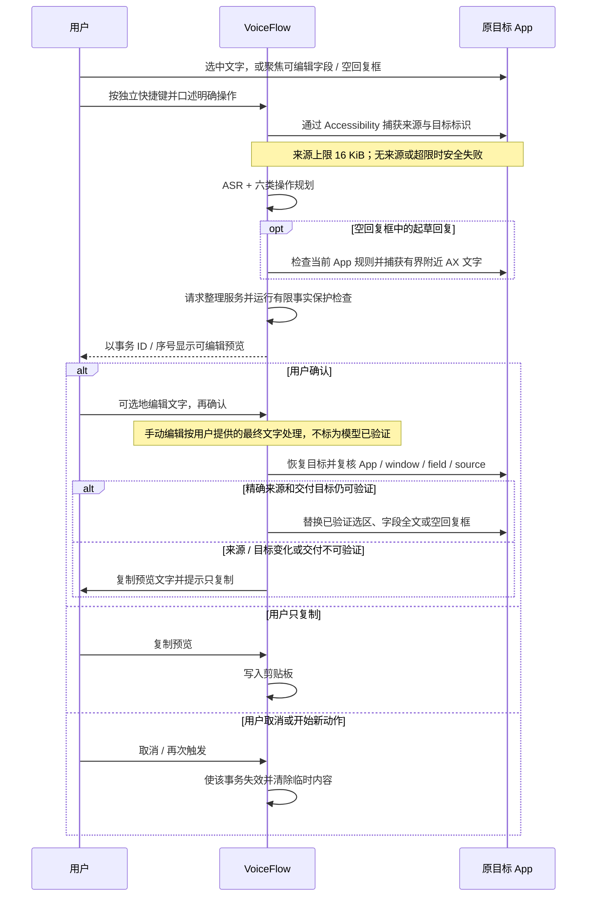

# VoiceFlow End-to-End Workflows

## 语气试跑与会话翻译

「编辑哪种语气」只选择编辑对象，不切换当前听写语气；试跑标明使用当前草稿或已保存配置。设置里的语气选择与单个手动试跑预览位于 Prompt 折叠区外；展开或收起 Prompt 不会重新挂载预览、触发试跑或取消正在进行的请求。普通折叠保留草稿及现有失焦提交，错误所在分组自动展开；快捷键录制所在分组从准备暂停热键到恢复完成期间不能收起。

后台设置快照按语气 id 和内容同步；相同内容不会重置编辑器。正在编辑的未保存 Prompt、名称和新建语气保留，其余语气接收更新；明确放弃草稿后使用最新已保存配置。错误在所属操作旁显示；试跑不可用时说明需要补全的字段，取消试跑后焦点返回试跑按钮。等待暂停热键期间离开页面，迟到的暂停完成会恢复全局热键，不进入录制或保存。

设置里的语气试跑是文字样例测试，不启动录音。请求携带当前语气草稿、用户输入文本和可选的已保存语气比较标记；样例最多 16 KiB，Prompt 最多 8000 字符。后端为该语气 family 构造场景，复用本机准备、整理路由、配置的 provider adapter、请求队列和最终保护检查。它清除测试快照里的片段和 App 映射，不获取真实窗口、上下文 grant 或风格示例；Prompt / Code 试跑使用 CodingPrompt，Terminal / Form / Search 使用对应字段类型。输出模式固定为自动整理以测语气，而 AI Off、强度和严格离线边界保留。试跑与听写共享服务限额，限流 / 重试事件独立，不改变录音 HUD。结果区分模型、本地-only、provider 回退和 guard 回退，包含试跑耗时；比较按已保存、草稿顺序进行，不将单次差异当作质量证据。它只返回内存结果，不进入交付、History 或学习。请求 ID 绑定取消；旧请求的取消 / 完成不能清除新试跑，取消早于请求启动时也不会重新发起。配置变更会废弃结果，90 秒到期终止试跑。本机 provider 错误仅在状态、准入阶段、发送标记和边界计数一致时显示为已确认的发送前容量拒绝；未知或矛盾字段不会被解释成已发送或未发送。

`translation_hotkey` 是可选独立录音快捷键（Fn 或组合键），旧配置和新安装默认空值。注册、按键录制、冲突校验与失败恢复都包括这条热键；使用全局 tap / hold_to_talk 录音方式，设置它不会修改全局按法。开始成功后，将 `translation_target_language` 固定在 DictationManager / StopClaim，分别应用到录音预取和停止处理的 settings 副本，只将本次 `output_mode` 覆盖为 translation。全局 `output_mode=translation` 也在开始时捕获目标；录音中的目标语言设置只影响下一次会话，不会替换当前会话目标。结束、取消、启动失败或下一次普通听写会清除临时值；按住模式只有同一来源、同一按压 ID、同一会话的 release 才能结束；其他热键和过期释放不会停止它。开始前检查实际场景的整理路由和凭据：云端 provider 需要可用密钥，On Device MLX 和 loopback LM Studio / Ollama 可无密钥运行；场景、离线策略或路由不满足时不采集音频。主 HUD 在录音时显示实际设备与计时，在处理时显示统一处理状态；翻译目标保留为会话辅助功能 / 详情元数据，不显示在主胶囊中。结果按现有交付状态处理，不把目标标签当作翻译成功证据。正常听写的截图边界、目标复核和 History 恢复策略保持生效。

翻译输出模式将完整的本机准备稿声明为明确的 `Translate` intent，并携带固定目标语言；正文不必加「翻译成……」前缀，正文里提及其他语言也不会切换本次目标。轻量、标准和重度整理都传递该授权，provider 与最终保护检查使用同一操作。AssemblyAI 翻译听写走 raw Sync ASR，再通过当前获准且可用的共同整理路由翻译完整准备稿，不使用 fused Dictation 候选；只有所选 provider 路线要求 API 凭据时才需要有效凭据，keyless 本机路线无需 API key。AI Off、保守场景和严格离线仍按现有策略限制路由。History 重试使用当前处理设置，临时热键模式不写入 History。

## 首次使用、自检和学习反馈

如果 Groq 密钥因 macOS Keychain 授权暂时不可读，用户可在前台 Settings 的 Groq 行明确点击「从钥匙串重新读取」。后端只读取当前应用固定的 Groq Keychain 项；成功时仅更新当前进程的内存设置，不保存设置或凭据、不连接 provider。重启后仍可能需要再次授权；取消、不可读、缺少项目或 Settings 页面关闭不会更改现有设置。启动与普通后台读取保持非交互。

主引导只有欢迎、权限、连接服务、听写试用、完成五步；完成页可主动进入选中文本试用。未进入可选试用时，结束引导不写入 `selected_actions_enabled` / `selected_action_hotkey`。连接服务默认显示 Groq 与 On Device 两条路线，服务商 / 模型 / 区域收在高级配置中；已有非默认服务商自动展开。On Device 在开始试用与最终保存时明确写入 `cleanup_enabled=false`，不把本机转写静默接到默认云端整理；运行时与 Cohere 语言检查仍是继续条件。

引擎保存与探测分开：服务商、端点、模型、凭据和首次设置完成仍检查所需凭据、host 绑定与本机模型状态，并执行既有 Keychain / 热键事务；主题、输入设备、增益和快捷键等非服务偏好只做结构验证，不要求服务就绪，也不读取、写入或删除未更改的凭据。首次 Finish 或跳过试用不发起合成音频或整理文本请求；服务可用性保留为未测试。用户主动 Probe 和试用才可能发送对应请求。`onboarded=true` 只代表完成设置，不代表转写或外部插入通过。麦克风自检读取已保存的输入设备、增益和合盖麦克风配置；其中任一更改仍在保存中或保存失败时，设置页标明未提交并禁用自检，只有保存确认后才可测试。

应用内试用以 `set_onboarding_test_mode(enabled, trialId)` 获取原生租约，返回 UUID `trial_id` 与后端 `config_generation` 十进制字符串。录音开始保存不可变试用快照；停止声明保留独立 `recording_generation`，处理 / 状态仍使用既有 `session_generation`。开始、采集、处理、错误和结果带同一试用身份、配置版本、有效性与 `trigger_source`；`native_hotkey` 只证明 native 回调接收，实体按键另需人工验证。选中文本由带 `trialId` 的命令绑定，过期或未选择时拒绝，不改读外部选区。释放必须匹配 trial ID；旧 React 清理不能撤销新试用。选中文本操作在接受声明时、任何异步准备之前固定试用与录音身份；读取试用选区前按同一租约和录音版本核对，旧操作不能消费新试用的文字或把新录音身份写到旧错误上。试用样例通过本机指纹和活动操作校验，普通选中文本继续复核外部原生目标与选区。只有持有声明身份的事件能携带试用事实；通用 HUD 状态不借用全局当前试用身份。试用在任何普通剪贴板 / History-only / paste 路由之前返回预览，撤销后仍保持预览路由，迟到结果不改成外部交付。成功试用不写普通 History 或启动纠错学习；真实外部交付必须单独确认。

如果 Groq 密钥因 macOS Keychain 授权暂时不可读，用户可在前台 Settings 的 Groq 行明确点击「从钥匙串重新读取」。后端只读取当前应用固定的 Groq Keychain 项；成功时仅更新当前进程的内存设置，不保存设置或凭据、不连接 provider。重启后仍可能需要再次授权；取消、不可读、缺少项目或 Settings 页面关闭不会更改现有设置。启动与普通后台读取保持非交互。

受控外部插入测试和生产焦点检查共用一个 PID 绑定的原生 Accessibility 捕获：同一焦点元素提供瞬态角色、窗口几何和 `CFEqual` 焦点身份，窗口号只在 CoreGraphics 候选唯一时记录。候选有歧义时，只有窗口标题和几何指纹仍匹配才继续粘贴；标题为空或指纹变化、缺失时退回复制和 History。两个窗口标题与几何都相同时仍无法识别切换。粘贴后的同字段回读不受此歧义规则影响。捕获前后复核前台应用身份。窗口标题等原始元数据仅在进程内用于匹配和生成本机指纹；receipt 只返回有限的捕获阶段 / 原因枚举，不返回目标文字、标题或指纹。捕获或目标检查失败且尚未进入插入交付流程时，剪贴板恢复明确为 `not_needed`；进入交付流程只证明该 owner 已开始执行，不证明按键已经发送。只有固定目标的同字段回读确认精确一次插入才报告 `exact_once`。辅助功能状态无法确认时，receipt 保留未知观察原因，不推断具体权限或系统故障。

自动粘贴提示可通过 `show_permission_guide(permission, guideId)` 打开 macOS 原生伴随窗，`permission` 仅接受 `accessibility` 或用户主动选择的 `screen`。当前 App 卡片使用 NSDraggingSession 与规范 NSURL 文件，不使用 HTML 图片拖拽或固定安装路径。原生窗口按当前中英 / 系统语言显示，可移动 / 调整大小，提供系统设置、Finder、重新检测和关闭。唯一系统设置窗口的几何元数据可确认且屏幕有空间时相邻摆放，否则保持独立可移动提示；不读取系统控件或截图来定位。权限仅以本机读回判断。无有效 bundle、签名未知或系统页不接受拖拽时提供说明与添加 / Open 替代路径。`close_permission_guide(guideId)` 只关闭匹配提示；主窗口关闭和进程退出也清理伴随窗。普通语音引导不触发屏幕权限。

麦克风自检通过 `start_microphone_check` / `stop_microphone_check` 主动开启，要求已有麦克风权限、空闲操作状态，以及输入设备、增益和合盖选择均已保存；未提交或保存失败的选择会标为未保存并禁用自检，避免用旧后端设置测试新标签。自检不发起隐式授权或服务请求。音频线程串行管理自检、录音和常开输入流。自检按保存的输入设备、合盖选择和增益打开实际 CPAL 输入，仅测量单声道音量、累计峰值与是否收到帧 / 信号，不缓存或编码样本。自检最多 30 秒，停止、离开设置、窗口隐藏或失去焦点、设备 / 增益改变或正式听写时关闭；正式录音优先，自检不能关闭新录音。结束后恢复原先获准的常开空闲流。自检事件独立于 HUD。会话 ID 过滤迟到结果和取消，取消先于启动也不会复活采集。开始命令五秒未返回时会发送取消。

词典反馈复用待确认与生效替换记录；实际收益由生产替换器记录它确实选择并应用的目标词，不把提示词命中或已正确拼写的文字算成替换。每个本机处理过程按目标词去重，存在 `learned_term_usage` 的次数 / 最近时间中；History 重新整理也可能计入。History schema v13 新建此表，不回填旧记录。统计发生在本机准备阶段，不能证明最终候选被接受、交付成功或识别质量提升。保守场景与无数据目录的语气试跑不写入记录。仅展示仍有生效学习规则的词条，忽略 / 忘记后隐藏；清空全部数据删除记录。读取失败保留已有数据并提供重试，不把未知统计冒充零。

完成页保存期间禁用可选试用入口，保存与读取设置都结束后才允许导航。词典页在听写完成后刷新学习反馈，覆盖粘贴确认、复制、仅历史、未确认和降级交付。

## 录音快捷键与设置事务

录音方式只有 `tap` 和 `hold_to_talk`，新安装默认 tap，默认绑定保持 `CmdOrControl+Alt+Space`。Fn/🌐 在点按模式下只在无其他按键的完整按下/松开后切换；组合快捷键在按下时切换，直到松开前忽略重复事件。按住模式在按下时开始，任一组成键松开即结束，短按同样结束。Fn 组合操作不会触发点按；纯按住期间加入其他键则取消该次会话。监听只检查必要的物理按键和修饰状态，不读取或保留输入文字。

自定义服务设置使用一个共享地址和 API Key，并为语音转写、AI 整理分别保存模型；只有两阶段都选择自定义服务时才将其显示为共享连接。远程服务需要对应服务或 Router 的 API Key；仅 loopback 本机服务允许留空。更换服务 origin（协议、主机或有效端口）后不会沿用旧 Custom 凭据；仅更改同一 origin 下的路径不会解除绑定。阶段测试只探测草稿中的对应阶段，不保存 key、修改设置或切换当前路线；「保存并使用」单独应用草稿。AI 整理的高级请求参数是默认留空的、有界 JSON 对象，只对自定义 OpenAI-compatible cleanup 生效，并进入日常短 / 长整理、History 重试 / 重新整理、写作预览及对应阶段的测试请求。空对象保持现有请求默认值；不能覆盖 VoiceFlow 管理的模型、消息、流式协议、认证、工具或输出形状。结构、类型、已知参数范围和凭据字段会在前端与后端校验；未知兼容字段在限制内原样保留，用户不得在值中放入密钥或其他秘密。非自定义路线和转写请求不使用这些参数。

Router 配置示例：在自定义服务地址输入 `https://router.example/llm/v1`，在 API Key 输入 Router 提供的密钥；转写模型填 `groq/whisper-large-v3-turbo`，AI 整理模型填 `groq/openai/gpt-oss-20b`。VoiceFlow 会在该地址前缀下分别请求 `/audio/transcriptions` 与 `/chat/completions`。语音转写使用 multipart `file`、完整模型 ID、`verbose_json` 和 word / segment 时间戳；固定中文或 English 会发送对应 `language`，自动检测会省略该字段。整理高级 JSON 只影响 `/chat/completions` 请求，不能填入 API Key 或其他秘密。这里的 `router.example` 是占位地址，需替换成你的 Router 服务地址。

原生输入通过 FIFO 队列先领取状态转换，再执行麦克风或转写工作。每次按压都有唯一标识；启动麦克风时收到松手或第二次点按会记住停止请求，启动完成后领取停止。空音频回到空闲，停止和处理期间忽略新录音手势。Esc 仍走通用取消流程；休眠、合盖休眠和监听中断清空按键状态并废弃排队输入，只取消 Starting / Recording，会话处于 Idle、Stopping 或 Processing 时不取消当前工作。中断时当前仍按下的键须先松开才能重新触发。翻译和跳过整理沿用同一录音方式，选中文本及看屏幕保持各自一次性流程。

schema 25 将旧 `double_tap`、`hybrid`、历史 `hold` 迁为 tap，保留合法绑定。旧单独 ⌘/⌥/⌃/⇧ 不被替换，保留显示并暂停注册，用户可改成 Fn 或组合键。捕获只提交绑定和目标，模式选择独立保存。录音或处理期间禁止修改。绑定事务先注册、再持久化、最后更新页面；失败恢复旧绑定，取消或完成捕获等待物理按键释放后恢复监听。仅绑定、模式或更新说明的修改使用结构校验，迁移也可在未读取到密钥时保存；服务修改、完成引导和开始录音仍要求相应就绪检查。

设置和引导共用就地快捷键编辑器：点击紧凑按键标签后，显示当前绑定、只读录入框、取消及适用的 Fn / 清除操作；主听写还可显式恢复默认 ⌘⌥Space。键盘捕获限于录入框，Tab / Shift+Tab 可导航；捕获期间的 Esc（含修饰键仍按下时）、点击外部、焦点离开该组、窗口失焦或隐藏均取消。WebKit 点击按钮时可能没有失焦目标，不能据此取消组内 Fn / 取消操作；外部点击与窗口失焦仍独立取消。物理键码避免 Option 字符与 Shift 标点变成另一枚键。新绑定要求 ⌘/⌥/⌃ 之一与其他键组合，或功能键；录音的 Fn 使用显式按钮，已有合法的普通单键 / Shift 绑定不被改写。重复事件忽略，WebView 在收到释放事件后将候选交给原生；WebKit 可能漏发普通键释放或保留旧修饰状态，因此原生等待所有物理按键释放后才注册、保存并恢复监听。准备、保存、取消各有进度；页面值只在原生确认后更新，错误在原位说明并可重试。全局捕获队列包含离开页面的未完成暂停或恢复，旧请求不能恢复下一次编辑的监听；尚未执行的暂停若已取消则跳过。明确取消可返回标签焦点，但外部操作后完成不会抢回焦点。

听写 HUD 收到设置发出的 UI 语言事件后更新译文而保留当前窗口与子组件状态；语言切换不重建胶囊。partial、progress、录音上限和限额事件只有通过各自的状态、代次与选中操作准入后，才会接管新 session generation 并清除旧会话的音频 / History 恢复入口及其详情操作状态；idle 中被忽略的 partial 和早于当前选中操作代次的限额事件不改变恢复 owner。同代次的已准入事件保留恢复入口，过时代次仍被拒绝。

## 1. 普通口述：默认自动交付


```mermaid
flowchart LR
  A[用户按快捷键] --> B[捕获音频]
  B --> C[ASR]
  C --> D[本机标点、布局、词典与授权改口准备]
  D --> E[本地解析 CleanupIntent]
  E --> F{Cleanup route}
  F -->|支持且启用| G[AI cleanup]
  F -->|Off 或场景本地策略| H[保留已准备的转录]
  G -->|成功| I[最终布局与 protected-span guard]
  G -->|失败/超时/空响应/未完整结束| J[local fallback]
  H --> I
  J --> I
  I --> K[delivery policy]
  K -->|尝试输入框| L[目标与焦点 guard + native clipboard snapshot]
  L --> M[最多发出一次 Cmd+V]
  M --> N{焦点 value 可验证?}
  N -->|是| O[paste confirmed]
  O --> P{VoiceFlow 仍拥有临时 marker?}
  P -->|是| Q[有条件恢复原 native pasteboard]
  P -->|否| R[保留较新的外部剪贴板]
  N -->|否：键盘可能已生效| Y[paste_unverified：History 持久保存；HUD 单行提示「先检查输入框」，无复制恢复入口]
  S -->|是| T[剪贴板文字已确认保留，用户可手动粘贴]
  S -->|否| U[History + 唯一的复制恢复入口（提交后）]
  M -->|发送快捷键前失败| S
  L -->|发送快捷键前失败且原 snapshot 未变| T
  L -->|发送前的其他错误或所有权不确定| U
  L -->|临时写入后、快捷键前取消| V{marker 仍属于 VoiceFlow?}
  V -->|是| W[经最终所有权复核恢复原剪贴板并写入 History]
  V -->|否 / 无法确认| X[保留当前剪贴板并写入 History]
  M -->|可能已发出后取消| Z[按取消路径保留 History，不自动复制或重试]
  K -->|只复制| T
  K -->|仅历史| U
```

普通听写在所有 App 都优先使用一次键盘粘贴；Accessibility 只用于确认目标与读回结果，不直接编辑字段。准备临时剪贴板时会读取当前焦点字段可用的 AX value 和 UTF-16 选区范围；发出 `Cmd+V` 前复核其中已知的值和范围。macOS 系统安全输入开启时，VoiceFlow 会读取其 owner PID 并与已捕获的目标 PID 比较：目标 App 持有时拒绝自动粘贴；其他 App 持有、owner 不明或探针不可用时都不发送快捷键，并进入现有剪贴板 / History 恢复路径。AX secure text field 检查仍独立保留。若其他 App 持有 secure input，或系统状态持续开启，自动粘贴会在此期间退回复制流程。已知 AX 值或范围改变、或变得无法读取时，同样不发出粘贴快捷键；原本无法读取的 AX 字段仍保持 unknown，按原有能力继续处理。`Cmd+V` 发出不等于目标控件接收成功：读回沿用同一保留字段锚点并做有界观察；首次 AXValue 与预期完整 splice 不符时，最多再用一次完整范围 AX 读取，且必须精确匹配全文、UTF-16 字符数和插入位置后的折叠光标，同时前后复核目标与焦点身份；轮询期间只复核前台 PID、bundle、窗口 ID 与焦点锚点，不再查询浏览器 URL / 标签页（不运行 AppleScript）；最后一次读回之后只做一次最终目标复核，浏览器目标按 URL 加标签页序号比较，不含页面标题，因此粘贴后标题变化不会让结果变成未确认，在已启用浏览器访问时，同站点切换标签页仍会被拒绝（粘贴前的目标复核仍包含标题）；光标原本无选区（折叠光标）或字段为空时同样可用。若替换文字与原选区完全相同，AXValue 不变而无法证明粘贴发生，此时 AXValue 相等不算确认，只有完整范围光标证明可确认：在轮询的第 1 次、第 5 次和最后一次最多各尝试一次（共至多 3 次），完整范围不可用时立即停止轮询；没有该证明时结果为未确认（读回不可用），不算成功，不恢复旧剪贴板、不开放撤销；空替换文字永不确认。该证明不移除换行或归一化正文；缺少粘贴前完整 AXValue 时仍为未确认。无论读回延迟或不确定，都不会发送第二次快捷键。VoiceFlow 先保存 native pasteboard snapshot 和 ownership marker，正常粘贴在确认后，会在 marker 仍由 VoiceFlow 持有时恢复旧剪贴板。只有键盘粘贴确定未发出且 marker 仍归 VoiceFlow 所有时，才会把听写文字留在剪贴板作为手动恢复路径；如果快捷键可能已经发出但没有精确读回证明，结果记为 `paste_unverified`：继续持久化 History，HUD 只显示单行「先检查输入框」，不恢复旧快照、不显示复制恢复入口，也不自动复制或重发；用户确认目标中没有文字后可自行打开 History 复制。若其他 App 已更新剪贴板或所有权无法确认，VoiceFlow 保留当前剪贴板并把文字放入 History；最终交付方法为 `history` 且文本可恢复时，History 写入后提供一个精确事务的复制恢复操作。临时剪贴板只声明 plain-text、owner marker 与 `org.nspasteboard.TransientType` / `org.nspasteboard.AutoGeneratedType` 提示；提示对剪贴板管理器是建议，不保证其隐藏内容。快捷键确定未发出且 marker 仍通过最终所有权复核时，取消会经既有恢复 owner 恢复原 snapshot 并写入 History；所有权变化或未知时保留当前剪贴板并由 History 恢复。快捷键可能已经发出时取消绝不恢复旧 snapshot，继续采用读回与 History 路径，避免误覆盖或重复插入。尚未准备临时剪贴板时发生的失败，只会在原 snapshot 仍未变化时尝试安全复制回退。

VoiceFlow 在每次冷模型加载前，以主机 `hw.memsize` 的 80%（向下取整）作为两个自有 sidecar 的合计 footprint 上限。当前只有精确固定身份的 Qwen3 ASR 0.6B 和 Qwen3.8-27B MLX 6-bit cleanup profile 获准：冷加载额外预留分别为 2.25 GiB 和 25.75 GiB；数值来自既有单次观测加 25% 并取整，不保证覆盖实际峰值。32 GiB 主机的 cap 为 27,487,790,694 B，低于 cleanup reserve，因此 27B 冷加载会被拒绝；64 GiB cap 为 54,975,581,388 B，预算估算可能允许该加载，但仍取决于完整 footprint 样本和双 child 总成本。ASR 1.7B 与 Cohere 尚未标定，不进行冷加载。已驻留模型走原有快速路径，不重复预留；更换 ASR 模型时先卸载旧模型，再进行新模型采样和准入。

预算仅统计 VoiceFlow 注册且 `models_root` 相同的 sidecar 子进程。采样需取得完整的进程 birth identity、`phys_footprint` 和物理内存；任一事实未知、身份改变、算术溢出或预算超限时，拒绝冷加载；cleanup 记录为 `local_memory_unavailable`，ASR 走本机识别不可用错误路径。每个 pending LOAD 以 admission 时的 footprint 加对应 reserve 得到目标 `T`，该 child 的成本为 `max(当前 footprint, T)`；其他 child 的已结算成本为其当前 footprint。一个 pending token 只计一次；未知大小的旧 LOAD reservation 会阻止新准入，直到匹配 LOAD 终态或 supervisor 实际 wait/exit。采样期间 registry epoch 或 child identity 改变时拒绝该次准入并由调用方重试或 defer；锁不跨系统采样、IPC 或 await。

主机 pressure 通过严格的 `kern.memorystatus_vm_pressure_level` `uint32` 采样读取：1 为 Normal、2 为 Warning、4 为 Critical，其他值、长度错误或系统调用失败都为 Unknown。冷 ASR 只在 Normal / Warning 且完整预算可证时准入；Critical / Unknown 不加载。冷 cleanup 和 startup warmup 只在 Normal 且完整预算可证时准入；Warning / Unknown 跳过 warmup。已知 Critical 时仍保留原有 cleanup load / inference 保护，即使模型已驻留也不开始 cleanup。

如果 cleanup 的冷加载因 `local_memory_unavailable` 被拒绝，且已有非空 ASR 原稿，短 / 长听写和 History retry 会逐字交付原稿，绕过本地 cleanup、`local_cleanup_or_raw`、词典替换与最终文本改写；History 标记「本机内存预算不足，未运行本地整理；已保留 ASR 原稿」。不根据空原稿制造结果。History 对选中文本的重新整理在创建 revision 或改动剪贴板前返回明确错误，保留选区与已有记录。已知 Critical 继续使用独立的 `critical_memory_pressure` 状态和原有文案。

交付诊断先记录观察到的失败原因，不在最终目的地确认前承诺已复制或已保存。终态使用 paste owner 的最终 `delivery_method`：只有 clipboard ownership 已确认才显示已复制；History 只有在实际写入成功后才显示已保存，写入失败会显示保存错误。目标在写入前变化且没有剪贴板副作用时走现有 History owner，不会重定向、恢复焦点或再试粘贴。

Stop-to-insert 的既有汇总仍只计入目标读回已确认的粘贴；另有按七种交付结果分组的有界延迟汇总，包含未确认粘贴、复制、仅 History、预览、失败和取消。两类数据都只保留最近 128 个样本 / 组，并受 32 组上限约束。指标不包含听写文本或其他目标内容。每个已准入 stop 的终态另会 best-effort 写入本机 `diagnostics/dictation-performance.jsonl`，仅保留固定分类 / 结果 / 阶段枚举、捕获的 session generation、时间戳和有界耗时；最多 30 天、10 MiB，清空全部数据时随 `diagnostics/` 删除。它不表示读回已确认，也不包含转写、prompt、模型 / provider 标签或目标身份；繁忙、写入失败或进程退出可能导致记录缺失。On Device ASR 模型在任务完成后等待 15 分钟空闲，再尝试卸载；新请求会使过期的 idle-unload 任务失效。该计时器本身不证明模型已成功卸载。若 unload 请求失败或其响应无法验证，runtime 会终止并等待回收当前自有 sidecar 子进程、清除该 session，并把状态设为 `runtime_failed`；后续请求会创建新 session 再尝试加载模型。

On Device ASR 的本机诊断按阶段记录模型文件校验、runtime / sidecar 启动与握手、模型加载或复用、runtime 排队、推理交换和终态耗时。正式听写阶段还携带当前已准入 stop 的 `session_generation`，用于与该会话关联；独立预热和状态探测不伪造听写代次。记录只含固定阶段 / 结果码、耗时和模型标识，不含音频、转录、提示词或路径。失败、取消或未完成的阶段仍按实际终态记录。

普通听写的 `paste_text` / `copy_text` 使用录音开始时创建并贯穿停止处理的同一事务身份。剪贴板 writer 在排入阻塞 worker 前取得 lease；终态、取消或超时封闭新准入，所有已准入 writer 退出后才记为 closed。closed 只证明该 writer 生命周期结束，不证明粘贴成功、剪贴板已恢复或下一次录音已就绪。普通听写在粘贴前先写入带稳定 transaction ID 的 `history-pending/` intent，状态为 `delivery_pending`；必要的预交付 I/O 记录为 `HistoryJournal`。当当前音频保留策略要求保留源音频时，还必须等实际 spool FIFO 尾部 ACK，未确认就不交付。交付 owner 返回结果后，同一 intent 更新为实际 outcome 并提交 SQLite History；History、gold audio、spool 关闭和恢复各由有界 retained owner 持有并分别记录阶段耗时。确认粘贴后，主 HUD 和 live dictation operation 立即结束，不等待可选的 SQLite History、gold 或恢复清理；History-only 仍须等 History ACK 才报告已保存。若进程在粘贴和 History ACK 之间退出，启动恢复按稳定 ID 幂等保存精确文字并标为 delivery-unconfirmed / unknown，不自动 ASR、整理、再次粘贴或重试。后续存储失败会保留 transaction intent 和可恢复来源并显示待确认 / 错误，不伪报已保存。捕获与 retained History owner 均有界；实时 spool 会话使用租约推导的路径 scope，旧事务的 History 数据库提交不会占用新会话的输入读取和实际 CaptureWorker。下一次录音仍须通过真实 start 与 input-frame 回执；public readiness 持续为 Unverified，不能只凭 manager Idle 或 writer closed 宣称 Ready。旧回调依完成代次和 owner 身份验证，不能发布到新录音或隐藏新 HUD。

常驻的听写完成状态在 Island 文档中位于会被隐藏的胶囊可访问性子树之外，并由后端正常快照命令和 owner 生命周期事件更新。macOS 原生发布任务在主线程实际执行时重新读取当前 registry snapshot，而不重放排队时捕获的事务文字；同一进程内的原生标识修订号也不会倒退。它把实际后端快照发布到保留在现有 NSWindow 可访问性子节点中的原生 `NSAccessibilityElement`：人类可读值与可读标签分开，原生标识源包含进程身份、十进制字符串修订号、当前 / 上一终态身份、结果类别、准入封闭、writer 关闭和 writer 数量；剪贴板恢复与下一次录音 readiness 明确保持未确认。原生人类标签和值跟随 Island WebView 实际使用的解析后界面语言；语言变化只重新本地化，不改变事务证据或修订号。标识和值都不含转录或剪贴板正文。前端先订阅再读取快照，并按进程身份与十进制修订号拒绝迟到或重复状态；修订号耗尽会失败关闭。原生 `NSAccessibilityValueChangedNotification` 尚未发布，避免在 WebView polite live region 和原生观察路径的实际播报关系未经检查前引入重复播报。此 source implementation 尚未通过最终打包应用的原生 AX 检查，WebKit / AppKit 的实际可观察性、原生通知与 VoiceOver 行为仍未验证；它不是剪贴板读回或恢复授权，也不把 `Inserted` 解释为 clipboard restoration、`Ready` 或下一次录音可用。可选 History、音频与 spool 存储仍可能阻塞后续录音。

当实际交付方法为 `history`，或发送前的失败已留下可恢复 History transaction 时，HUD 可提供一个「复制听写文字」入口；它覆盖 History-only 的已保存、待确认或失败状态、明确未插入后采用 History 的结果，以及有确切 History 来源的发送前恢复失败。若快捷键可能已发出但读回未确认（`paste_unverified`），History 仍持久保存，但 HUD 只提示检查输入框，不提供复制恢复入口。面板仅携带当前 delivery owner 与确切 History transaction 身份，不把 transcript 放入事件或命令参数；用户点击后才从该 transaction 的 pending intent 或同 ID History 行读取文字，并只写剪贴板，不会重新 ASR、整理、自动粘贴或重试交付。ACK / 失败只更新仍显示同一 transaction 的面板；用户关闭后或新录音开始后，旧事件不能重建或覆盖新 HUD。剪贴板结果不确定时显示未知并禁用再次复制；仅在文本读取失败或明确未写入时允许用户主动重试。复制状态不代替 History ACK。


录音 HUD 与识别、整理、交付及结束状态共用同一深色 220×48、R24 胶囊；折叠时原生窗口为 244×64，恢复和详情面板从主胶囊上方展开，最多使用 320×116 窗口。录音期间主行显示录音状态，第二行显示采集状态、实际打开的设备和计时；第一帧到达前显示等待麦克风。录音电平只由当前会话最近收到的真实音频样本驱动；超过 750ms 未收到新帧时动效回到静止状态。停止按钮在录音和处理中保持同一位置：录音时停止并进入处理，处理中取消当前会话；Esc 仍可取消。它不会激活目标 App 或改变输入焦点。处理开始后隐藏设备与计时，所有 ASR、整理、重试和交付阶段统一显示「处理中」，不暴露内部阶段、倒计时或设备信息。录音和处理使用克制的灰白渐变边缘动画；静态终态、错误、恢复和学习提示统一使用黑灰表面、白灰文字及单条中性细边，不使用彩色描边。键盘粘贴可能已发出、但没有精确读回证明时，结果显示为未确认，不谎报插入成功或确定失败；HUD 只用一行显示「先检查输入框」，约 3 秒后收起，不自动展开详情、不显示复制恢复入口，也不自动复制或重试。精确转写仍写入 History，用户确认目标中没有文字后可自行打开 History 复制。只有实际 `history` 交付或有确切 History transaction 的发送前恢复失败且文字可恢复时，才显示唯一的复制恢复入口。选中文本操作不会写入 History，因此其未确认 HUD 不提供 History 入口，详情文案与无障碍播报也不引导用户查看 History。确认键盘粘贴且没有回退后，主 HUD 立即收起；空闲和取消也不留主提示。复制、历史、未确认、降级、错误和恢复提示按实际结果显示。恢复详情提供有证据支持的历史、麦克风、模型或服务设置入口；不自动重试或再次粘贴。录音动画仅在本代次收到 750ms 内的新麦克风帧时播放；减少动态效果或没有新帧时动画暂停。连续五秒没有首帧时会提示尚未收到麦克风音频；新帧到达后恢复为正在接收。正常停止后没有可用音频会明确提示检查麦克风，快速取消仍走取消路径。设备选择只影响下一次录音；显式选择设备不可用时本次启动失败并显示设备设置入口，不会在录音中切换到另一台设备。会话级流错误只恢复对应录音的音频；如果首次 History 保存失败，HUD 可显式重试该会话的 History 保存，成功后打开该记录；失败时仅在同一 spool 仍可恢复的情况下保留音频和重试入口。若 spool 已过期、被清除或无法恢复，结果显示为未确认，只提供检查 History，不声称音频仍在或已经保存。此恢复不自动重转写或粘贴。跟随系统默认设备的选择会在下一次录音启动时重新解析。Idle 预热流不按设备名称/采样率冒充设备身份复用；每次正式录音重新解析并打开所选输入流。录音 owner 保存实际打开设备可确认的 CoreAudio 稳定身份与 transport；Stop 时若当前 lid 已关闭且该身份明确为内置麦，capture 会关闭并排空已接受音频，保留部分录音后返回设备错误，不进入正常 finalization / ASR。外置、身份未知和 owned-WAV 回放不因该检查误拒；已有采集设备错误优先保留。物理流错误按实际 stream ID 归属，worker 错误同时绑定 stream ID 与录音代次；旧会话迟到事件不能污染新会话。当前 App / 语气、翻译目标和上下文来源仍可通过无障碍描述读取，不增加可视行或显示上下文文字。词典学习提示使用同一 220×48 胶囊，说明改正内容并提供撤销 / 关闭；撤销仅影响学习规则，不撤销已交付文本。麦克风电平反馈设置不会关闭文字状态提示。上下文整理也区分自然语言撰写提示与代码编辑、终端和安全输入；只有可确认的自然语言撰写字段使用 coding-prompt 整理意图，字段身份不明时保守处理。内置 Codex 的精确身份是窄例外：当 AX 仍将字段观察为 Code 时，只有完整 ASR 转录具备明确自然语言请求且无代码、命令或结构化数据特征，才在当前事务临时按 coding-prompt 整理；目标分类和自动词典学习规则保持原样。历史录音中没有保留的 AX 字段内容不会被追溯推断。

粘贴失败或未确认时，History 会保存稳定错误码和不含听写文字的操作提示。详细本机诊断位于 `app_data_dir/diagnostics/paste-delivery.jsonl`，记录失败阶段、目标 App bundle ID、Accessibility / 焦点检查、clipboard snapshot 与 ownership、键盘尝试、读回验证和恢复结果；不记录 transcript、窗口标题、URL、PID 或密钥。启动和写入时会清理超过 30 天的记录，并从最旧记录开始裁剪到 10 MiB；“清空全部数据”也会删除该日志。

History-only、临时剪贴板所有权丢失 / 未知和 post-write cancellation 都以 History 作为恢复路径。若 SQLite 未能写入这些结果，HUD 会报告保存失败，并对确切 transaction 提供 clipboard-only 文字复制；这不代表 History 已保存。pending intent 使用与 History 相同的正文和上下文过滤，不额外记录转写文字。当 `keep_audio_days` 允许时，短 / 长录音的源 capture spool 保留到启动恢复重建；精确 History 文字由 pending intent 单独保护。History 写入确认后，未选择保留音频的成功录音删除临时 spool；用户 opt-in 的成功音频写入 gold；需要显式恢复的失败、未确认或降级结果保留 manifest recovery session。清理等待真实 owner I/O 结束；clear 的 root lease 跨越 journal、delivery、History ACK 与最终 spool I/O，存储错误不会被报告成已保存。

录音捕获的 16 kHz F32 轨迹保留在最多 15 分钟的有界内存缓冲中；采样率转换在结束时按源样本数冲洗 sinc 尾部，使输出覆盖完整的有理数采样区间。首帧到达后，若相邻真实采集帧超过 750ms，新鲜度跟踪器会锁存该录音的不完整状态；短暂静音不算作帧间隔，恢复来帧也不会清除锁存。Stop 仍会关闭 capture、排空已接受音频并走既有音频保留 / 恢复路径，但该会话返回捕获错误，不把存在缺口的音频交给 ASR 当作完整成功。首帧之前的等待不触发此缺口判定。捕获队列溢出代表样本丢失，也会在 ASR 前将整段录音标为不完整；spool 队列溢出只影响落盘确认，内存里的完整轨迹仍可继续处理。录音开始只在内存中预留 spool session 路径；有界 spool owner 随后独占创建目录和 manifest，并写入 F32 恢复分块。该 owner pool 最多三个会话；每个 owner 的队列最多 16 条、合计 40 MiB；创建失败不会覆盖已有恢复目录。生成提交用 WAV 不再同步写出并重读临时 raw 文件。捕获停止的应答窗口为 200ms；超时后迟到结果不再选为本次停止结果，owner 与其 session lease 保留到实际退出。普通成功 finalization 将 spool lease 与 WAV 一起交给 History handoff；known no-side-effect 路径明确请求完成清理，已 journal 的交付则在确认 History 或保留恢复源之后关闭 owner。长录音 finalizer 的完成、取消和删除仍直接封闭 producer admission，采样队列关闭不会自行把录音选成 Recoverable。spool worker 与最多三个 retained History store owner 分开限额；History transaction 仍用 scoped I/O gate。每 session 实时 spool 写入按租约推导的路径 scope 隔离；扫描、完整 quota / retention 枚举、清空和兼容旧路径保留 root-wide scope，并与所有 session 冲突。共享 spool quota 在互斥预留账本中同时计入磁盘内容和未完成写入，reservation 直到真实 I/O 返回才释放。恢复扫描、保留清理、History 提交和 gold 写入在覆盖其完整 quota / enumeration 的 scope 下运行；争用时有界 spool owner 保留已接收命令并有限间隔重试，不在 capture callback 等待，也不建无界 worker。文件系统操作或 History ACK 超过 5 秒时，调用方只报告待确认；已入队操作的 owner 与 root mutation lease 继续保留，不会把超时当作已保存。清空数据先取得 root 级排他租约；进行中的录音、恢复、保留、History 修改或 retained 写入会使清空返回 busy。session lease 使用代次标识，旧 owner 退出时不能删除后来复用的同一路径。lease drop 只请求实际 owner 收尾；I/O 返回前 owner 与 mutation lease 不释放。此基础不启用生产语音过滤，也不代表麦克风端到端验证；spool 是否完整可恢复仍需实际确认，不能按已保存显示。

真实硬件采集另检查采样时钟漂移：首个成功接受的回调建立单调时钟基线，排除该首块源帧和基线之前的启动等待；之后只累计成功入队的原生采样率 mono 源帧，不使用重采样后的 16 kHz 输出。源帧时长与基线后的实际单调经过时间相差绝对值严格超过 750ms，且同方向连续严格超过 750ms，才锁存捕获错误并发送一次 `CaptureError`。任一差值恰为 750ms 或持续恰为 750ms 都不会触发；误差回到阈值内或方向变化会重置持续窗口。Stop 竞态下仍排空并保留已接受 PCM，但在 ASR 选择前按不完整录音失败；错误事实也会进入 capture close trace。Owned-WAV 回放不启用硬件墙钟漂移判定，因此不会因 feeder 调度延迟而被误拒。

交付警告使用 HUD 的紧凑两行提示，说明原因和下一步操作，并显示 6 秒后淡出。

录音手势：默认 tap 点按切换，再按一次结束；也可选 hold_to_talk 按住说话，松开完整快捷键的任一部分即结束，短按也会结束。Fn 单键和合法组合键都支持两种方式，Esc 取消。旧配置迁移规则见上方「录音方式与快捷键」；更换绑定不改变方式。

服务页把当前生效路线与待应用草稿分开。provider、模型、区域、AI 整理开关和本机预设修改后只改变草稿；阶段测试只检查对应草稿路线，不保存密钥或切换当前路线。「保存并使用」才提交设置与对应凭据。Soniox 密钥随共用「保存并使用」操作写入钥匙串；设置界面没有 Soniox 连接测试，连接在开始听写时建立。严格离线开关立即执行保护策略。左侧「模型配置」下有「服务配置」「API Key」「本地模型」「高级设置」四个独立页面；四页在同一设置视图中切换，保留路线草稿与进行中的本机模型操作；共享保存栏只在有待处理操作时出现。模型下载与管理位于「本地模型」；Custom、本机服务地址、区域、预设、LM Studio 检查和请求参数位于默认收起的「高级设置」。API Key 页面默认显示所有支持凭据输入的 provider，每项只有一个默认收起的编辑器；Ollama、本机 Whisper 和 Custom 的密钥为可选输入。四个页面之间切换保留草稿。App 映射的高级条件可折叠，独立授权始终显示且保持原值。

Installable Test 的一次性 Groq 凭据导入由最终签名 App 的固定 `--import-test-groq-key-stdin-v2` 命令提供：调用方把单行密钥经 stdin 送入并关闭输入，App 在启动 Tauri 和单实例分流前退出导入命令。它只向新的 Test Groq Keychain v7 主 / 回退项执行 create-only 写入并读回确认；同值重试幂等，不同值冲突或验证未知时不覆盖。旧 Test Groq v1 / v2 / v3 / v4 / v5 / v6 项保留且不会被该路径读取、删除或修改。固定只读 `--test-groq-key-status-v1` 命令可查询两个 v7 槽位；输出仅含固定状态、阶段、等待结果、耗时、数字 OSStatus 与 `prior_add=unknown`，不含密钥或 Keychain 标识。stdin 有 512 字节上限与明确超时，导入输出为固定状态码和有界脱敏诊断；之后由测试流程正常重启后台 App。自签名 Test build 的 Keychain partition 可能绑定可执行文件的 CDHash，不同 build 不保证能读取前一 build 写入的凭据，测试流程可能需要由该 build 的最终 App 重新配置。该路径不调用 provider、不接收 argv / 环境变量 / 文件中的密钥，也不影响普通应用、其他 Test provider 或 History 凭据。

同一 Installable Test bundle 在 macOS `research-harness` build 中可用固定 `--research-owned-wav <absolute-path> --target-nonce <uuid>` 入口执行有界的已知 WAV。入口默认要求固定本机 ASR 与本机 cleanup，也可通过严格解析的 `--research-owned-route` 明确选择 native/Groq 的四种组合；云端只使用 Groq `whisper-large-v3-turbo` ASR 和 `openai/gpt-oss-20b` cleanup，并要求当前已保存设置、凭据和非严格离线状态完全匹配。它将经过固定哈希和 PCM 格式校验的同一份 WAV 字节送入现有 capture / finalization / ASR / cleanup / paste 路径，不调用麦克风、不为测试修改已保存 provider，也不把该 session 送入词典学习；实际重试与 cascade 仍由生产 provider owner 决定并记录。开始与插入前都必须在同一 PID 绑定的受控可编辑字段中读到完整 nonce fixture 和精确 UTF-16 选区，授权有效期为三分钟；只允许固定的本机 Chrome 测试页或私有的 nonce 绑定 TextEdit `.txt` fixture。TextEdit 还必须匹配固定私有 fixture 目录下的规范文件 URL、UUID 文件名、窗口标题和完整字段值；个人文档不在允许范围内。任何插入检查失败都不会恢复焦点、改写目标或复制到剪贴板。只有同一已授权来源和仍有效的原目标租约下，明确的 prewrite `target_changed` 且诊断证明没有剪贴板写入或键盘尝试，才继续走同一个 History owner；取消、过期租约、未知诊断及任何写入副作用仍失败关闭。History 只在保存成功后报告为已保存。Window ID 通常要求 AX window title 与 geometry 严格匹配；只有字段 `AXWindow` 与应用 `AXFocusedWindow` 的直接对象相等证明，才允许用完整有效 geometry 唯一匹配同 PID、屏幕内、layer 0 的 CoreGraphics window，而忽略可变标题；明确不等会失败关闭，证明未知时保留严格标题路径，geometry 缺失或有歧义时不猜测。`audio://owned-replay` 生命周期记录和成功时的 stderr 摘要只含固定源 hash、generation、帧 / 采样计数与阶段；目标准入失败的 stderr 诊断另含静态 admission / focus 阶段与原因码、稳定前台身份布尔值及有界 paste 错误码，不含源路径、nonce、PID、窗口、字段内容、音频或转录。此入口只验证软件回放路径，不能替代物理麦克风验证。

ASR 默认保持 Groq `whisper-large-v3-turbo`；cleanup 默认保持 Groq `openai/gpt-oss-20b`。新增预设不覆盖已保存的 provider/model/custom endpoint。SiliconFlow 仍默认 `FunAudioLLM/SenseVoiceSmall`，另有可选 `Qwen/Qwen3-ASR-1.7B`。新 provider IDs 为 `fireworks`（`whisper-v3-turbo`，base host `https://audio-turbo.api.fireworks.ai`）、`mistral`（`voxtral-mini-2602`，base host `https://api.mistral.ai`）、`soniox`（实时流式专用 `stt-rt-v5`，WebSocket `wss://stt-rt.soniox.com/transcribe-websocket`）、`assemblyai`（Universal-3.5 Pro Dictation / raw Sync）和 `dashscope`（只接入 `qwen-audio-3.1-asr-flash-message`）。Fireworks 可用性尚未核实；Qwen 账户与地区可用性尚未核实；Soniox 的真实麦克风生命周期尚未验证；本阶段未验证 AssemblyAI / DashScope 帐号与服务可用性。Deepgram 预设不启用 `multi`，此处不声称它支持中文或中英混合。

On Device 是单独的本机 ASR provider。新选择默认为 `qwen3-asr-0.6b`，也可选 `qwen3-asr-1.7b` 或 `cohere-transcribe-2b`；MLX 运行要求 Apple Silicon 与 macOS 14 或更新版本。Cohere 要求将识别语言固定为中文或 English，自动语言模式不可用。SenseVoice Small 只作为旧设置和文件保留项，没有 MLX 推理支持；即使旧文件就绪也不能通过 MLX 推理探测。设置和引导页分别显示文件状态、sidecar 能力握手、当前模型 loading 和已 loaded 的具体模型；握手不等于已加载，也不等于实际转写成功。加载状态绑定模型 ID，用户可取消本次加载；取消会终止加载尝试，不更改保存的 provider / model 或删除下载文件。普通配置控件仍可在加载期间使用。

本地模型设置将功能分为“本机转写”（语音转成文字）和“本机文字整理”（转写后在这台 Mac 上调整文字和排版）；文字整理使用 VoiceFlow 管理的 MLX 模型。默认行摘要只显示模型名称、文件大小与简短状态；只有服务配置中已保存的本机模型显示“服务配置已选”，当前草稿中的模型显示“待应用”，不把选择草稿写成生效路线。下载后需在“服务配置”中选择模型并保存；模型在本机运行，下载需要联网。运行要求、版本、来源、校验信息和许可说明收在可键盘操作的技术信息折叠区，操作错误仍在页面提示。SenseVoice 仅作为旧版文件管理项显示，仍可下载、取消和删除，旧路线被选中或存在操作 / 错误时会展开以保留可达性。托管整理模型空闲时只提供删除，未托管且平台受支持时提供下载和折叠的导入操作；部分文件也可删除。平台阻塞信息、操作进度、真实错误与取消状态在常规视图可见；无状态、读取失败或平台能力未知时才显示刷新，操作期间读取失败仍可手动刷新，并继续轮询。

ASR 模型文件首次校验时会按固定清单完整计算 SHA-256。成功后可在模型目录外保存 app-private durable proof；后续只有模型来源、安装 marker 原始字节、根目录 / 模型目录和全部固定文件的身份（含设备、inode、大小、mtime、ctime、权限、所有者与链接数）都匹配时才跳过模型 payload 散列。proof 缺失、损坏或身份不匹配会触发完整重校验；写 proof 失败不会改变已通过完整校验的本次结果。显式研究来源准入继续完整散列并保留输入文件描述符，不使用该快捷路径。

严格离线模式只允许 On Device ASR，但允许本机 cleanup：经验证的 loopback Ollama `qwen3.5:4b`、已检查的 LM Studio `voiceflow-cleanup`（Qwen 3.8 27B MLX 6-bit），以及 VoiceFlow 管理的 keyless `on_device_mlx`。它阻止其他 HTTP ASR 路由与探测、云端 cleanup、History 重试、cascade / prefetch 和视觉请求；开启时会取消进行中的云请求，并保留已保存的 provider 选择。模型文件不可用时使用本地规则或关闭 AI cleanup，不转向云端；所有 ASR / cleanup 模型下载都要用户主动发起并需要网络，启动不会自动下载。默认 Groq ASR / cleanup 与现有 provider、model 和 key 不因新增选项而覆盖。

`on_device_mlx` cleanup 使用 VoiceFlow 打包的 Swift/MLX 独立子进程，不依赖 LM Studio 应用 / CLI 或 Python；固定来源为 `lmstudio-community/Qwen3.8-27B-MLX-6bit` revision `05f38c1f39e2f39619653616fe8e96a5d676358e`。该路线要求 Apple Silicon 与 macOS 14 或更新版本；应用仍以 macOS 13 为最低系统版本，HTTP / cloud 及其他现有本机 cleanup 路线不受此 MLX 条件影响。平台不支持或状态未知时，设置页禁用导入和下载，后端也会在打开文件夹选择器或启动网络请求前拒绝；已存在的模型文件保留，取消和删除管理副本仍可用。用户可显式下载或导入匹配清单的目录，APFS clone 建立管理副本；取消保留已验证的 partial，删除只移除管理副本。首次加载与驻留状态分开展示，不代表模型质量。听写与 History cleanup 共用现有路由和最终保护检查；LM Studio 的 4096 字节限制不适用于此 provider。本机 MLX cleanup 与 LM Studio 的 HTTP / CLI 超时保留其 typed timeout 失败，不由共享队列自动重试。本机诊断按请求 ID 与 History 行 ID 记录队列、子进程启动 / 复用、模型校验与加载、生成、最终保护、revision 写入、剪贴板和终态耗时；校验摘要包含缓存命中 / 原因、文件数、实际散列字节数及 SHA-256 后端。首次迁移或证明缺失时会完整校验固定清单中的模型文件；成功校验后，应用把证明保存在管理模型目录之外，并在后续启动逐项核对固定模型来源、安装清单和文件的设备 / inode / 大小 / 修改与变更时间 / 权限 / 链接 / 所有者等身份。身份相同且目录中的 `*.safetensors` 与固定清单完全一致时才跳过大文件 SHA-256；证明损坏、清单、shard 集合或任一身份变化都会保守地重新完整校验。证明缓存无法写入不会使已经通过完整校验的本次加载失败。Qwen 3.5 cleanup 可复用安全的系统前缀 MLX cache：生产 Prompt owner 为 Light 请求标出 transcript 前的固定任务、档案与词典配置；Standard/Code builder 在无 previous-chunk 实时 context 时标出 Transcript 前的实际配置边界（profile/style 等精确 tokens 会绑定 cache key），有 previous-chunk context 时明确退回 system-only 边界。完整 Prompt、profile、词典、模板及生成设置保持原样，持久化候选仍由完整实际 Prompt tokenization 与两个不同特殊 token 后缀探针共同确定，并遵守 producer 给定的 UTF-8 边界。缓存 key 绑定模型清单、打包 sidecar 运行时、锁定的 `mlx-swift` 0.31.4 / `mlx-swift-lm` 3.31.4 / `swift-transformers` 1.3.4、固定前缀 tokens 和 512-token prefill 设置；Transcript、原始 ASR、实时上下文、选择区、窗口文字与生成结果留在每次请求的未缓存后缀中。每次请求从官方 MLX cache 的独立副本继续处理后缀，完整 Prompt 仍按 8192-token 总预算验收。缓存快照位于 app-private `cleanup/.voiceflow-mlx-cache/prompt-prefix`，与模型目录及耐久校验证明分开；单份快照上限 512 MiB、目录 / 文件权限为 0700 / 0600。读取前验证有界 safetensors header、类型、形状、偏移、缓存类、状态摘要与实际文件 SHA-256；损坏、过期或不匹配时安全视为 miss 并重新计算。缓存不改变模型、Prompt、生成参数或整理保护规则。符合现有边界的前缀可在首次请求时 build；512-token 对齐路径沿用现有 snapshot/persist/restore 行为。若该路径不适用，生产 Prompt、实际完整 tokenization 与两条空 user-prefix 的 system-only 探针共享且长度为 128–511 tokens 的前缀可作为仅内存 resident；此路径跳过 snapshot recovery、读取和写入，使用同一 state 大小上限和最多两个 resident。resident cache 每次请求复制后只处理新的完整 Prompt 后缀。

Onboarded、启用 cleanup、选择 `on_device_mlx` 且管理模型已存在时，应用会在启动、完成引导或保存会改变 warmup 路由 / Prompt 的设置后，以及用户主动导入 / 下载模型完成且文件仍通过现有校验后，按当前路由最多排队两个有界 warmup。重复触发以相同的相关设置签名、固定模型 revision、模型操作代次和 `processing_configuration_generation` 合并；不会使用每次保存都会变化的 `settings_generation`。较新的相关设置或模型操作会使旧任务失效。普通观察到的 Code 场景仍跳过隐式 live cleanup，并可使用 Code History/Reclean 变体；若另有空位且 General implicit route 符合本机策略，会加入 General implicit 变体。每个 warmup 使用生产 prompt builder、固定合成输入和独立的一 token 内部评估，丢弃生成内容，不写入 History、剪贴板或学习记录。预热不读取麦克风、History、窗口或所选文本，也不下载模型。每个合成 prompt 只在 dictation phase、操作租约和前台 MLX cleanup demand 都空闲时开始；普通录音开始不会取消或等待当前 warmup，当前 prompt 可继续运行，后续 prompt 会等录音 / 处理结束再开始。实际 On Device MLX cleanup 请求（听写、History cleanup、Writing Preview 或明确的本机 cleanup probe）建立贯穿前台 future 生命周期的 demand，并优先使用同一 runtime、cleanup gate 和子进程。若 warmup 正在加载，runtime 保留 load 与 child，加载结束后跳过尚未派发的 eval；若 warmup eval 已派发，则通过同一 generation owner 发送绑定原请求身份的协作取消，并等待原请求 terminal 与匹配 cancel acknowledgement，才释放 gate。成功结算保留已加载 child 和模型 lease，取消中的步骤不计为已完成；terminal 先完成时按完成处理。协议错误、身份不符、两秒绝对期限超时、自然退出、设置 / 模型失效和 shutdown 仍走既有退役或失效路径。每个空闲等待最多五分钟，同一设置签名的前台打断最多重试两次；超出后等待下次触发。设置保存不等待 warmup；研究模式与 owned replay 不启动它。后台预热不会阻塞录音，但启动预热本身不保证首次整理延迟。

应用会把这些结构化元数据写到本应用的 `app_data_dir/diagnostics/mlx-cleanup-performance.jsonl`，最多保留 1 MiB 当前文件和 1 MiB 轮转文件；单条记录最多 4 KiB。超过 6 秒的本机整理事件还带有 sidecar 在准备前、准备后、生成计划后与终止时采集的 MLX 活跃 / 缓存 / 峰值内存、进程累计 CPU、minor / major 缺页与 page-in、物理内存占用、设备、任务优先级、线程 QoS 与热状态快照；这些进程级计数用于后续诊断，不能单独证明慢请求的原因。前台本机整理使用允许系统空闲睡眠的 user-initiated 活动范围；模型、生成设置和缓存策略不因采样改变。日志不包含口述文字、完整 Prompt、密钥、模型路径或 token IDs。stderr 未设置 `RUST_LOG` 时默认为 INFO；`RUST_LOG=info,voiceflow::mlx::modelstore=debug` 可额外在 stderr 显示最多 15 条按模型文件序号标识的散列阶段事件。JSONL 接收本诊断事件（包括这些文件级事件），不收集通用 stderr；Rust 与 sidecar 使用各自的单调时钟报告阶段耗时，不比较两个进程的绝对时间。

普通本机 ASR 的同一诊断文件会在部分 `inference_terminal` 失败事件中记录固定 `terminal_code`：`inference_exchange_failed`、`response_identity_rejected`、`response_status_failed`、`loaded_model_identity_rejected`、`transcription_result_missing`、`local_completion_incomplete`、`local_coverage_incomplete`、`local_generation_budget_invalid` 或 `local_empty_output_not_accepted`。没有对应分类的事件省略该字段；它不包含转写文字或原始 runtime 错误文本。

本机 ASR 请求被调用方取消后，独立 Rust owner 保留原 request/session/model revision、单一 sidecar I/O、Child 与该请求的私有 WAV。仅在读取匹配原转写的 `cancelled` 终态、随后匹配新 request ID 的 `cancel` 确认，且两帧均验证 session、model revision 和已加载模型 ID 后，才复用当前子进程；整个配对共用两秒宽限期。超时、错误响应、身份不符、EOF 或帧顺序异常会请求结束子进程；owner 持续保留 session 与 WAV，直至 `Child::wait` 观察到退出，再允许后续请求启动。被取消的 Rust caller 或模型加载 future 也不会提前清除活动 PID；只有保留真实 Child 的路径观察到退出后才能清除它。Swift ASR dispatcher 保留并取消确切 worker Task；固定版本 SDK 的 Qwen、Cohere 与 DSP 取消回调覆盖实际分块、预处理、token / evaluation 检查点。同步 MLX 原生调用仍不可被中途抢占；任务返回且 DTO 已转换后，模型 owner 同步其实际使用的 CPU 与 GPU stock streams，再按序写出原转写终态和匹配确认。模型在有效取消后继续驻留。Rust fake-child 和 Swift 合成 owner 测试只验证源和 fixture 行为，不证明真实模型取消时延、Metal 静止状态或打包 App E2E。

LM Studio 的 4096 字节限制计算完整 system 与 user 消息。Light 请求不再把 System 已有的任务和布局规则重复塞进 user 指令；它仍完整保留准备稿，并在不同的时候附上完整、仅供参考的原始转录，不截断文本来适配容量。超限会在模型请求发送前以 `input_too_large` 结果拒绝，并在 Writing Preview 显示输入字节、上限和已确认的未发送事实。其他错误只有其 owner 能确认时才报告请求阶段或发送状态。

HTTP ASR 上传 16 kHz、单声道、16-bit PCM WAV。VoiceFlow 每个直接 ASR 请求最多发送 10 分钟；更长录音分段后完整覆盖，不截断尾部。单次录音本身最多 15 分钟。默认分段阈值为 25 秒（设置范围 5–3600 秒），目标段长默认 35 秒（范围 15–60 秒）；达到阈值或 10 分钟直接请求上限时会进入长录音分段路径。SiliconFlow 的 adapter 另限制单文件 50 MB、音频 1 小时；Mistral 文档上限为 3 小时；Fireworks 没有在当前接线中声明 provider 文件或时长上限，10 分钟是 app 的直接请求上限。

| Provider / preset | 请求与已知能力 |
|---|---|
| SiliconFlow SenseVoice / Qwen3-ASR | multipart 仅 `file`、`model`；只自动检测语言，不发送语言或术语字段，也不请求 `verbose_json`、时间戳或置信度。 |
| Fireworks `whisper-v3-turbo` | multipart `file`、`model`；只自动检测，不请求术语、时间戳或置信度；服务可用性尚未核实。 |
| Mistral `voxtral-mini-2602` | multipart `file`、`model`；省略 `language` 时自动检测，也可指定单一固定语言；最多 100 个术语通过 `context_bias` 发送；只在自动检测时请求片段时间戳，不发送 Whisper `prompt` 或置信度字段。 |
| Soniox `stt-rt-v5` | WebSocket 实时流；`auto` 发送 `zh`、`en` 候选提示，固定语言发送对应提示，均不限制识别；不发送自定义 context/terms。服务端 provisional token 与 final token 分开处理。 |
| AssemblyAI Universal-3.5 Pro | 选择固定的 Dictation 与 Sync endpoint；Dictation 最长 120 秒并返回独立 `text` 原稿与可选 `llm_response` 候选；AI Off、本地-only 或长录音走同一公司的 raw Sync。Dictation 和 Sync 的产品 `auto` 都显式发送 `language_codes: ["zh", "en"]`；固定中文 / English 分别发送 `language_codes: ["zh"]` / `language_codes: ["en"]`。Sync 的术语只用 `keyterms_prompt`，最多 100 项 / 8000 字符，避免通用 prompt 覆盖 `language_codes`。 |
| DashScope Qwen Audio 3.1 Message | 只接入 `qwen-audio-3.1-asr-flash-message` 完成音频 WebSocket 路径；原始识别关闭 disfluency removal，原生 polish 不启用。Beijing / Singapore 区域保存为相应 HTTPS origin 并解析到官方 `/api-ws/v1/inference` WSS endpoint；不使用 Workspace ID、不虚构语言提示字段。 |

ASR 不会因服务错误静默改用其他 provider。若用户另行配置了准确识别级联，满足该级联条件时才会额外请求其指定 provider。HTTP ASR 使用 30 秒请求超时；429 最多重试两次，网络错误和 5xx 最多重试三次，`Retry-After` 等待最多 60 秒。401/403 不重试；取消会停止排队、重试等待或正在进行的请求。HTTP ASR 不跟随重定向。History 中重试恢复音频时，超过直接请求上限的音频会拆分并完整识别，不丢弃片段。

### Soniox 实时流式

Soniox 是用户单独选择的 streaming-only ASR 路径；它不会调用 HTTP ASR，也不会对同一录音启动 batch chunk prefetch。录音开始时，VoiceFlow 先启动非阻塞、有界音频队列和后台 WebSocket 握手，麦克风采集不等待网络连接；握手期间的音频仍按样本顺序入队。队列满或覆盖校验失败会把流标为不完整，停止使用该流结果，并保留完整本机录音供恢复。每个录音会话只有一个 finalization 与交付所有者。保存 Soniox 凭据只写入 Keychain 并显示为已配置；保存本身不连接 provider。设置界面没有 Soniox 连接测试，实时连接只在用户开始听写时建立。开启严格离线会取消当前云请求；进行中的 Soniox 握手、实时流和完整 WAV 重放会停止，不再发送后续音频帧或接受转录结果。

Soniox 的 provisional token 仅在当前会话内使用，不显示为已完成结果，也不启动 cleanup、写入目标 App、剪贴板、History 或学习。发送音频按实时节奏进行时，actor 仍通过同一 select 循环读取 WebSocket 消息，不在等待下一帧发送时阻塞接收。停止录音后，VoiceFlow 发送结束信号并等待 final transcript；只有最终转录进入已有本地准备、cleanup、保护检查与交付流程。历史记录保留 provider final 的 `asr_text`、本地准备后的 `raw_text` 与保护检查后的 `final_text`，不保存流式 provisional token。

若初次流的传输、音频覆盖或 finalization 失败，VoiceFlow 取消 / 拒绝该结果，用本机保留的完整裁剪前录音向同一 Soniox WebSocket 按近实时音频节奏重放一次；重放期间 HUD 显示“正在重新转写完整录音”。它不会把不确定的 partial 与重试结果拼接，也不会跨 provider 回退。两次尝试之间只允许这一次完整重放，不叠加 HTTP 队列重试；认证、请求格式或计费失败会作为可处理错误返回。此协议按实时节奏重放，耗时可能接近录音长度；可由取消终止，处理 watchdog 有界且最长 30 分钟。完整重放可能再处理并收费一次全录音；Soniox 按完整流时长计费，包括静音。实际价格依账户而异，参见 [Soniox 定价页](https://soniox.com/pricing) 和 [WebSocket API 说明](https://soniox.com/docs/api-reference/stt/websocket-api)。

### AssemblyAI 集成转写与原始 Sync

AssemblyAI 使用一把 Keychain key 和固定 endpoint，不是 OpenAI-compatible provider。保存 AssemblyAI 设置不连接服务；本机校验允许短 Dictation 的共同 cleanup 凭据保持可选。用户主动探测或实际试用的结果按其真实覆盖解释。对于总时长不超过 120 秒、且 CleanupIntent 允许 AI 整理的录音，VoiceFlow 发送 `POST https://dictation.assemblyai.com/v1/transcribe/live`。原始 `Authorization` header 携带 key；multipart 先发 `application/json` 配置，再发 `audio/wav` WAV 音频。此 endpoint 默认总会执行改写；省略或置空 `llm_instruction` 也会执行，接口没有 `cleanup=false`。

`text` 保留独立的 ASR 原稿，`llm_response` 只作为整理候选，`llm_error` 区分整理失败。候选通过与 Phase 2 一致的本机准备稿授权和最终保护检查后，才作为最终文字使用；接受候选会跳过第二次 LLM 请求。候选缺失、为空或 `llm_error` 时保留原稿；当前共同整理路由可用时，对本地准备稿只发起一次共同 cleanup，且只有所选 provider 路线要求 API 凭据时才需要有效凭据，keyless 本机路线无需 API key；没有可用路由时使用本地规则回退。成功的短 Dictation 候选本身可提供整理，不要求共同整理凭据。候选被最终保护检查拒绝时保留受保护原稿 / 本地回退，不再发第二次模型请求。

当 cleanup 为 Off / local-only，或完整录音超过 120 秒时，单路改用 `POST https://sync.assemblyai.com/v1/transcribe` 获取原始 ASR；同一 key 以原始 `Authorization` header 发送，并带 `X-AAI-Model: universal-3-5-pro`。配置 part 放在 WAV 音频之前。每次请求最多 120 秒；更长音频由有界重叠 chunk 完整覆盖，并要求每块都成功后才合并原始全文并最多做一次共同 cleanup；任一块失败时跳过全稿 cleanup 和交付，把原始完整 WAV 存入失败 History 供显式全音频重试。该 all-or-nothing 规则只用于 AssemblyAI 长 Sync；其它 batch 路线保留现有部分结果复制与完整音频恢复策略。长录音的模型整理使用当前获准且可用的共同整理路由；只有所选 provider 路线要求 API 凭据时才需要有效凭据，keyless 本机路线无需 API key。没有可用路由时保留 raw / 本地准备稿并用本地规则回退，严格离线仍阻止云端整理。保存的 key 本身不是探测结果；只有用户主动探测或试用才产生请求事实，单次 ASR 请求不验证共同 cleanup 服务或识别质量。Dictation 和 Sync 都明确发送 `language_codes`：产品 auto 映射 `['zh','en']`，固定中文与 English 分别映射 `['zh']` 与 `['en']`。这是预期语言列表；API 列出 32 种支持语言，但产品选择仍为 auto / zh / en。Sync 只通过 `keyterms_prompt` 发送最多 100 个、合计最多 8000 字符的相关术语；不附带会覆盖 `language_codes` 的通用 `prompt`。

### Qwen Audio 3.1 Message 原始转写

DashScope 设置显式保存 Beijing 或 Singapore：`https://dashscope.aliyuncs.com` 或 `https://dashscope-intl.aliyuncs.com`。这条路径在录音结束后上传已完成音频，不是 Soniox 式麦克风实时流。backend 将所选 HTTPS origin 转成对应官方 WSS host 加 `/api-ws/v1/inference`。连接使用 `Authorization: Bearer`，通过带 UUID 的 `run-task` / duplex 配置启动，等待 `task-started` 后才发完整音频；全部音频发完后发送 `finish-task`，仅在收到明确的 `task-finished` 时接受完成。模型固定为 `qwen-audio-3.1-asr-flash-message`，`disfluency_removal_enabled:false` 保留原始识别，interim results 不进入最终转录、cleanup 或 History。普通 HTTP `qwen-audio-3.1-asr-flash` 未接入此功能，也不标为可 raw-preserving。

Qwen Message 不提供已查证的固定语言提示字段，因此该路径使用多语言自动识别，不造出语言提示设置。只接收最终句子；服务若返回句子 / 词时间戳则按毫秒保留，heartbeat 不是转录，task-finished 的累计 usage 只记录一次。7168 输入 / 1024 输出 token 上限带来整段处理风险；VoiceFlow 对较长录音使用 15 秒目标、20 秒上限和 1.5 秒重叠的分段，并保留完整采集音频（包括安静片段）以保证覆盖。若任何块失败或达到输出预算上限，整段转写失败，不交付部分结果，完整 WAV 留在 History 供重试。此实现未验证实际账号权限、识别质量或延迟。严格离线会阻止这些云端路由、History retry、provider probe、预取和仍在进行的请求。

## 2. 长录音

1. 超过分段阈值后，音频按 chunk 处理；AssemblyAI 的每个 Sync 请求最多 120 秒，长录音与 DashScope 的保守 token 限额路径都必须由有界重叠 chunk 完整覆盖；HUD 保持单一「处理中」提示，不显示 chunk 计数或处理阶段。
2. 所有 chunk 完成后按来源音频的实际时间戳合并 transcript，再执行一次 cleanup 和最终 protected-span guard。AssemblyAI 不会逐 chunk 改写；它只合并 Sync 原稿后做一次全稿 cleanup。Qwen Message 也使用保守 token 分段并完整覆盖较长录音。只有双方词语及其可信时间都对齐到同一段真实重叠音频时才删除重复前缀；缺少可靠词时间或文本有多行布局时保留重复内容，避免把静音间隔前后两次相同口述删成一次。
3. Settings 的“长录音输出”使用 `delivery_policy`：

   - 自动粘贴：优先发送一次键盘粘贴；临时剪贴板准备前就失败时，仅当原剪贴板未变化才安全复制回退；
   - 写入当前输入框：同样使用 fail-closed target guard；键盘快捷键确定未发出且 VoiceFlow 仍拥有临时剪贴板时，会按实际 clipboard 结果保留文字供手动恢复；若在快捷键前取消，则按原 marker 最终所有权复核恢复旧剪贴板。快捷键可能已发出但没有精确读回证明时，按 `paste_unverified` 持久化 History 并只显示「先检查输入框」，不提供 HUD 复制入口或自动复制 / 重试；用户确认目标中没有文字后可自行打开 History。快捷键确定未发出但最终交付方法为 `history` 时，由精确事务的复制恢复入口提供手动恢复；剪贴板所有权丢失或未知时保留当前内容；
   - 复制到剪贴板：跳过键盘注入；
   - 仅保存到历史：不修改当前 App，也不覆盖剪贴板。

4. 任何部分 ASR、AI cleanup 或 delivery 降级都会保留 raw/final、原因和可恢复音频到 History。

长录音 spool 为每个分块记录来源样本起点和样本数；恢复时按整数样本区间合并相同的重叠部分，并保留每个来源样本一次。来源区间有缺口、重叠样本内容冲突或新旧区间元数据混用时，恢复会安全失败。旧的非重叠 spool 仍按分块索引串接；旧 manifest 如果显示重叠、但没有精确样本区间，则不能精确重建，也会被拒绝。

Spool 保留期按 manifest 的 session 创建时间计算，不会因启动恢复写入或重建失败而延长；重建失败时，未到期的源分块会保留到原定到期时间。短录音为 History 写入失败准备的单 WAV session 也使用 manifest 和同一保留期限。`keep_audio_days=0` 表示不保留 recovery 音频；启动清理会删除新建的同秒 session 与旧式平面 WAV，不会因秒级年龄仍为 0 而重建它们。创建时间缺失、无效或位于未来的 session 会保守清理。

HTTP providers 使用 batch ASR，且当前都报告 `streaming_partial_results=false`、`streaming_final_results=false`；只有 Soniox 报告 partial 与 final streaming capability。该 capability 描述协议接线，不代表真实录音行为或延迟收益已验证。Provider 时长与文件限制由 adapter 能力决定：SiliconFlow 报告 1 小时 / 50 MB，Mistral 报告 3 小时；未声明的 `max_audio_duration_secs=null` 不代表无限制。HTTP batch 路径下，VoiceFlow 的直接请求都不超过 10 分钟，录音不超过 15 分钟；超出直接请求上限的处理采用完整覆盖分段。batch prefetch 只服务这些 HTTP providers：它在录音期间于后台转写已完成的非 warmup 分块，但不向 HUD 显示预取文字，也不会写入剪贴板、外部 App 或 History。Soniox 真流式路径不再对相同音频启动 batch prefetch。HTTP 分块规划按固定校准样本和固定最大边界运行，不受音频设备 push 大小影响。对 HTTP provider，录音结束后只有最终分块与预取块的来源区间、精确样本内容、ASR 请求设置、录音 generation、配置 generation 和录音目标绑定都相同时才复用完整 transcript；缓存包含原始文字、分段、词时间、语言、置信度和 quota 元数据。取消、新录音或会影响当前处理的设置变化会丢弃迟到结果。若录音仍有效但交付目标改变，会保留可恢复的转写结果并通过现有剪贴板回退，不会向新目标注入；绑定到旧目标的上下文 / 视觉证据会丢弃。读取旧缓存 quota 不会覆盖较新的实时限流状态。静音裁剪、压缩或设置变化导致身份不一致时会重新转写，确保尾部和变化后的分块仍有识别覆盖。

录音预处理压缩长静音并裁掉数字静音，同时根据本次录音较安静的帧自适应判断语音边界；单凭固定音量门槛不会删除整段低音量语音。数字静音仍返回无语音。

普通与长录音先在本机按同一顺序执行语音标点 / 有界布局、用户词典与局部明确改口，再由本地解析 CleanupIntent。独立的中文口述标点词可以映射成符号；紧跟「把 / 用 / 加 / 换成 / 改成 / 删掉 / 输入」等编辑动词的标点词保持原文。局部改口排除引号与 Markdown code literal 区域。列表改口只在同一块中用显式 ordinal cue 唯一指向较早的编号项、且目标项、占位项、cue、reference、replacement source span 均逐字验证后，才替换那一项；cue 仅匹配完整措辞（包括 `spoken_revision` 的标记及其内部标点），proof 的来源字节范围绑定到标点保护检查通过后布局解析实际接收的输入；若标点变更未通过保护检查，布局会回退到布局入口文本并从该文本建立来源范围。proof 向最终保护 owner 提供这份布局输入的来源证据，不表示每个范围仍对应 provider 原始 ASR 字节。尾项明确计数保留也接受“算了吧，只要前两个”及“只留前两个”，仍须产生布局输入绑定的 retention proof；明确“不要第 N 个”或“删掉第 N 个”仅在同一块有连续编号列表且 N 指向实际列表项时删除该项，剩余项按原顺序重新编号。列表渲染会去掉项目末尾的分隔逗号，但 proof 仍保留布局入口 list_source 的原始 value 与 byte span；该坐标位于标点处理之后，不保证对应 provider 原始 ASR 的字节；数字、日期、代码、否定和其他 protected 内容不因渲染变化而改写。目标缺失、重复、歧义或修正语句处于 literal 中时，原项与改口 cue 都保留；解释性、假设和引用文字不会授权改写。没有显式回指的尾部“不对”仅在相邻的下一编号且既有 backtrack parser 确认时作为 false start 处理；其他情况不会猜作 forward correction。标点与每个布局阶段分别以该阶段完整输入定位引号 / code literal；只有解析器实际成功消费的精确语法范围可豁免自身 protected-span 匹配，每步检查通过后才进入下一步。payload 中的同词、部分重叠实体、引号内容和文件路径仍受保护；Markdown code 的外层 fence / backtick 可省略，但 code payload 必须作为完整 token / expression 逐字节保留，不能用扩展后的标识符、flag、路径、成员或调用中的子串代替，并保持原顺序、重复次数和代码块缩进；省略包装符号时，只要求保留 literal 边缘原有的 code attachment（比较局部语法时规范化空白），新接入的成员、调用、flag 后缀或运算仍会被拒绝，周围普通 prose 仍可按现有 cleanup 规则编辑；紧邻 CJK 正文时，只用原边缘相邻字符作最小锚点；重复或重叠正文必须能按顺序唯一绑定，否则保守拒绝；每条 transcript 最多绑定 64 个 literal、每个正文最多枚举 256 个候选出现，超限保守拒绝；布局标签只移除空白和明确的命令分隔符，保留文件名等 payload 点号；code literal payload 不计作 prose 的布局内容，口述布局恢复只以候选中已逐字绑定的 occurrence 作占位并从候选原样移回，不会从原稿补入缺失或修改的 payload。启用 cleanup 时，准备稿是模型编辑目标。仅在 Groq 的隐式 Cleanup 且完整 ASR 原稿与准备稿不同时，共享请求构造器会省略原始 ASR reference，以准备稿作为唯一文本依据；原稿仍保留在本机 History 与来源记录。其他 provider 和明确选区 / 操作沿用现有 reference 行为。语气试跑内存响应在最终 guard 前分别保留完整解析后的 provider candidate 和共享 cleanup adapter 接受后的文本；二者均不写入普通成功 History，adapter candidate 不代表未经处理的模型 wire response。最终验证不再对所有出现位置追加全局词典改写，并会拒绝丢失结构化行内容或改变代码缩进的候选。当整理关闭或场景被路由为本地处理时，不发起整理请求；短、长录音的 Off 结果都经过同一最终本地保护检查，并保持已准备的文字不变。provider 失败或验证拒绝时使用保守 fallback 并保留准备稿布局。未携带共享 cleanup plan 的遗留 Groq Cleanup 路径仍会追加固定列表保真提醒，并只在候选因遗漏编号列表前言触发布局拒绝时尝试有限恢复；恢复后的文字仍经过完整保护检查。该 legacy 提示不适用于普通短录音、长录音和 History 音频重试的共享 plan 路径；这些路径不追加该 reminder，且被拒绝的 `StructureSafe` 候选不会通过 preamble recovery 复活。其它非 StructureSafe 路径仍保留既有的受证明恢复规则，失败后走对应的本地 fallback。`asr_text` 保留 provider 原始结果，便于区分原始识别与本地准备后的草稿。

普通录音与 History 音频重试共享一份 effective cleanup policy：Auto 仍按既有强度解析，并只选择一个场景输出 add-on；手动 Email、Bullets、Meeting Notes 仅在有已捕获多行能力的兼容目标应用。本机只在来源 cue 足够明确时渲染推断段落 / 列表；证据不足时保留原呈现。History 音频重试没有活动目标的 multiline 证据，使用当前保存的场景 / 强度和翻译目标，但手动 layout mode 回退到该场景的 Auto add-on，不推断新布局。提供或本地渲染的结构使用 `StructureSafe`：provider 只能调整受保护 literal 外的安全标点，必须逐字保留所有词、大小写、空白字节、换行、列表前缀和缩进；canonical 和 projection 的既有 source authorization、literal、实体、列表 proof 与 finalizer 检查仍有效。模型不会创建标题、摘要或布局。Code 模式的普通听写与音频重试不调用共同 cleanup；AssemblyAI 此时走 raw Sync，不走 fused Dictation；既有明确片段匹配仍按原路径处理，未匹配片段时识别稿原样通过。选中文本已授权操作仍沿旧路径，翻译仍使用现有固定目标的 `Translate` operation。AssemblyAI 其余 fused 行为和指令保持独立；History 的已选择文字 Reclean 也不使用 live-mode Code 路由。

在没有 `StructureSafe` plan 的 legacy cleanup adapter 路径中，若同一 code literal body / attachment 绑定失败并同时导致布局检查拒绝，adapter 报告 `protected_token_changed`；其他布局拒绝仍报告 `explicit_layout_changed`。共享 StructureSafe 路径先运行标点专用 guard，这类候选会按结构拒绝处理，不走该 legacy taxonomy。

列表 owner 也只消费有 proof 的明确连接词、误起填充词和同一列表块里的保留指令；它不会全局删除「是 / 才是」，而会保留「是否 / 是不是 / 是什么 / 是的」、否定、强调和不确定语气。仅当 2–10 项的计数保留指令有连续序号证明，且相邻前一项的明确改口把一个值改成新值、后一项以「才是」开头并逐字复用该旧值时，来源 proof 才记录该连接词的精确来源与输出范围；准备稿 owner 在模型请求前按 proof 同步规范化该处，更新保留项和修订输出范围。provider adapter 与最终布局检查因此都检查同一份规范化准备稿，其他同词仍须保留。明确的「啊算了…只保留前两个」会按同一组 cue、动作、数量和连续序号事实解析：同一块内必须有末尾编号项中的直接撤回 cue，保留数量在 2–10 之间且小于当前编号项数，才撤回该数量之后的项；旧式「前面两个，第一个和第二个」仍要求唯一匹配前两项的显式回指。疑问标点组合、缺项或序号不符，以及角色不明的指令都会完整保留。指令里的「如果分支」等内容词本身不会把紧邻的实际指令改判为假设。跨段落或先前已交付的内容不受影响。通过解析的列表项正文可清理边界清楚的呃 / 嗯 / uh / um 等填充词和单个明确误起；「嗯嗯」等有意义的重复、普通词语前缀（例如 `umbrella`）与重复强调（如「非常非常」）会保留。模型遵循同一清理边界，但最终输出仍须通过来源、实体、否定和布局验证。

词典设置允许用户手动创建明确的「听写识别为 → 应替换为」纠正规则，并从当前运行的原生 App 列表选择唯一 bundle 范围；不要求先建语气 / context mapping，也不写入全局个人词典或编辑旧 History。保存后该 pair 不依赖目标词已存在于全局词典，仍通过唯一的当前场景适用集进入本地替换、提示、使用计数和最终来源保护。未知目标范围不匹配，已有相同 pair 在另一 scope 时拒绝覆盖；「忘记」使用现有 tombstone 撤销这条规则。当前手动入口不支持 browser host scope。

共同云端整理只有协议明确成功终止时才产生候选：OpenAI-compatible 流式需要 `finish_reason: stop`，已收到 stop 后的正常 EOF 可接受；`[DONE]` 本身不能替代完成状态。Anthropic 需要 `end_turn` 或 `stop_sequence`，工具内容不作为整理结果。缺失完成状态、过滤、工具调用或 token 预算耗尽走完整准备稿的本地回退。共同 LLM 和视觉客户端与 ASR 一样不跟随 HTTP 重定向。

Groq 的 Cleanup 候选若只因省略编号列表前的准备稿前言而未通过布局检查，adapter 会尝试一次保守恢复：准备稿与候选必须各自只有非空前言及同一连续编号块；编号、顺序、数量、分隔和每项内容必须匹配，候选前言只能是准备稿内容的删减。嵌套列表、尾注、引号或代码 literal、数字、否定、实体或文字系统变化等歧义都会拒绝恢复。恢复后仍运行原有完整布局、脚本和 protected-span 检查；失败仍按原拒绝与回退处理。仅 Groq 的 Cleanup 使用此路径；解析后的 provider 候选保持原样，只有通过全部检查的组合文字被接受，并记录固定的 `restore_prepared_preamble` 转换。它不增加请求，也不改变本机或其他 provider 路径。

History 将 provider 返回的原始文字写入 nullable `asr_text`；如果 ASR provider 在同一响应中明确给出独立融合候选，则另存为 nullable `provider_cleaned_candidate`。本地置信度过滤、口述修订和词典替换后的识别草稿在 `raw_text`，最终保护检查后的输出在 `final_text`，并记录实际产出识别草稿的 ASR provider/model。语义保真检查拒绝的完整 cleanup provider 文本与 typed reason 分别保存在 nullable `cleanup_rejected_candidate` 和 `cleanup_guard_reason`，与可能来自 ASR 融合路径的 `provider_cleaned_candidate` 分开。两列只记完整合法文本被语义 guard 拒绝的结果，不保存取消、协议错误或截断内容；History 折叠展示并沿用现有本地数据保留、删除与 JSON 导出。候选不写入普通日志或诊断，也不再发送给 provider；复制仍只使用 `final_text`。各字段保留各自来源，不会用本地或最终文字伪造 provider 候选。正常听写不会持久化已接受的 cleanup 结果；语气试跑的内存响应会分别返回完整解析后的 provider 候选、cleanup adapter 接受的候选（在最终保护检查前）、最终 `text`、实际 adapter 转换，以及适用时的 typed rejection stage/reason，方便比较各个阶段。provider 候选是解析后的完整消息，不代表未经处理的 wire response。`provider_cleaned_candidate` 仍表示 ASR 响应中的独立融合候选，不充当 cleanup 模型候选。History 重新整理与音频重试会绑定启动时的处理配置代次；provider/model、AI Off 或严格离线等相关设置变化会取消旧操作，避免旧请求重试或写入剪贴板 / History 修订，也不会把取消当作本地回退。History 重新整理从 `asr_text` 原稿重新执行本机准备与共同 adapter/finalizer，不使用已处理的 `raw_text` 或 `final_text` 作为源。旧记录若缺少、为空或仅含空白 ASR 原稿，会沿用“没有可重新整理的原文”错误，不回退到处理稿。完整序列化请求仍由本机 4096 UTF-8 字节准入校验，不截断。超限时保留回退稿并保存 `native_input_too_large` 原因，History 提示实际与上限字节数。重新整理在等待 provider 前捕获剪贴板 lease；只有成功结果且原剪贴板仍匹配该 lease 时才复制。失败或降级不复制；剪贴板变化、所有权未知或写入失败时，结果保留在 History 并记录交付状态。音频重试会保留本次重新识别的完整原始转录供请求路由判断；如果目标是 Groq 且实际 intent 为隐式 Cleanup、原稿与本机准备稿不同，共享请求构造器会省略 raw ASR reference，最终请求只含准备稿。原稿仍保留在本地 History 与来源记录；其他 provider / 明确操作沿用现有 reference 行为。只重新整理选中文本时，不附加旧的 ASR 转录。操作 lease 保持到该操作返回。旧记录迁移后 `asr_text`、候选和缺失的 provider provenance 保持为空；History 单独展示这些来源，JSON 导出会保留 nullable 字段。 新记录还可在 History 详情中显示整理请求类别、首次 provider 失败原因、独立的最终输出保真检查原因和已观察到的响应调整代码；provider 候选仍只在真实候选存在时显示。旧行的缺失 provenance 保持未知；最终保真检查拒绝不覆盖先前 provider 失败事实，失败也不会伪造 provider 候选。响应调整描述实际接受回复的代码，不保证该调整后的文字成为最终输出。编辑状态支持取消与 Esc，保存前停用复制、重新整理及删除，避免操作旧版本；`unverified` 显示交付未确认，不能冒充已复制。macOS History 音频重试在开始时捕获有界的本机 pasteboard snapshot；现有 owner 在写入前核对所有 item/type/data，并用临时文本和 owner marker 验证写入。快照仅保留在内存，不发给 provider 或持久化。起始捕获失败或写入前发现变化时转写只记入 History；其他平台缺少相同 native 准入时也只记入 History。写入 owner 的结果以 typed delivery fact 保存，成功才显示复制；AppKit 无原子 compare-and-write，最终复核与声明写入间保留窄竞态。词典加载独立保留各来源的最后成功数据，失败显示重试；学习撤销只在成功后关闭通知，旧操作迟到不关闭新通知。

普通听写的本机性能诊断只在当前进程保留最多 32 个 provider/model/path 分组和每阶段最近 128 个延迟样本。它分别汇总静默预识别、最终 ASR、整理、最终验证、粘贴提交、读回确认和停止到已确认插入，并区分已发送、已确认、未确认、复制、仅历史、预览、失败与取消。ASR 用量记录实际 HTTP 请求与失败数（包括队列重试）、提交 WAV 时长和可解码时长的请求数；流式路径另记录尝试 / 失败数、session 墙钟时长、发送音频秒数和重放音频秒数。墙钟时长与发送音频量是诊断指标，不等同于服务商报告用量或费用；Soniox 按实时流完整时长计费，包含静音。provider 返回的最多 8 种固定单位和数量保持独立，不换算为费用。键盘快捷键只发送一次；目标 / 焦点改变、取消或读回 unknown 不会触发第二次注入。第一次读回前固定等待 250 ms；之后在同一个 AX field anchor 上按固定间隔轮询：已知预期 splice 时最多 10 次、排程等待合计 1.8 秒，否则只轮询前 5 次（300 ms）；这是排程等待，不含原生 AX 调用耗时，不是墙钟时限。AXValue 只接受完整预期 splice。只有键盘快捷键确定未发出且临时 marker 仍由 VoiceFlow 持有时，才会按 `clipboard` 方法保留文字供手动恢复；取消在同样的发送前和所有权条件下会恢复原剪贴板。键盘可能已发出但没有精确读回证明时记为 `paste_unverified`，继续持久化 History，HUD 只显示「先检查输入框」，不提供复制入口或自动复制 / 重试；快捷键确定未发出且最终方法为 `history` 时，用户可通过精确事务的复制恢复入口手动复制。剪贴板所有权丢失或未知时保留当前内容。停止到插入只统计读回确认成功的粘贴，AX 安全编辑会记入读回确认时间。诊断不包含文本、音频、上下文、图片、目标、URL、endpoint 或凭据；用户可在设置中读取并主动复制 JSON，不会自动上传。

## 3. 选中文本助手：preview-first


```mermaid
sequenceDiagram
  participant U as 用户
  participant V as VoiceFlow
  participant T as 原目标 App
  U->>T: 选中文字，或聚焦可编辑字段 / 空回复框
  U->>V: 按独立快捷键并口述明确操作
  V->>T: 通过 Accessibility 捕获来源与目标标识
  Note over V,T: 来源上限 16 KiB；无来源或超限时安全失败
  V->>V: ASR + 六类操作规划
  opt 空回复框中的起草回复
    V->>T: 检查当前 App 规则并捕获有界附近 AX 文字
  end
  V->>V: 请求整理服务并运行有限事实保护检查
  V-->>U: 以事务 ID / 序号显示可编辑预览
  alt 用户确认
    U->>V: 可选地编辑文字，再确认
    Note over V: 手动编辑按用户提供的最终文字处理，不标为模型已验证
    V->>T: 恢复目标并复核 App / window / field / source
    alt 精确来源和交付目标仍可验证
      V->>T: 替换已验证选区、字段全文或空回复框
    else 来源 / 目标变化或交付不可验证
      V->>U: 复制预览文字并提示只复制
    end
  else 用户只复制
    U->>V: 复制预览
    V->>V: 写入剪贴板
  else 用户取消或开始新动作
    U->>V: 取消 / 再次触发
    V->>V: 使该事务失效并清除临时内容
  end
```

支持的操作是改写、精简、翻译、结构整理、起草回复和按指令修改一个值或术语；模糊指令或保护检查不支持的结果会安全失败，不创建预览。捕获不到 AXValue 或精确选区范围时，选中内容只能用于生成和复制。完整字段替换要求可验证的辅助功能字段值，不会写到不确定的插入光标。系统不从环境剪贴板读取来源，也不按 Enter 发送内容。

结构整理可由明确的“整理成开发任务 / 工作进展 / 待办”指令选择三个封闭 recipe；quoted cue、否定 cue、冲突选择或其它操作不会携带 recipe。recipe 只加一个 Rust 定义的中英固定标题，并按来源原有空行给正文段落加列表标记；不改写、拆分、合并或重排正文，含代码 literal 的正文保持原样。预览携带有限 recipe ID / 版本，并显示模板和来源。该布局 proof 不能证明全文语义等价；有限否定 guard 会将受支持的否定标记绑定到后续最近的内容 token，允许有限形式变化 `don't` → `do not`（完整 `do not` 作为一个表达式范围），并忽略标点和空白差异。不同内容序列只接受所有最高分纯内容 LCS 对齐都把否定目标映射到同一预期位置的情况；重复词产生歧义时保守拒绝。该规则是有限词面证据，不是完整语义证明；否定目标 token 本身的同义替换不能建立词面对齐；未匹配或歧义沿原 preservation fallback。G2 的冻结任务、原生 App 和用户验收仍需独立完成。
模板在 16 KiB 结果预算内预留固定标题、换行和列表标记开销；无法完整容纳的来源会在请求整理服务前报来源过长，不会截断正文。

这些操作的语音指令经过共享录音 / ASR 路径；长音频仍完整覆盖分段。若 ASR 失败、需要重试，完整录音按恢复策略保存在 History；History 重试使用完整音频并且只复制结果，不恢复原来的目标字段，剪贴板准入与结果状态沿用前述 History owner 规则。操作来源文字、指令和预览仍不写入普通 History。

每个动作有一次性事务 ID 和递增序号。后端只消费一次匹配预览；重复确认无第二次效果。取消会立即关闭并 tombstone 该预览，并向后端发送匹配事务的取消请求，即使确认 / 复制 IPC 已经开始等待；是否已提交由后端 owner 的 commit 边界裁定：commit（含 ⌘V 与读回）不持有取消用的锁，取消立即触发令牌；若取消时 commit 正在进行，预览取消命令返回错误且不发 `cancelled`；全局取消（Esc、取消命令、设置变更、CLI）同样只触发令牌、不认领该动作，也不发 `cancelled`，由 commit 自己的结果（`replaced` / `unverified` / 过期 / 取消）为准，⌘V 发出前被取消则 commit 返回取消并由其补发 `cancelled`。取消 IPC 未确认时显示状态未知，不把它说成已取消；迟到预览不会重建对话框。有效的迟到确认 / 复制回复只展示其返回的 outcome，不会重放动作。用户确认前，选中文本、指令、页面文字和预览结果均为临时数据；操作本身不写入普通 History、纠错学习、HUD 或日志。确认时在修改前发现来源或目标变化会复制结果；如果已尝试写入但系统不能确认结果，或 ⌘V 可能已发出，则安全报告未验证（不发 `replaced`，也不再复制或重试）。事实保护是有限规则而非语义证明：例如否定标记按有限规则检查；翻译只识别受支持的日期 / 金额表示，其它无法验证的变化会失败。DraftReply 仅在空回复框和当前权限允许的有界附近文字下运行，不承诺开放式事实核查。

## 4. 后端交付撤销命令

当前 HUD 没有交付撤销按钮；保留的 `undo_last_delivery` Tauri 命令仅是后端能力，不是用户可点击的 3 秒入口。词典学习提示的「撤销」仍可用，撤销的是学习规则。

后端交付撤销只针对最近一次已确认的键盘 paste transaction，生命周期 3 秒。事务绑定交付完成后读回验证的实际字段与完整文字指纹，不使用录音启动时的字段代替。粘贴、读回和撤销由同一线程持有同一个原生 AX 字段 anchor；先返回交付结果，再最多保留 3 秒，不重新捕获焦点。anchor 不传入诊断或 History。调用命令后在该 worker 内复核 generation、App/PID、window、browser target、同字段身份、完整文字及期限；无法捕获或复核时不提供有效事务，目标变化返回 `stale_target`。同窗口另一个字段即使文字相同也不能通过同字段检查。连续第二次插入会使前一次 transaction 失效；线程随 ticket 释放或到期退出。

## 5. Screen assistant / 看屏幕

自动上下文是逐 App opt-in，与手动「看屏幕」热键分开：

设置与空闲预览仅在引导完成、`context_enabled` 打开且操作租约空闲时运行；关闭总开关或尚未完成引导时跳过前台焦点 / 浏览器检测。设置变更会在本机把缓存预览改成 General 策略并应用当前手动覆盖，浏览器状态标为关闭；被跳过的忙碌预览不增加检测代次，也不改写录音会话已冻结的目标。听写、选中文本和看屏幕各自在用户触发后执行自己的新鲜目标捕获，自动上下文关闭或引导中的「试用」不会取消该次手势的输入类型分类。

1. `context_enabled` 打开后，场景与当前目标仍在本机分类；AppMapping 的 bundle / executable、网站 host / path、focused field 所有已填写条件必须同时匹配，缺少信号就不匹配。具体站点 / 路径 / 字段规则优先于通用浏览器规则，同等条件按 mapping ID 决胜。
2. 新旧 mapping 的 AX 文字、OCR、云端视觉和 `context_text_to_providers` 权限缺省关闭。只有匹配规则许可 `ax_text` 才读取有界 AX 文字；ASR / cleanup 只有在 `context_text_to_providers` 同时开启时才可收到有界 terms / 选中或邻近片段。获准的 OCR 派生文字也可能离开 Mac。
3. 如果 AX 内容不足，只有具体 App / executable 规则获准 `local_ocr`、全局窗口 OCR 打开且有屏幕录制权限时，才截当前窗口一张内存图供 OCR。若仍不足，且 `cloud_vision`、`context_text_to_providers` 和用户配置的 vision provider / model 都就绪，同一张图才会作为云端回退；不捕获整屏，不选择其他 provider。AX / OCR 足够时跳过云端。
4. 请求发出和结果返回时都会验证权限、录音 session、目标与页面 fingerprint。撤销权限 / 取消 / 目标或页面变化后丢弃证据或结果；图像不落盘、不进 History / 导出 / 日志。
5. HUD 只显示实际送入当前 provider 请求的来源（AX、设备端 OCR、云端视觉或无），不显示原始内容。raw URL、query、fragment、窗口标题、PID 和目标 identity 只用于本地路由与绑定。

手动「看屏幕」仍须用户自己录入 `screen_action_hotkey` 和配置视觉模型。触发后只截当前窗口一张内存 PNG（长边 ≤1280），连同语音指令发给用户配置的 vision provider，再弹出一次性事务预览（替换 / 只复制 / 取消）；确认会复核当前目标，目标变化或不能验证时只复制；若 ⌘V 可能已发出或结果未确认，则报告 `unverified`，不再复制，取消会丢掉 PNG。屏幕结果沿用相同的确认 / 复制 / 取消事务命令，但不会被描述为经过选中文本操作的事实保护检查。手动动作不依赖自动上下文 grant，也不会启用后续自动截图。会议录音、Spark、生图仍然不做。

## 可选录音策略

成功领取会话启动时绑定跳过整理策略，StopClaim 携带它进入短／长录音处理；普通启动明确关闭，失败、取消和结束清理。JSON press / release / toggle 事件经类型解析，非法事件忽略。Idle release 不启动也不遗留策略；用辅助键停止普通会话不会重写它。

音频引擎可以保留一个空闲预热流，但样本直接丢弃；每次录音都重新解析所选设备并打开本次流，再创建本次 worker / spool / provider 通道。当前 CPAL Device 没有可用的稳定相等身份，因此不会凭设备显示名或采样配置相同就把空闲流重新绑定到录音会话。跟随系统默认输入每次开始时重新解析；预热不可用时按需打开，打开失败会保留实际错误并显示不可用状态。录音事件分别记录最初请求的输入选择、启动时读取的系统默认设备名，以及本次实际打开的设备名；空字符串请求表示跟随系统默认。合盖策略可能将请求替换为另一输入设备，HUD 副标题显示实际打开名，提示信息保留原请求或系统默认名称供区分；只有实际打开名来自本次流，不会把默认设备快照冒充为已打开设备。设备选择元数据进入 opt-in 研究诊断，不新增 History 持久字段。设备身份和计时只在采集阶段显示。更改选择只影响下一次录音。显式选择的设备无法打开时会提供输入设备设置入口；会话中断时仅为该会话创建原生恢复 ticket，终态提示保持可见，直到用户打开目的地、关闭提示或开始新会话。恢复 tray 初次出现时展开；主胶囊的箭头和关闭按钮控制同一代次绑定的详情 owner，折叠时原 ticket 仍拥有原生面板交互，但窗口回到 244×64，不留下空白点击带。History 重试必须匹配当前 ticket 版本和确切 spool，会与新录音及保留设置变更串行；写入前按当前 `keep_audio_days` 重新验证该音频。保留设置不允许重试或无法确认文件时，界面不再声称音频仍可恢复。恢复只写入同一会话的 History，不自动重转写或粘贴。

开始提示音在录音首个输入回调 readiness 和当前会话/取消/stop 检查之后才尝试播放。采集 owner 只向异步提示音 waiter 提供该代次的小型 cue handle；实际 child spawn 前和 wait 返回时读取 macOS Mach absolute clock，只有成功退出才确认屏蔽。每个实际接受的 CPAL packet 使用 `InputCallbackInfo.timestamp().capture` 及 native frame 数 / 采样率，将 observed process envelope 与 packet 时间跨度求交，再映射到已有 16 kHz source cursor；尚未有 packet 可映射时只保留小型时间 / cursor 状态并延后 fanout，不提交空范围或缓存额外 PCM。成功范围在 worker fanout 和最终 VAD 前静音，原始 PCM spool 保留。CPAL 的 capture 时间是 CoreAudio 提供的软件估计，不能证明声学采样或扬声器物理 envelope；样本级声学覆盖与物理 R4 仍 UNKNOWN。时钟或时间映射失败、spawn/wait 失败、非零退出或 admission 在 child 完成前关闭时保持原始音频并记录提示音 warning，不将可选提示音升级为采集失败。Stop 不等待提示音 child，闭合 admission 会冻结该代次的未确认窗口，迟到 waiter 不能修改它。不能把 bundled WAV 的 60 ms 长度当作屏蔽预算。

停止等待单调时钟 deadline，普通命令按顺序暂存，取消 token 独立于 recorder 锁；设备故障和自动上限优先终止等待。采集槽关闭后播放结束提示音，随后完成编码和有界可选上下文刷新。可选 VAD 使用自适应能量阈值及 onset / pre-roll / hangover，完整覆盖非整帧尾部。VAD 打开时取消最终预取复用，完整音频和 Soniox 流保持全稿。

精确词典后、共同准备稿中的可选 ASCII 模糊词典阈值为 0.18，只匹配同行普通词语；换行（含 Unicode 行／段落分隔符）、制表符、代码和受保护片段是边界。先用未套模糊替换、已应用获准口述修正的准备稿识别精确片段与明确文字操作，再仅对普通听写应用模糊词典。片段匹配和操作类型绑定到替换前的输入，模糊替换不能创建新的片段触发或文字操作。短录音、长录音和 History 重试共享该阶段，原始 asr_text 保持 provider 原稿，片段展开和明确文字操作不套用模糊替换。

PromptOrCode 场景和 Code 输入中的「请 / 帮我 / please」请求作为口述内容保留，不解析成显式整理操作；普通聊天中的明确口述操作仍按原规则解析。Codex 的自然语言请求识别允许请求正文包含 `--force` 等命令 token，同时独立的 shell 命令仍识别为代码。

历史列表只对相邻记录添加本地日期标题，不重新排序或改变查询和分页；加载更多后同日记录共用标题。复制、编辑与可用的重试保持直接可见，原文、版本、重新整理和删除由支持方向键、Escape 与焦点返回的「更多操作」菜单进入。进入编辑时输入框获焦；输入框、保存版本或取消按钮上的 Esc 均放弃编辑，保存或取消后焦点回到编辑入口。取消删除回到该行更多操作按钮。复制成功只在对应按钮显示两秒，失败保留实际错误，按钮宽度保持稳定。记录或音频导出期间，原按钮显示「导出中…」，暂时停用两个导出入口和清空操作；完成或失败后恢复，反馈紧邻页面标题与导出区。

文字操作预览先显示可编辑结果，来源、截图与指令默认折叠；展开共用正文滚动区。语音服务把输入中的密钥与已保存凭据分开，连接检查状态仅表示本次页面会话的检查结果；删除密钥失败在对应服务旁显示错误并保留输入草稿。严格离线模式会在当前生效摘要标出被阻止的路线。

## 显式文件评测的参数与来源

`voiceflow-eval --experiment ... --run` 使用同一 production ASR/cleanup、准备和最终保护 owner。当前固定候选可选择 auto/zh/en、SHA 绑定的词表/context 与逐 case 本地规则 fixture；实际 multipart/JSON/config builder 返回构造字段和 requested/constructed model facts，不能用候选显示名推测模型权重或服务端采纳参数。Assembly fused Dictation 与 raw Sync 在 producer facts 中分别标识，尚未作为本批 file evaluator 候选开放；Soniox/Message/local 候选也保留独立接线边界。

Opt-in 观察记录 provider parsed、post-filter、prepared、parsed cleanup reply、adapter accepted 与 app finalized 阶段。已确认空与本地抑制不同；speech 无可用输出是失败，未确认来源保持 unknown。cleanup reply 只在显式 recipe capture 时写外部研究文件；普通 History/metrics 不增加这些内容。保护拒绝使用 typed GuardReason，queue/preview/短长听写/选中操作/History retry 消费同一分类 owner；不从错误文案重新猜拒绝种类。空、截断、tool、未正常完成和保护拒绝不会绕过原有 late-cancel、配置代次或目标验证。具体 fixture 契约和未接线范围见 [cleanup-evaluation.md](cleanup-evaluation.md)。

SHA 候选重放需要 recipe 显式 `quality_replay` 和 TTL，并选择仓库外新 checkpoint/report 路径。输入与 actual constructed request 通过共享 builder 匹配后才可省略对应调用/key 读取；历史 ASR/cleanup 候选、fresh attempts 和当前 guard/finalizer 分开记录。fresh reliability / cloud anchor / performance 不能重放；V3 本机 ASR 的显式 replay 使用独立 schema2 checkpoint，每次仍需本次 owned load attestation；完整 runtime/Metal/image、实际 parameter dtype/layout、model pins/tokenizer 与有效 request 必须匹配。缺事实明确拒绝 replay，普通 fresh 与旧 sidecar 兼容。V1 local 和独立 V2 negative-only 不开放 checkpoint。具体失败、原子持久化和崩溃限制见[文件评测协议](cleanup-evaluation.md#explicit-sha-candidate-replay)。

## 显式本机文件评测

研究者可在仓库外声明 reviewed WAV、experiment、只读 `--models-root` 与本次新建的 `--models-work-root`，选择本机 Qwen3-ASR 0.6B / 1.7B。验证只校验固定源文件；运行将独立副本交给现有 OnDevice provider / runtime，不自动下载、不使用默认 App 模型目录、不回退云 ASR。本机 ASR 和 cleanup Off 不需要云 key。复制失败或完成后工作目录均保留；复制使用可协作取消并等待 join 的 worker，setup 事实先于 keys/provider 记入同一个 RunRecord journal。已处理取消不读 key、不调用 provider；强制终止/崩溃没有 durable terminal 或 resume checkpoint 承诺。模型文件校验、运行时握手、实际模型 ID/revision、加载、推理与音频覆盖分别记录，不互相替代。空或不完整的本机结果继续被生产 guard 拒绝；不把超时或错误当静音成功。详细契约与当前验收限制见 [文件评测](cleanup-evaluation.md)。这条路径不读取麦克风或私人 History，不证明外部粘贴质量。

## 开发者显式 fixture trace

macOS 可用 `cargo build --manifest-path src-tauri/Cargo.toml --locked --offline --features research-harness --bin voiceflow` 构建单独的研究入口。默认 feature 与正常启动不产生研究事件。由外部 launcher 保持新启动进程、内核出生身份、二进制 SHA 和专用 stdio 管道；若 singleton 将启动转发给其他实例或本进程退出，必须记 owner unknown，不附着既有进程。

入口为 `--background --research-stdio`，协议 `voiceflow_research_stdio_v1`。每行至多 8192 bytes，最多 256 个请求、输入期限 20 分钟，stdout 背压 2 秒后关闭；不要通过 shell 管道无人值守地开始录音。请求形状为 `{"request_id":"canonical-uuid","command":{"op":"prepare","lease":{"run_id":"canonical-uuid","case_id":"canonical-uuid","job_id":"canonical-uuid","ttl_ms":60000,"fixture_target_pid":123,"allowed_capture":{"fixture_microphone":true,"audio_identity":false}}}}`。request UUID 不复用；同一个 run UUID 不能在此进程内另建 lease。`start`、`stop`、`drain`、`cancel`、`end` 的 command 均带相同 `run_id`；`quit` 仅在 run 已结束且现有 dictation owner Idle 时有效。所有代际、序号和单调纳秒为十进制字符串。prepare 的 `expires_monotonic_ns` 来自创建 lease 的同一 owner；普通消费者不要将其与另一语言时钟相减。

`start` 回执只表示 claim 接受；用 `input_first_accepted` 和 `recording_ready` 判断真实输入已进入 worker / 录音状态。stop 沿用原生产 stop claim，携带分别记录的 recording / processing generation。drain 返回 `events`、`dropped`、`local_terminal`、`capture_closed`、`delivery_writers`、`clipboard_settled` 和 `final_clipboard_read_allowed`。外部必须核对不可变身份、连续序号和 owner 闭合事实，不能只检查一个 success 字段。`provider_termination` 始终明确 unknown。end 撤销本 run；若实际 owner 未终止会返回 `owner_not_terminal_drain_and_retry` 并保留 lease。输入关闭进入已有有界退出 / 取消流程，不发送额外粘贴。

这是显式 stdio 操作覆盖，不能声称系统热键接受或人类物理按键端到端覆盖。当前集成只启动普通听写；独立的选区 / 看屏幕 / Onboarding preview / History 重整不从此入口授权。精确 wire 请求值、真实 provider effective model 和远端停止计费没有可靠来源时仍须单独验证。私有外部 harness 的 `research_stdio` recipe 可消费实时 owner 回执；独立 AX / DOM 文字判断和最终剪贴板比较继续由它完成，持久化 JSON 文件单独不能开放最终读回。有关模型、capture identity、质量、热键及压力矩阵的完整验收仍需独立运行证据。

The optional `final_clipboard_boundary` in a live `drain` response is produced by the same research owner only after its existing final-read gate and before lease expiry. It retains run/case/job, accepted recording/processing/configuration generations, target PID and owner-hook coverage. When the native restore owner has an exact sampled commit association, it includes the original snapshot generation and ordered-fixture SHA, temporary-write generation and final restore generation. The SHA hashes bytes already captured by the product; it does not request clipboard bodies again or certify equality. Unknown commit generations omit this association. A later delivery writer or unresolved/changed clipboard result clears it.

The restore protocol returns its sampled commit generation as an immutable result to the snapshot owner. That owner associates it with the captured snapshot once; consumers do not inspect mutable backend state or adopt a later sampled generation. A successful restore call can still have an unknown commit association. Terminal/quiescent owner facts and that association do not prove target insertion or final clipboard bytes; the separately authorized harness must establish those observations independently.

The external oracle must retain the original child and private request/response pipes, validate contiguous events and current identities, and obtain fresh matching owner boundaries before and after its final declared-value observation. Persisted JSON, a timer, a PID/path or `local_terminal` alone cannot create this authority. Only the declared ordered item/type pairs may be fetched after terminal; native fetches and generation checks remain non-atomic and have no prefetch allocation cap. Independent exact byte comparison and a fresh post-terminal target sample determine their separate results; product terminal, restoration association and product readback never establish independent paste success. Normal clipboard preparation/preservation must be separately controlled; no automatic ambient backup or cleanup overwrite is introduced.

The same lease accepts optional `learning`, owned by `learning_research::LearningConsent`: selected_state_id, nullable baseline_run, edit_fixture_id, purpose (correction/baseline/unseen/negative/undo/delete/restart), mapping_id, bundle_id, observer_enabled, post_insert_field, settled_field and at most eight terms[{fixture_id,before,after}]. Test state must be explicitly created/selected; this entry creates no parallel profile, imports no private History and never clears a normal dictionary. Prepare returns selected_learning_state with a content SHA and initial selected-pair facts, not a claim that the whole DB is empty. Missing consent keeps the original disabled-learning fixture rules.

Consented dictation uses the real paste observer/classifier/candidate SQL/settings save owners. Names still require two hits, terms three; each declared family, mapping, browser-host and native-bundle constraint must be known and match the saved context. A mismatch or unknown required dimension disables that pair. One applicable-pair set drives replacement, hints, usage and final protection; exact replacement and hit detection skip quoted and code literals. Version-1 learning_record fields retain null/not_observed/not_measured for unknown stages. SQL promoted is distinct from completed settings persistence; hint/replacement usage is actual local prepare and can precede later cancellation. The 3-second initial/400ms sample/1.5-second idle/12-second total observer window is unchanged. Drain adds learning_tasks and pipeline_closed; session_terminal waits for all observer/persistence descendants. Cancellation, expiry and configuration changes cannot attribute late work to a subsequent run.

Private Driver learning_edit pressure requires the real eligible-registration receipt plus fresh independent AX window/control/text/UTF-16 caret proof. Host rechecks its own foreground/key-window/control/caret before its declared programmatic setter. This is synthetic actor evidence, not human action or ASR quality. Independent original-insertion scoring stays unchanged; learning-readback.json separately describes the controlled final field, and unseen quality still needs independent text/labels. Prepared-only learning_action(run_id,fixture_id,action=undo|delete) calls the existing undo/Forget owner and returns selected tombstone/dictionary-retention and partial failure facts, then closes the unstarted lease. It supplies no recording terminal or clipboard read authority. Driver consumes purpose=undo/delete and cleans up before clipboard/go/recording.

### Standalone deterministic-text learning fixture

The feature-gated `voiceflow-learning-harness` binary is a separate stdin/stdout process. It does not initialize Tauri, load normal `app_data_dir` settings, access Keychain, route to cloud providers or observe a native target. An explicitly declared WAV task may call the existing on-device ASR provider. The caller must pass `--arm-root` as a fresh, absolute, private (mode `0700`) directory beneath `std::env::temp_dir()`; the arm owner creates only its own `learning-arms-v2/<arm_state_id>` settings and SQLite state there. It creates fixture settings from `Settings::default()` and reopens only that arm's settings and selected pair rows. It never clears an existing arm or imports History.

Build and run it with the explicit research feature. The positive fixture supplies a version-2 `VoiceFlo` → `VoiceFlow` episode, three declared `apply_text` operations, and a bounded follow-up sequence. Each JSON line needs a unique request UUID. Keep the declared operation IDs stable when replaying their exact operation. Three distinct learning operation IDs reach this term's threshold; the next operations exercise the production local replacement and undo owners. `learning-v2-text-trajectory.json` separately declares six complete-field snapshots. The protocol accepts two through six ordered states; actual stdio checks consumed 2/4/6 states with 2/4/6 polls for the matching-length fixtures, and rejected seven states before creating arm state. It reports actual states consumed and observer polls, so a stable early exit does not mean later declared states were observed:

```sh
fixture_path=src-tauri/src/fixtures/learning-v2-text.json
arm_root="$(mktemp -d "${TMPDIR:-/tmp}/voiceflow-learning-arm.XXXXXX")"
chmod 700 "$arm_root"
{
  jq -c --arg request_id 60000000-0000-4000-8000-000000000001 '{request_id:$request_id,command:{op:"prepare",episode:.episode}}' "$fixture_path"
  jq -c --arg request_id 60000000-0000-4000-8000-000000000002 --arg operation_id 50000000-0000-4000-8000-000000000009 '(.apply_text_template | .operation.operation_id=$operation_id) as $template | {request_id:$request_id,command:{op:"apply_text",operation:$template.operation}}' "$fixture_path"
  jq -c --arg request_id 60000000-0000-4000-8000-000000000003 --arg operation_id 50000000-0000-4000-8000-000000000010 '(.apply_text_template | .operation.operation_id=$operation_id) as $template | {request_id:$request_id,command:{op:"apply_text",operation:$template.operation}}' "$fixture_path"
  jq -c --arg request_id 60000000-0000-4000-8000-000000000004 --arg operation_id 50000000-0000-4000-8000-000000000011 '(.apply_text_template | .operation.operation_id=$operation_id) as $template | {request_id:$request_id,command:{op:"apply_text",operation:$template.operation}}' "$fixture_path"
  jq -c --arg request_id 60000000-0000-4000-8000-000000000005 '(.followup_templates[0] | del(.expected_output_text)) as $command | {request_id:$request_id,command:$command}' "$fixture_path"
  jq -c --arg request_id 60000000-0000-4000-8000-000000000006 '(.followup_templates[0] | del(.expected_output_text)) as $command | {request_id:$request_id,command:$command}' "$fixture_path"
  jq -c --arg request_id 60000000-0000-4000-8000-000000000007 '{request_id:$request_id,command:.followup_templates[1]}' "$fixture_path"
  jq -c --arg request_id 60000000-0000-4000-8000-000000000008 '{request_id:$request_id,command:.followup_templates[1]}' "$fixture_path"
  jq -c --arg request_id 60000000-0000-4000-8000-000000000009 '(.followup_templates[2] | del(.expected_output_text)) as $command | {request_id:$request_id,command:$command}' "$fixture_path"
  jq -nc --arg request_id 60000000-0000-4000-8000-000000000010 --arg episode_id 50000000-0000-4000-8000-000000000001 '{request_id:$request_id,command:{op:"end",episode_id:$episode_id}}'
} | cargo run --manifest-path src-tauri/Cargo.toml --locked --offline --features research-harness --bin voiceflow-learning-harness -- --arm-root "$arm_root"
```

`prepare` binds the fixture identity, exact text SHA/byte lengths, source rights declaration, local-only grant, two-to-six ordered edit states and one mapping/scope. `edit_states[].layer=settled` is a predeclared authority label; it does not mean each snapshot was read or independently shown stable. `apply_text` passes the predeclared full-field trajectory through the same bounded observer, production local-edit guard, classifier and candidate/SQLite owner used by learning. Early observer termination is reported with its actual poll and consumed-state counts. The selected pair and operation observation are saved only in the named arm. The local-only owner uses an `auto_scoped` rule and does not add its target to global `Settings.dictionary`; no settings save is needed for the operation, and the receipt says `not_required_local_only_scoped_pair`. A legal preexisting dictionary word remains unchanged. Receipts report observer and candidate outcomes, current hit/promotion state and SQL row readback, plus `not_run` for insertion/AX/independent target oracle and `not_measured` for ASR quality. Full field text is kept out of the arm manifest and training receipts; the production candidate row still stores the selected word pair.

Two actual early-stop paths distinguish the consumed prefix from declared future states. `[A, B, B, C]` ended after two polls and three consumed states with `trajectory_settled=false`; the observed candidate did not match the authorized pair, so it wrote no row. `[A, B, B, D, B]` also ended after two polls and three consumed states; the observed prefix did match its authorized candidate, so the production owner persisted it. In both cases the remaining declared states were not read. The second case establishes only the observed prefix candidate, not the declared future state or any later task's benefit.

`apply_followup` accepts only a declared `task_id`, its bound `operation_id`, and text whose exact UTF-8 length and SHA match that task's deterministic source declaration. The first task runs the production local replacement owner against the selected applicable scoped pair and records `last_used_at` plus `learned_term_usage` in one transaction with its bounded operation receipt. The output text and hash are actual local-owner results; an expected-output mismatch remains a mismatch and never substitutes fixture text. Replaying the same operation returns current output but does not increment usage again while the receipt remains retained. `undo` requires that positive selected-pair usage and calls the production tombstone owner, recording the undo receipt and tombstone in the same transaction; duplicate undo does not refresh tombstone timestamps. For this `auto_scoped` path, undo retains the global dictionary and returns `not_required_auto_scoped_undo`; there is no dictionary/settings reconciliation step. The second declared task expects the tombstoned state and exercises that the old pair no longer applies. Only the fixture-authorized `final_output` layer is returned, from this local replacement owner; pipeline final, ASR quality, insertion, AX and independent target oracle remain `not_run` / `not_measured`. Actual output is bounded to 1 KiB before usage or receipt writes.

The fixture's `followup_templates[].expected_output_text` is test metadata only. Do not forward it in the stdin command: commands reject undeclared fields. The `jq` examples above remove that field before sending the command. `learning-v2-text-cobalt-invalid-local-only.json` preserves the earlier `cobolt` → `cobalt` case with an explicit invalid-for-local-only-parity label; the production local-edit lexical guard rejects it. B1b closes the observed sentence-final Latin period boundary in the bounded text path: `VoiceFlo.` is classified without treating the trailing period as part of the alias, while an internal period remains part of the token. The earlier fixture mismatch remains historical evidence; this deterministic coverage does not establish native paste-to-AX behavior. The original native owned-WAV learning suppression remains in force. A real public WAV and on-device Qwen model produced an ASR transcript in the W1 research probe, but its attestation is still pending the shared completion gate and the learning owner did not run; the present local-only parity runtime reused that ASR evidence without a fresh inference. Human/unknown actors, multiscope/casing rule identity, native insertion/AX, independent target readback and recognition/cleanup quality are separate evidence and are not established by this text slice. Reopening the same arm was verified through a new process; that does not prove native App restart behavior.

### Versioned multi-scope phase fixture (V3)

The same feature-gated research binary also accepts `prepare_plan` with a version-3 phase plan. An ordinary learning plan binds its complete phase order, mappings, source payload hashes and byte lengths, operation IDs, per-phase grants and TTLs to one identity hash. It creates or reopens one `learning-arms-v3/<arm_state_id>` beneath the caller's private `--arm-root`; all declared mappings remain in that arm's settings. `enter_phase` opens only the next declared phase grant, one phase lease may be active at a time, and `end_phase` requires an admitted operation receipt for every operation declared for that phase. `LearnText`, `ApplyFollowup` and `Undo` use the existing production learning, local-replacement and tombstone owners. The phase scope remains plan-declared metadata (`identity_kind=plan_declared_not_observed_target`), not proof of a focused native app. The separate target-only `ObserveTarget` plan does not create or reopen a learning arm or Settings.

The fixtures `learning-v3-multiscope.json`, `learning-v3-pending-apply.json` and `learning-v3-postundo-multiscope.json` exercise the real stdin dispatcher. They use synthetic programmatic text only. A/B phases keep the same family but use separate mapping IDs and bundle IDs in one arm. For replacement, V3 obtains the candidate set from production `LearnPairScope::applicable_promoted_records`; an A-owned row applied under B therefore yields the ordinary scope mismatch, no selected-pair application and no usage. It may add one `research_fixture_noop` operation receipt, but that receipt is not a learning hit/proof or usage. A B-side attempt to learn the same pair exercises the existing normalized `pair_key` collision: the owner returns a scope conflict with the actual stored/requested scopes and the entire SQL state remains unchanged. This records the C1 identity gap; it does not add a second rule identity or make same-pair rules independently ownable across scopes.

V3 keeps local-only rules `auto_scoped`, preserves the existing global dictionary byte-for-byte (including a legal preseeded word), and does not save Settings for a local rule or its undo. Application and no-op operations have distinct retained observation kinds; Undo requires the exact positive receipt for its referenced application phase, so a no-op receipt cannot borrow usage from another operation. A later A- or B-scoped follow-up after Undo observes the tombstoned A row and does not apply it. A one-hit pending row likewise produces no-op receipts for both its owner scope and the other scope. Reopening the same arm from a new process preserves the stored owner scope and tombstone.

The 2026-11-06 verification used an offline build, focused schema/learning tests, and actual stdin runs for the three plans, a legal preseeded dictionary arm, an exact-positive-application prerequisite negative, phase/order rejection, and TTL expiry. Wrong-plan, undeclared-operation, text-SHA, missing-learning-grant and plan-identity-change requests left the selected SQL tables and settings unchanged. A declared 1,017-byte follow-up that the production local-replacement function expanded to 1,130 bytes was rejected by the research dispatcher's output bound before an application receipt or usage write; its existing three learning hits remained. The ordinary `LearnText` / `ApplyFollowup` / `Undo` plans still require `target_oracle=none`. A separate target-only `ObserveTarget` plan now connects the research binary to the registered, source-pinned owned FixtureHost and AX reader. The 2026-11-06 positive stdin run sampled the fixed 29-byte target value, matched its registered SHA-256 and byte length, confirmed the same held Host identity before and after the AX read, and waited for helper/Host exit; the target-only arm root remained empty. Wrong operation, duplicate operation, binding mismatch, missing manifest, missing target grant and expired phase were rejected; a 1 ms deadline returned unknown only after the Host exit was confirmed. This is one component sample per operation against a newly launched owned FixtureHost. It does not cover VoiceFlow product insertion, product learning, pipeline final output or a same-Host insertion-to-correction chain. The synchronous stdin dispatcher has no in-flight CLI cancellation command; helper deadline cleanup was exercised separately. IME, browser fields, independent benefit judgment and ASR/cleanup quality remain outside this slice. Exact casing remains subject to the C1 rule-identity contract. B1b's deterministic text tests also close the sentence-final Latin period boundary; they do not establish native paste-to-AX behavior.

The research binary has a named-only `--clipboard-guard-component` for fixed synthetic seeds on a unique named NSPasteboard. The prior named-only round3 evidence records five owner tests (5/0) and nine actual CLI contracts, including ACK-loss recovery, EOF while the child remained alive, and preservation of a later external copy; eight child exits and nine parent exits were confirmed. The separately recorded `--mainqueue-probe` completed an OS-main callback and real owner join in 16 ms without touching AX, clipboard, Host, or input-source selection. Those round3 results remain historical. In the earlier no-General verification batch (round2-fixed-fixture), default/research builds passed; the full default suite passed 1,867 tests, with 34 ignored; the 11-test research-feature subset passed (2 shared pure-function contracts, 6 named-feature, 3 General synthetic; it overlaps the default suite and must not be added to its total); global fmt and the specified strict all-target/all-feature Clippy command exited 0. Nine named CLI contracts were fresh-run in that earlier batch and all accepted; four malformed General argument combinations were rejected before clipboard capture. A separate, explicitly approved General `normal_restore` preflight then passed: parent and child exit status were 0, the receipt reported `owner_retained=false`, `controls_sent=0`, and a parent restore commit. Original flavor/byte readback was not probed, and the driver did not read or export clipboard body text or hash. This preflight did not run Host, AX, TIS, `Cmd+V`, WAV, or a model. `general_guard_active_for` remains false, so `RunOwnedPasteSession` still rejects before target or clipboard effects. An earlier physical General clipboard attempt remains failed without a normal owner-close / restore receipt; its original clipboard restoration result remains unknown. The independent preflight does not resolve that earlier result or establish the product paste/learning chain.

A distinct RemoteNamed recorder probe has since accepted nine CLI cases: positive, write-ACK loss, permit-ACK loss, permit denial, EOF while the child stayed alive, prewrite external copy, wrong sequence, wrong write ID, and replay write. Parent and child waits returned exit 0, owners resolved, and `controls_sent=0`, target dispatch count was zero, and `shortcut_sent=false`. The only callback was the named-pasteboard probe's recorder/fake callback; no actual CGEvent or `Cmd+V` was sent, no `ConfirmedInsertion` was created, and no General clipboard, Host, AX, TIS, WAV, model or SQL learning path ran. This is a remote protocol-ordering result, not native paste, product delivery, user correction or quality evidence. The binary used for this run was SHA-256 `76831406f79ef31dfaf864cec1797ddffac3d09c8be1b03a2f901edb143b420d`; the run was bound to `src-tauri/src/paste.rs` SHA-256 `95e76043bcef205bd8f5ae47e09603f0d2e0af7170c2df81f77e8f70a036bb5a`. That historical run predates the later QA batch, which separately rebuilt and revalidated the RemoteNamed route on the b78 source epoch; see the current QA record below. It does not verify the newer General Remote source epoch. Summary: `/var/folders/gm/g2vs8nvn4tn2108l6l6t87gc0000gp/T/vf-remote-named-actual-verification-f4o0m3rh/remote-named-partial-verification-summary.json`.

A later, separately pinned QA batch revalidated the RemoteNamed nine-case CLI on `paste.rs` SHA-256 `b78f92170dcba45f9283ff8f3334f4a0a200a490ddf9634cf059e6a222ec6c82` and research binary SHA-256 `d3e618c0d5b1534ecd16354111b901aa3f8174242adef28f930a10a5b34d5de7`; all nine cases were accepted with zero target dispatch and no General clipboard access. The batch also passed 11 new research named-remote tests, one post-permit pure test, one MLX mock trace test, the existing 11-test research contract subset, and formatting. V2/V3 text runtime cases were reused from earlier evidence, not rerun. The QA summary is `/var/folders/gm/g2vs8nvn4tn2108l6l6t87gc0000gp/T/vf-harness-qa-resumed-kr5wornx/harness-qa-summary.json` (SHA-256 `aa67707c7acb7fa29feb0867f49b673c3d3bd5bd7c071c408a09db48e4ab542f`). The full default suite was not green: 1,907 passed, 2 failed, 34 ignored, with both failures in the foreign evaluation `filter_report.rs`; strict Clippy exited 101 on five diagnostics in that same foreign file, with no owned diagnostics. These repository-wide failures were not repaired or bypassed. 

One General Remote no-shortcut `normal_restore` component run is now accepted. Its 10 protocol operations ended with a real child wait at exit status 0, followed by a parent fresh ownership check and restore; the parent reports `owner_retained=false`. The recorder-only permit and child callback each occurred once, with `controls_sent=0`, `shortcut_sent=false`, and target dispatch count 0. Result: `/var/folders/gm/g2vs8nvn4tn2108l6l6t87gc0000gp/T/vf-general-remote-single-physical-z5wzeowr/attempt/result.json` (SHA-256 `5fa9be6df977f681c91df60db57f6b425d31fbd1a327815e349f5501da978e32`); resource-terminal confirmation: `/var/folders/gm/g2vs8nvn4tn2108l6l6t87gc0000gp/T/vf-general-remote-single-physical-z5wzeowr/resource-terminal.json` (SHA-256 `4f1d3d0f5a08b0e1a544604dd00bded2cafda7fc5d7895dfed3774fc4a6a17a3`). Original flavor/byte readback was not probed, and no original clipboard body or hash was exported. This run is separate from the b78/d3 QA batch and does not enable product behavior: `general_guard_active_for` remains false. No Host, AX, TIS, `CGEvent`, `Cmd+V`, learning, provider, or model path ran. The earlier physical General restore remains unknown; this component run does not resolve that incident or establish product paste, learning, or quality.

The existing pending/promoted/usage/draft UI remains. EN10 per-observation eligibility/persistence UI has not yet consumed these authoritative receipts and cannot infer outcomes from teaching copy, counts or Toasts. Native GUI observer to unseen utterance, actual target editing, scope resolution from real foreground Apps, and full deletion acceptance still require separate runtime evidence.

四项按需教学的持久化入口为 `get_guide_acknowledgements` 与 `acknowledge_guide({guideId,version})`。读回是固定四项裸数组 `{guide_id,current_version,acknowledged_version}`；ID 为 `dictionary_learning`、`context_screen`、`selected_translation`、`scene_preferences`，各项当前独立版本为 1，旧配置 `acknowledged_version=null`。只在明确“知道了”后调用确认；关闭不写，重复确认幂等，未知 ID 或过期教学版本拒绝。确认经过现有 settings 保存 owner，不发送 `settings://changed`，不改处理配置代际或权限 / 功能开关。UI 据未确认版本在真实功能入口展开教学，功能实际成功仍需自己的独立状态。


## 就地教学与返回设置

四类说明直接复用生产入口，不增加必经向导步骤或捕获前弹窗：

| 入口 | 说明与实际操作 owner |
| --- | --- |
| 个人词典 | 手动术语、固定错词示例、同框纠错观察 / 分类 / 晋升、候选确认 / 忽略、已生效替换 / 忘记和实际使用计数。添加仍由现有词典命令完成；错词建议由 History 的显式编辑保存产生；自动 History 学习比较编辑前已采用版本，按同一事务捕获的 scene / App mapping 保持范围，只接受分类器认可的单词纠正，不读取 AX / raw ASR，也不追加到全局个人词典；同一 History 行的同一 pair 只计一次，粘贴观察与 History 编辑通过数据库中的同一听写事务来源去重。旧 receipt 没有可恢复来源时保持 unknown，不猜为独立证据。Latin 自动纠正还要求 CamelCase、全大写缩写或下划线等标识符形状；Latin 普通单词、书写数字 / 量词、否定反转、单复数和跨文字体系替换不会自动晋升，用户仍可在现有 History 候选中手动确认。连续中文长串中没有明确分隔边界的同音人名编辑会放弃词条与风格学习，避免把邻近上下文字当作姓名；完整有界的 2–3 字姓名仍可按现有同音规则自动晋升。若学习存储在版本已保存后暂时失败，保持编辑并再次保存会复用原版本来源与 History 回执，不增加版本或命中。现场同框观察默认关闭独立的「本机观察插入后的改动」许可（已有 AX 文字许可也仍可允许）；它只观察通过原 paste owner 确认的 UTF-16 插入范围，前后原文变化时不学习，不读取其他屏幕文字或发送改动。人名 2 次、术语 3 次以及 tombstone 保持原规则；family 仅用于区分宽泛类型，单独的 family 不构成已知作用域；family 缺失时仍保留既有全局作用域语义。作用域中的 mapping ID、browser host、native bundle 必须由当前记录提供并逐项匹配；缺少所需上下文或与其他 App / 网站不符时不应用。旧的 family-only 已晋升词对会降为候选，不再应用于同类所有 App。History / 本机局部观察晋升的 scene pair 通过 `auto_scoped` 资格在对应范围内替换并生成 cleanup 提示，无需把目标词写入全局词典；此标记不跳过当前 scope 匹配，也不解除既有目标 / 任务保护：普通 Code、Secure、Terminal、Form、Search 等仍不会仅因 scope 匹配而自动替换或生成提示。只有有效且明确的 `PromptOrCode` 声明可将 Code 的整理输入按 `CodingPrompt` 处理后，才会按现有规则使用；本机观察许可本身不会解除这些保护。旧记录默认没有 `auto_scoped` 资格，忘记后 tombstone 会停止应用。替换、提示、使用计数和最终保护共用同一份适用词条；逐字替换与命中检查跳过引号和 code literal。 |
| 语气的 App 来源规则；智能整理；更多快捷键的看屏幕入口 | 分别解释 AX 文字、OCR、provider 文字用途、云端视觉和独立风格样例批准。导航到系统权限本身不请求授权，用户还需主动打开对应原生提示；不会因为阅读说明截图。配置、权限读回和本次捕获不能互相替代。 |
| 可选选中文本试用；更多快捷键；真实来源捕获后的事务预览 | 标记固定原稿与可选任务；真实试用复用当前 lease / generation / 选区快照，预览仍显示当前事务的操作、来源、结果。没有选区需回原输入框重选；来源或目标改变保留结果供复制；取消 / 失败后的迟到结果不成为新成功。教学不会按旧选区执行，不增加发送或 Enter。 |
| 语气与预览；词典中的风格草稿入口 | 区分保存的 Prompt、未保存草稿、待确认样例及已批准的 App 样例。比较复用用户主动点击的 WritingPreview，可能请求已配置整理服务；阅读说明不请求。App / executable / host / path / focused field 条件仍由现有映射 owner 同时匹配。 |

相关页面、试用与预览中的就地说明默认折叠，由用户主动展开，不会取得焦点；快捷键页折叠组内也保持手动展开。收起不写完成状态，随时可重看。只有明确点击「知道了」才调用原生 `acknowledge_guide`，读取与保存均验证四类 ID、教学版本和回执；保存失败保持未确认。阅读状态由现有原生设置 owner 持久化，不使用 localStorage，不修改来源 grants、onboarded 或处理配置 generation，也不根据成功 toast 猜测已读。

教学中的固定原稿只是演示，不自动成为词条、样例、识别结果或质量证明。风格草稿的原有确认框现在显示实际前后文本，并明确说明确认会保存、批准后续 App 整理请求；当下不发请求。手动输入的样例仍需单独批准并保存；在 App 规则关掉样例批准并保存后停止后续使用，旧预览不表示当前授权。其他 AI 账户不需要导入。

就地说明用有标签的按钮和 region，隐藏内容退出键盘顺序；关闭只在当前窗口仍有焦点且焦点仍在说明内时返回入口。说明导航到设置页时，在窗口仍活动的情况下聚焦新标题；语气、映射、服务、词典和片段的未提交表单在同一窗口内跨页保留，不会因导航自动保存；关闭窗口后丢弃。语气切换编辑对象、清空规则或开始编辑另一条规则时，仍使用现有放弃修改确认。说明没有新增动画，窄窗口可换行并沿用页面 / 预览的滚动区域。ARIA 和源 fixture 不证明真实 VoiceOver、多屏、外部选区或粘贴验收通过，这些仍需真实 macOS 验证。
## Deterministic learning baseline boundary

The A0 replay fixture at [`learning-a0-baseline.json`](../src-tauri/evals/learning-a0-baseline.json) contains bounded inputs, frozen targets, and case classifications only. `dictionary_learn::tests::learning_a0_baseline_runs_production_probes_and_emits_observed_facts` executes the existing observer, candidate store, receipt, promotion, tombstone-owner, and replacement functions against isolated temporary state. It prints one `VOICEFLOW_LEARNING_A0_BASELINE_JSON` line with observed facts and target comparisons; save that run output outside the repository. The fixture itself is not a report of current behavior.

These probes are deterministic production-function replays, not native end-to-end acceptance, microphone capture, ASR quality, or independent human evidence. A0 holds the current ordinary-term threshold at three and the Chinese-name threshold at two; it does not invoke or change the ASR model or cleanup prompt. The native microphone smoke remains not run. Owned-WAV evaluation continues to suppress learning. A target miss records a known gap for later stages; it does not make the incorrect observed behavior a permanent expected result.

The observer now requires a successful read of the same changed inserted segment at or after the full idle grace before finalizing a dirty edit. Missing values do not count as unchanged; if a dirty observation reaches the 12-second total limit without that read, it abstains as ambiguous and creates no word or style candidate. No-change and unreadable observations retain the existing initial-window boundary. The 3-second initial window, 400ms polling interval, and 1.5-second idle grace remain in place. This timed text evidence does not establish an IME commit, and native IME behavior remains unverified; no AX notification or guessed composition API is used.

## Normal dictionary learning audit boundary

The backend adds `get_dictionary_learning_audit` using facts from the existing dictionary-learning registration, same-field observer, classifier, candidate store and review/save owners. It creates no second learning loop. One metadata token moves into the observer's actual selected persistence descendant and closes on its return; stale epochs, unknown aborts, evictions and clear generations remain distinct. Rejected unpersisted edits retain no text or invented pair link. Source UI wiring is present; runtime acceptance remains separately gated.

The paste-to-observer handoff carries an internal, non-serialized `ConfirmedInsertionV1` minted only when the original paste owner confirms the exact expected UTF-16 splice in the same focused field with `PasteVerificationFact::Verified`; `VerifiedFullRange` does not authorize learning. The observer reads through that original anchor and uses the confirmed UTF-16 range with unchanged prefix/suffix anchors to localize the observed segment; it does not recapture the current field or locate the inserted text by searching. B1b now extracts up to three non-overlapping local word corrections from a bounded observed edit. It checks every hunk before deduplication; the lexical path rejects the entire edit when any hunk is unsafe, mixed with content changes, ambiguous, moved/reordered, insertion/deletion-only, or beyond the limit. A sentence-final period is excluded from the alias surface while periods inside identifiers remain part of the token; unsupported Unicode boundaries abstain. Explicit style handling uses a narrow whole-edit allowlist, so content-changing rewrites do not fall through to style. Structural suggestions do not imply automatic eligibility: every pair still passes the existing automatic gate, and `Reakt` → `React` has no evidence for automatic learning. History and local-only learning keep their existing conservative single-pair gate. The same owner holds separate grants: one single-use 3-second Undo and one absolute 12-second read lease. It checks observer epoch, cancellation and deadline on the owner side before and after each synchronous AX call; a call already in progress cannot be interrupted. The research learning task closes after all in-flight learning AX calls have actually returned and the read lease closes; the independent Undo owner may continue until its own grant is consumed, released or expires. The source and deterministic isolated-stdio slice passed the default/research builds, 108 dictionary tests, 6 learning fixtures, 11 fresh V2 runs and 5 fresh V3 runs; evidence is at `/var/folders/gm/g2vs8nvn4tn2108l6l6t87gc0000gp/T/voice-flow-b1b-verification-xnji3vz8/round4/checks-summary.json`. This does not validate a real AppState multi-pair paste-to-native-AX chain, a same-Host delivery→correction→final-read sequence, native IME behavior, human correction, or learning benefit.

SQLite promotion, settings-file call outcome, in-memory dictionary membership and the lexicon eligibility predicate are separate facts. A completed call does not establish all-row mutation or all-leg success; failure does not imply no side effects. Style/intensity records are distinguished from word classification and the existing two-name/three-term thresholds. Each learned rule keeps its saved scope; replacement, prompt hints, usage and final protection use the same applicable set, with missing required context remaining unknown. The projection calls existing `last_used_at` bookkeeping `last_output_surface_match_at`. Actual `replacement_runs` remains the separate term-level local-prepare counter, possibly preceding cancellation or unconfirmed delivery; multiple same-after rules must not multiply or reattribute it.

C0 keeps public `Settings.dictionary` as a string list and persists separate per-word source ownership for manual entries, legacy words with unknown origin, and learning rules. A whole-dictionary settings patch remains a replacement: unchanged words keep their sources, new words become manual, and explicit removals clear the word's global effect and cancel pending additions. Add/import sends the unique valid words accepted by that action, including an existing learned spelling when the user explicitly adds it; it does not resend the merged dictionary. A full list still accepts an existing valid entry for manual ownership, while new words beyond the cap remain rejected. Forgetting a learning rule removes only that rule's source; manual or legacy ownership keeps the word. Paste observation and History edits use the database-owned dictation transaction as their shared origin; the same rule and origin count once. Retained legacy hit counts stay visible but do not combine with new known origins to satisfy automatic thresholds; only distinct eligible correction proofs count, while operation receipts and unknown-origin rows do not. Explicit confirmation is separate from evidence counting. Pending independent proof count comes from retained receipt rows, so History deletion may reduce a pending count; a promoted rule is not demoted. SQLite records the finite dictionary effect/version with the learning action before syncing Settings. If that second step fails, the command reports a partial result and UI says the source/rule was saved but the dictionary projection still needs retry. The deterministic local-only fixture does not exercise global Settings ownership, shared paste/History origin, or cross-store partial sync; its scoped replace/undo evidence is not C0 acceptance or quality evidence.

The content-free `dictionary_learning_audit://changed {runtime_id,audit_revision}` event only invalidates a snapshot. Audit revision stability does not certify a coherent DB/settings interval or authorize historic actions. A historic entry may only focus separately resolved existing current controls; changed/stale/error states do not enable audit-derived actions. Existing confirm/undo owners retain their validation. The API adds no mutation action. Activity is limited to 128 current-process entries; complete pair reads and actual encoding have separate 1024-row/2-MiB-source/16-MiB-JSON admission budgets and return typed unavailable on excess.

The separate Settings form `add_manual_scoped_learn_pair` accepts an explicit before / after pair and a bundle selected from the current running native-app catalog. It does not require or create a style/context mapping, append the destination to the global personal dictionary, or edit a History row. A pair is stored in `learn_pairs` with `manual_scoped=true` and its native bundle. Scope resolution is fail closed; replacement, prompt hints, local usage and final pair protection reuse the single applicable promoted-pair set. Because the target word need not exist globally, this manual row has its own explicit eligibility fact, not a second replacement path. A pair-key collision with another scope is rejected and explained in Settings rather than silently combining scopes. Forgetting tombstones the row and does not remove a global dictionary word. The current selector offers native applications only; browser host pairs are not supported by this form.


### Onboarding check ownership and current readiness

The microphone self-check owns no recording buffer or provider request. Stop is acknowledged by the audio thread: its matching self-check stream is dropped before a terminal `stream_released` event or stop receipt is published. An IPC completion without that fact does not close the UI lease. Enqueue/ack failures keep the same session and listener owned for retry, including across guide reentry; a known terminal-after-drop event can close ownership even if the later stop reply is lost. Prewarm/recording streams have separate owners, so this is not a claim that every audio device stream is closed.

An in-app selected-action result applies only to the same trial/recording, full source text and current UTF-16 selection range captured at listening start. Selection-only drift preserves the result for recovery without modifying the new range; duplicate lifecycle/results cannot rebase the captured source. Once applicable, one synchronous DOM range replacement commits text and its end-of-insertion selection together; controlled React state consumes that value. No deferred selected-trial caret callback can later overwrite a user selection or newer recording. This in-app guard is distinct from production preview confirmation, which rechecks the native source/selection/target and retains its own copy fallback and clipboard ownership.

Permission readback has one presentation owner shared by polling, refresh and explicit permission requests. Revoke/change, unavailable/unknown/conflicting readback or guide window exit/reentry invalidates permission-dependent Finish facts and the existing trial lease key. Original receipt provenance remains; current display becomes unknown. Regrant requires a fresh trial receipt and cannot reactivate old passes. Native configuration generations, saved credentials/model facts and hotkey registration remain their own facts. Polling is bounded and non-interactive; these are scoped observations, not a continuous OS permission monitor. Normal completion/learning/delivery/clipboard owners remain unchanged.

The controlled external-insertion entry (ON09) has an opt-in product trial for a new plain-text TextEdit document or the specifically prepared VoiceFlow local Chrome test page. It still requires an independent oracle integration and real acceptance evidence; product readback does not establish external paste/clipboard restoration. This section does not reduce the16 onboarding +16 enhancement scope.


### Opt-in controlled external onboarding test (ON09)

Finish offers an explicit fixed-target test in a new plain-text TextEdit document or a specifically prepared VoiceFlow local Chrome test page. A new matching-ID onboarding lease prepares one nonce fixture for three minutes. For Chrome, the fixture must be in the controlled local page's named plain-text field; personal pages and unrelated tabs are outside the trial. The user copies it only by clicking the copy action, pastes it into the selected test target, selects the fixed placeholder and requests a five-second target-switch interval. No recorder, ASR/LLM provider, History write, learning example, personal document discovery or automatic target launch is part of this route. A new attempt requires a new lease.

TrialOwner owns the prepared continuation; DictationManager and TextActionControl retain the existing claim, cancellation and commit boundary. The delivery callback admits the selected TextEdit or Chrome bundle only after current configuration/permission/lease/deadline checks, complete native target identity and exact fixed full text/UTF-16 selection checks. Target or selection drift rejects before insertion. The same paste owner checks the field after insertion; exact expected full value establishes only the product’s displayed readback fact. Clipboard restoration is a separate confirmed/not-needed/conflict/unknown fact derived from the actual clipboard owner. An explicit fixture-copy action changes the clipboard and is not undone to an earlier personal value.

Expected blur/reentry is permitted only while the backend-prepared external continuation is held. Ordinary onboarding retains permission-window invalidation. Actual changed/unknown readback clears the continuation and the existing lease key; regrant cannot revive old facts. Returning to the guide requires a fresh permission readback and a native current-owner confirmation before either fact appears in Finish. Closing/cancelling requests cancellation and waits for the existing matching-ID lease release; IPC success alone never means the delivery resource was released. Native main-window close continues to revoke. Unconfirmed insertion instructs inspection, never automatic retry. Independent oracle acceptance remains a separate workflow; product self-readback is not that evidence.

### Typed writing-preview outcomes (ON10)

The shared LlmError owner serializes a bounded kind and its existing GuardReason; transport detail is not rendered. PreviewResult retains that typed fact, an available accepted model reply separately from local/final fallback text, and the final preservation-guard outcome. Empty, truncated, incomplete, tool, capacity, timeout, network, credential, authorization and unknown failures remain distinct. Cancellation does not become fallback success. Off and other local-only routes invoke zero provider closures and do not resolve credentials for a model request. Preview still shares preparation, queue/retry, parser and finalizer owners and never enables History/learning/context by adding a test.


## 设置交互与状态反馈

日常设置标明自动保存；语气与 App 规则需明确保存，服务路线通过「保存并使用」应用，阶段测试不保存或切换当前路线。首次设置的完成页先汇总麦克风自检、听写试用及外部写入三个独立结果，完整配置和检查项按需展开。检查通过不互相替代。

权限检查失败显示无法检测和重试入口，不停留在检测中；辅助功能的说明包含自动粘贴及另行授权的读取或文字操作。历史文字保留值 0 表示保留至手动删除；音频保留值 0 表示立即清理。清空历史期间确认框保留并禁止重复提交，失败可就地重试。

多个模态窗口同时出现时，只有最上层接收键盘和 Escape；关闭后恢复下层或原页面。删除行后，焦点移到邻近存活行或添加入口。隐私开关与选择器通过可访问描述关联说明，HUD 的操作和恢复失败加入状态播报。
本机模型下载错误保留原始错误供详情查看；操作系统报告 ENOSPC / “No space left on device” 时，状态另带 `disk_full` 类别。设置与首次配置显示检查可用空间的本地化提示，并保留手动重试下载入口；VoiceFlow 不会自动重试。

应用内听写试用失败以当前租约回执的 `code` 选择本地化主提示；未知代码使用通用本地化提示。后端原始 `message` 只显示在可展开的详情内，不作为主提示或回退文案。租约、配置代次和录音代次校验仍先于错误呈现。
