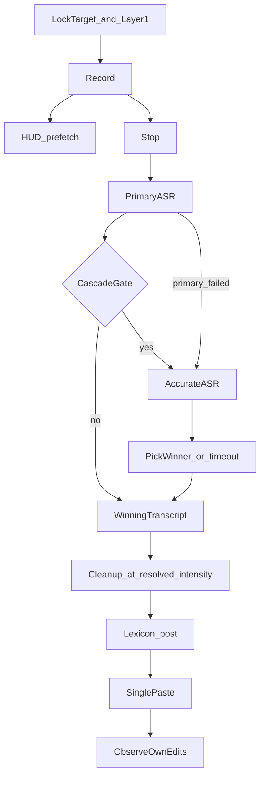

# Dictation, ASR cascade, and cleanup enhancement

**Date:** 2026-09-03  
**Status:** Draft for review. Not implemented.  
**Product:** VoiceFlow (macOS dictation, React 19 + Tauri 2 + Rust)  
**Companion:** [2026-09-03-screen-awareness-design.md](2026-09-03-screen-awareness-design.md)  
**Research:** [competitive-research.md](../../competitive-research.md), session plan `screen_context_research_86670356`

## Problem

VoiceFlow already has the category ticket: global hotkey, BYOK ASR/cleanup, App family policies, selected-text preview, fail-closed paste, and a local harness. It does not yet *win* on the two things users compare: **recognition accuracy** and **cleanup that is ready to send**.

Today:

- Default ASR is Groq `whisper-large-v3-turbo`. Chinese CER is roughly 2–3× worse than SenseVoice / Qwen3-ASR.
- Cleanup is on or off. Internal `CleanupEffort::Light | Standard | Command` is not a user-visible control. WeChat and Slack both default Light; few-shots are not “a WeChat you would actually send.”
- Prefetch drafts stay in the HUD. There is no second, more accurate ASR shot when the first result is weak.
- Style learning is vocabulary-first. Large tone shifts are not supposed to auto-apply. The user now wants the app to learn short, stable tone from their own edits so they do not have to think about settings.

Quality bar: **table-stakes with Typeless (sendable text), Wispr (predictable intensity), Willow (technical nouns)** without owning a model. Cloud to the user-chosen providers is allowed.

## Goal

A dictation session that:

1. Uses the current ASR plug by default.
2. Re-runs a user-configured **Accurate ASR** only when the first result looks weak.
3. Shows drafts only in the HUD. **Pastes into the target app once.**
4. Cleans up at a user-visible intensity. Default is **Heavy**, including WeChat, unless that App mapping or learning overrides it.
5. Learns short tone examples and intensity from the user’s own post-paste edits. Learns on-screen proper nouns from Layer 1. Never learns other people’s sentences as style.

## Non-goals

- True streaming ASR into the target field (Willow 200ms type-in). HUD prefetch stays HUD-only.
- Changing the default provider brand in onboarding (still Groq unless the user picks otherwise).
- Silently swapping the live ASR engine.
- Dual-running Accurate ASR on every utterance.
- Meeting notes, Ask Anything, computer control, emoji packs, default profanity filters.
- Fine-tuning weights on user audio. No global keylog.
- Screen pixels. That is the companion spec. This spec **consumes** Layer 1 tokens; it does not capture images.

## Product rules

### Shared contract with screen awareness

- Audio and transcript may go to the configured ASR and cleanup providers.
- Default dictate path never screenshots.
- Layer 1 tokens may enter this session’s ASR prompt and cleanup prompt.
- Other people’s chat bubbles are context for *this* utterance only. They are not style few-shots.
- Proper nouns from the screen may enter the local lexicon (2× for classified person names, 3× otherwise).
- If Layer 1 fails or times out, dictation continues as Layer 0 (family + policy only).

### One paste

Prefetch, cascade second shot, and cleanup all finish in the background. The HUD may show draft text and “精确重打中”. The target app, clipboard delivery, and History `final_text` update **once** after the winning transcript is cleaned. Undo still applies to that single paste transaction.

### Intensity is visible and overridable

User-visible global control in 智能整理: **关 / 轻 / 中 / 重**.

| UI | Meaning | Default dictate behavior |
| --- | --- | --- |
| 关 | Local rules + lexicon only. No cleanup HTTP. | Same as `cleanup_enabled = false` for this session |
| 轻 | Remove fillers, resolve mid-sentence revision, light punctuation. Do not upgrade register. | `CleanupEffort::Light` |
| 中 | Complete sentences, lists when spoken, mail-like paragraphs when the family wants them | `CleanupEffort::Standard` |
| 重 | Typeless-like sendable polish: word choice, structure, punctuation. Must not invent facts, greetings, or subjects the user did not speak | New `CleanupEffort::Heavy` |

**Global default is 重.** Unmapped WeChat uses 重 until the user or learning writes a mapping override.

Per-app / per-host mapping can override the global slider. HUD shows only the **resolved** pair: `微信 · 重` or `微信 · 轻`. Do not show two numbers.

`CleanupEffort::Command` stays reserved for **selected-text spoken commands** (shorten, translate, rewrite). The dictate slider never becomes “summarize this page.” That is Phase 3 of the screen spec.

`output_mode` (auto / email / bullets / translation) still applies on top of intensity. Translation still does not flip just because family is WeChat.

### Learning (own edits only)

Observe only the locked field VoiceFlow just wrote, same window as today’s `dictionary_learn.rs` (about 3–12s, skip Secure Input / banking / learn-off mappings).

**Tone few-shots.** If the user rewrites a short result in a stable direction in the same App three times, write a style example pair on that mapping. Keep **at most 3 pairs** per mapping (oldest drops). A “short” rewrite is Latin 2–4 words, CJK 2–8 characters, or a whole-sentence rewrite of at most 40 characters. Paragraph rewrites, topic changes, and added facts are ignored.

**Intensity.** If the user three times in the same App shortens or casualizes a Heavy result back toward the raw transcript, drop that mapping’s override one step (重→中→轻→关) and toast with Undo. Raising intensity requires the same 3× in the opposite direction (user expanding fragments into full sentences) or a manual mapping change.

**Undo / tombstone.** Existing HUD undo for learn events applies to both lexicon promotions and these mapping writes.

**Screen names.** Layer 1 proper nouns seed the lexicon. They never seed style examples.

Settings still allow full manual edit and delete of learned examples. History shows which learned style pairs applied to a row (ids only, not raw screen context).

## Architecture

### New settings (names are normative)

Add to `Settings` / `SettingsView` / frontend `Settings`:

- `cleanup_intensity`: `"off" | "light" | "standard" | "heavy"`, default `"heavy"`.
- `accurate_asr_provider`, `accurate_asr_model`, `accurate_asr_base_url` (same provider shapes as existing ASR). Optional. Empty means cascade never runs.
- `cascade_timeout_ms`: default `5000`.
- `cascade_proper_noun_threshold`: default `3`.

When `cleanup_intensity == "off"`, do not send cleanup HTTP even if `cleanup_enabled` is true. Keep `cleanup_enabled` as the master “user turned cleanup off in engine/onboarding” flag; the slider can also be 关. Resolved skip-LLM if either is off.

Accurate ASR credentials reuse the existing Keychain-per-provider map. Do not invent a second secret store.

### Cascade gate

After primary ASR (including merged prefetch), run cascade when **any** is true and Accurate ASR is configured:

1. Provider-reported low confidence, or segment `no_speech_prob` / `avg_logprob` already used in `asr.rs` crosses the existing hallucination-adjacent thresholds.
2. `spoken_revision` hallucination bag hits the transcript.
3. Detected mixed Chinese-English (existing language / script mix signal).
4. Layer 1 extracted at least `cascade_proper_noun_threshold` proper nouns.

If Accurate ASR is not configured, skip quietly. Never change the primary provider behind the user’s back.

**Winner.** If Accurate ASR returns non-empty text before `cascade_timeout_ms`, use it. If it times out or errors, use primary. If primary failed and Accurate succeeds, use Accurate. If both fail, existing recovery: History raw path + clipboard / HUD error. Do not paste empty.

**Cleanup once** on the winner. Do not cleanup the draft and the winner.

**Prefetch.** Prefetch remains primary-provider only. Accurate ASR starts at stop (or when the gate can already fire on a completed prefetch merge). HUD may show primary draft while Accurate runs.

### Cleanup prompts

- Add `CleanupEffort::Heavy` with a Typeless-like sendable prompt: resolve revision, format lists, fix grammar, choose natural wording. Forbidden additions stay: no new facts, no unsolicited 您好, no swear-word sanitization unless the user mapping says so.
- PersonalChat / WorkChat **few-shots** must include at least one Heavy example that is still chat-shaped (“好的哈哈我晚点回你”), so Heavy ≠ email.
- Pass Layer 1 payload as `visible_context` with explicit instruction: use it to spell names and choose address terms; do not quote, summarize, or answer the screen.
- Pass at most 3 learned style pairs for the resolved mapping.
- Dictionary hit pairs remain hit-only, existing caps.

### Failover (availability)

Independent of cascade: if primary ASR HTTP fails (network, 5xx, auth) and Accurate ASR is configured, use Accurate as the only shot. If cleanup HTTP fails, existing fallback: local rules + raw / locally cleaned text, `degraded` in History. Do not block paste on cleanup failure.

### Modules to change (implementation later)

- [src-tauri/src/asr.rs](../../../src-tauri/src/asr.rs), [engine.rs](../../../src-tauri/src/engine.rs), [providers.rs](../../../src-tauri/src/providers.rs) — Accurate client + gate
- [src-tauri/src/lib.rs](../../../src-tauri/src/lib.rs) — session orchestration, single paste
- [src-tauri/src/llm.rs](../../../src-tauri/src/llm.rs) — `Heavy`, visible_context, style pairs
- [src-tauri/src/lexicon.rs](../../../src-tauri/src/lexicon.rs) — skip-LLM when intensity off; consume screen names
- [src-tauri/src/dictionary_learn.rs](../../../src-tauri/src/dictionary_learn.rs) — intensity ±1 and style pairs from own edits
- [src-tauri/src/store.rs](../../../src-tauri/src/store.rs) — settings + mapping fields
- [src/components/ContextSettings.tsx](../../../src/components/ContextSettings.tsx) — slider, Accurate ASR, mapping override
- [src/lib/hudContextLabel.ts](../../../src/lib/hudContextLabel.ts) — resolved intensity label
- Island HUD — draft + “精确重打中” without changing paste-once

## Error handling

| Case | Behavior |
| --- | --- |
| Accurate ASR unset | Gate never fires. Primary only. |
| Accurate timeout (5s) | Paste primary winner. HUD does not show a hard error. |
| Accurate empty / hallucination | Keep primary. |
| Both ASR fail | No paste. Recovery spool + History + copy path as today. |
| Layer 1 timeout | Cascade noun trigger counts as 0 nouns. Continue. |
| Cleanup fail | Local cleanup + degraded. Still one paste. |
| Target stale before paste | Clipboard / fail-closed. Never paste the draft that was waiting. |
| Learn window stale / Secure | No style or intensity write. |

## Testing

Automated:

- Intensity resolution: global Heavy + WeChat mapping Light → HUD Light; unmapped WeChat → Heavy.
- Slider 关 skips HTTP (existing cleanup-disabled tests extended).
- Cascade gate unit tests for the four triggers; no Accurate configured → no second HTTP.
- Timeout: Accurate slower than 5s → winner is primary.
- Cleanup called once per session in a fake dual-ASR test.
- Style learn: 3× short same-app rewrite adds a pair; 4th pair drops the oldest; paragraph rewrite ignored; other-person bubble text fixture never becomes a pair.
- Intensity 3× revert Heavy→Standard on that mapping; Undo restores.
- Protected-facts corpus still holds on Heavy (no invented greetings).
- PersonalChat Heavy few-shot does not contain 您好.

Manual Gate 2 (owner): WeChat two lines, Gmail, Slack, Cursor identifier, mixed 晓雯/知乎, one low-confidence cascade with Accurate SenseVoice. Do not claim accuracy from unit tests.

## Out of this spec

- ScreenCaptureKit, OCR, vision hotkey (companion spec).
- Changing default activation from tap to hold.
- User-visible None/Light/Medium/High copied as English Wispr chrome; UI stays 关/轻/中/重.
- Snippet placeholder expansion beyond `{{date}}` / `{{clipboard}}`.
- Sogou dictionary import (later, harness hit-rate).
